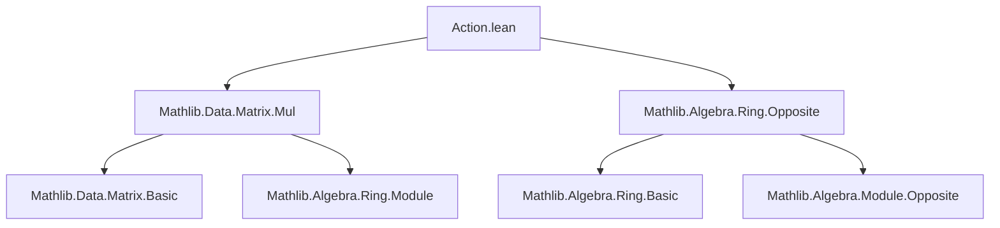

### Technical Brief: `Action.lean` — Matrix Actions on Vectors

---

#### **1. Key Definitions & Theorems**

| Name | Type / Signature | Purpose |
|------|------------------|---------|
| `Module (Matrix n n R) (n → R)` | `Matrix n n R → (n → R) → (n → R)` | Defines **left action** of square matrices on vectors via `mulVec`. |
| `Module (Matrix n n R)ᵐᵒᵖ (n → R)` | `(Matrix n n R)ᵐᵒᵖ → (n → R) → (n → R)` | Defines **right action** of square matrices on vectors via `vecMul`, encoded as a left module over the opposite ring. |
| `smul_eq_mulVec` | `A • v = A *ᵥ v` | Identifies the scalar multiplication in the left module with `mulVec`. |
| `op_smul_eq_vecMul` | `A • v = v ᵥ* A.unop` | Identifies scalar multiplication in the right-module instance with `vecMul`. |
| `mulVec_mulVec` | `(A * B) *ᵥ v = A *ᵥ (B *ᵥ v)` | Associativity of matrix multiplication with vector multiplication (used in `mul_smul`). |
| `one_mulVec` | `1 *ᵥ v = v` | Identity law for left action. |
| `vecMul_vecMul` | `v ᵥ* (A * B) = (v ᵥ* A) ᵥ* B` | Associativity for right action. |
| `vecMul_one` | `v ᵥ* 1 = v` | Identity law for right action. |
| `mulVec_smul`, `smul_vecMul`, `smul_mulVec`, `vecMul_smul`, etc. | Various `smul`-related lemmas | Establish compatibility of scalar multiplication with ring actions (e.g., `SMulCommClass`, `IsScalarTower`). |

---

#### **2. Naming Conventions**

- **Prefixes**:
  - `mulVec_`: for properties of left multiplication (`*ᵥ`).
  - `vecMul_`: for properties of right multiplication (`ᵥ*`).
  - `op_`: for lemmas involving the opposite ring `(–)ᵐᵒᵖ`.
- **Suffixes**:
  - `_smul`: for lemmas about `smul` (scalar multiplication).
  - `_mulVec` / `_vecMul`: for lemmas about `mulVec` / `vecMul`.
- **`unop`**: used to extract the underlying matrix from an opposite-ring element.

---

#### **3. Tactic Stack**

- `rfl`: used in `@[simp]` lemmas to equate definitions.
- `symm`: used to flip equalities (e.g., to match `mul_smul` pattern).
- `letI := SMulCommClass.symm`: to reuse symmetry of `SMulCommClass`.
- Implicit use of `simp`-friendly lemmas (`@[simp]`) for normalization.

No heavy automation (e.g., `aesop`, `ring`, `linarith`) is used—proofs are mostly definitional or rely on algebraic properties already proven in `Mathlib`.

---

#### **4. Proof Logic**

- **Module structure proofs**:
  - Constructed by directly matching axioms of `Module` to known lemmas:
    - `one_smul`, `mul_smul`, `add_smul`, etc., are proven by appealing to pre-existing lemmas like `one_mulVec`, `mulVec_mulVec`, `add_mulVec`, etc.
  - For the opposite ring instance, proofs are mirrored but involve `unop` and `vecMul_*` lemmas.
- **Compatibility instances** (`SMulCommClass`, `IsScalarTower`):
  - Use symmetry (`symm`) and known lemmas about interaction between `smul`, `mulVec`, and `vecMul`.
  - E.g., `mulVec_smul` is used to prove `SMulCommClass (Matrix n n R) S (n → R)`.

---

#### **5. Imports**

- `Mathlib.Data.Matrix.Mul`: Provides `mulVec`, `vecMul`, and their algebraic properties.
- `Mathlib.Algebra.Ring.Opposite`: Provides the opposite ring construction `(–)ᵐᵒᵖ`.

These imports define the core operations and structures used in this module.

---

#### **8. Mermaid Diagrams**

##### **Dependency Graph**



##### **Overview of Theory Flow**

```mermaid
flowchart LR
  subgraph "Matrix Actions"
    A[Matrix n n R] -->|left action *ᵥ| B[n → R]
    A -->|right action ᵥ*| C[n → R]
    Aᵐᵒᵖ -->|left action over opp| C
  end

  subgraph "Module Structures"
    B <-->|Module (Matrix n n R)| A
    C <-->|Module (Matrix n n R)ᵐᵒᵖ| Aᵐᵒᵖ
  end

  subgraph "Scalar Compatibility"
    D[S] -->|SMulCommClass| B
    D -->|IsScalarTower| C
  end
```

##### **Module Hierarchy Summary**

- `Matrix n n R` acts **on the left** on vectors `n → R` via `mulVec`.
- `Matrix n n R` acts **on the right** on vectors `n → R` via `vecMul`, encoded as a **left** action over `(Matrix n n R)ᵐᵒᵖ`.
- Additional `SMulCommClass` and `IsScalarTower` instances ensure compatibility with external scalar rings `S`.

---

This file formalizes the foundational module-theoretic interpretation of matrix-vector multiplication, enabling reuse in broader algebraic contexts (e.g., representations, bimodules, linear actions).
