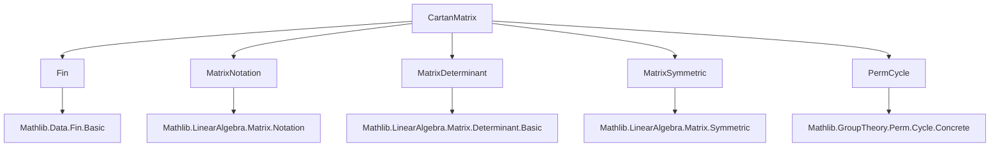
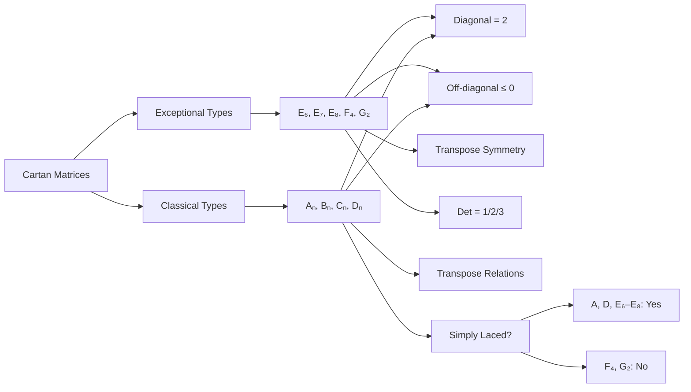

**Technical Brief: Cartan Matrix Formalization in Lean 4**

---

### 1. **Key Definitions & Theorems**

| Name | Type | Purpose |
|------|------|---------|
| `CartanMatrix.E₆`, `E₇`, `E₈`, `F₄`, `G₂` | `Matrix (Fin n) (Fin n) ℤ` | Explicit integer matrices defining Cartan matrices for exceptional Lie algebras. |
| `CartanMatrix.A n`, `B n`, `C n`, `D n` | `Matrix (Fin n) (Fin n) ℤ` | Parametric definitions for classical infinite families of Cartan matrices (type A–D). |
| `Matrix.IsSimplyLaced A` | `Prop` | Predicate asserting all off-diagonal entries are 0 or −1 (i.e., no multiple edges in Dynkin diagram). |
| `A_diag`, `B_diag`, `C_diag`, `D_diag`, `E₆_diag`, … | `∀ i, A n i i = 2` | Diagonal entries of all Cartan matrices are 2. |
| `A_transpose`, `B_transpose`, `C_transpose`, `D_transpose`, `E₆_transpose`, … | `A n.transpose = A n`, etc. | Symmetry / transpose relations: A, D, E₆, E₇, E₈ symmetric; B and C transpose to each other. |
| `isSimplyLaced_A`, `isSimplyLaced_D`, `isSimplyLaced_E₆`, … | `IsSimplyLaced (A n)` etc. | Proves which families are simply laced (A, D, E₆, E₇, E₈); F₄, G₂ are not. |
| `G₂_det`, `F₄_det` | `det = 1` | Determinants of small exceptional matrices. |
| `E₆_det`, `E₇_det`, `E₈_det` | `det = 3, 2, 1` | *Unproven* (marked `proof_wanted`); expected values per Lie theory. |

---

### 2. **Naming Conventions**

- **Prefixes**:
  - `is_` (e.g., `isSimplyLaced`) for predicates.
  - `diag` suffix for diagonal properties (`A_diag`, `E₆_diag`).
  - `off_diag_nonpos` suffix for non-positive off-diagonal entries.
  - `transpose` suffix for transpose identities (`A_transpose`, `B_transpose`).
- **Matrix constructors**:
  - `A`, `B`, `C`, `D`, `E₆`, `E₇`, `E₈`, `F₄`, `G₂` — direct use of standard Lie type notation.
- **Indexing**:
  - `i.val`, `j.val` used to access underlying natural numbers of `Fin n` indices.
- **Quantifier style**:
  - `intro i j h` for arbitrary indices with inequality hypothesis.

---

### 3. **Tactic Stack**

| Tactic | Frequency | Role |
|--------|-----------|------|
| `simp` / `simp only` | Very high | Simplify matrix definitions (`Matrix.of_apply`, `transpose_apply`, `of_apply`). |
| `decide` | High | Prove equalities of small concrete matrices (e.g., `A_two`, `E₆_diag`). |
| `fin_cases` | Medium | Exhaustive case analysis on `Fin n` indices (especially for exceptional types). |
| `grind` | Medium | Automated simplification for index-wise reasoning (used in `A_transpose`, `isSimplyLaced_A`). |
| `rw`, `ext`, `aesop` | Low–Medium | Rewrite using transpose symmetry, extensionality, and automated reasoning. |
| `omega` | Medium | Solve linear arithmetic goals after `split_ifs`. |
| `intro`, `obtain`, `split_ifs` | Medium | Standard proof structuring. |

---

### 4. **Proof Logic**

- **Structure**:
  - **Explicit matrix definitions** → **element-wise verification** of properties.
  - For classical families (`A`, `B`, `C`, `D`):
    - Use `Matrix.of fun i j => ...` and prove properties by case analysis on index relations (`i = j`, `i + 1 = j`, etc.).
    - Proofs often proceed by `simp only [definition]`, `split_ifs`, then `omega`.
  - For exceptional types:
    - Use `decide` or `fin_cases i <;> fin_cases j <;> simp_all` to verify entries.
    - Symmetry and determinant proofs rely on `decide` (small matrices).
- **Induction is not used** — all families are defined *explicitly* (either parametrically with `Matrix.of`, or concretely for E₆–G₂).
- **Transpose properties**:
  - Proven by extensionality (`ext`) and simplification (`grind`/`simp`).
  - For `B` and `C`, use `rw [← transpose_transpose]` to derive mutual transpose.

---

### 5. **Imports**

| Import | Purpose |
|--------|---------|
| `Mathlib.Data.Fin.Basic` | Finite types `Fin n`, indexing, decidable equality. |
| `Mathlib.LinearAlgebra.Matrix.Notation` | Matrix syntax `!![ ... ]`, `transpose`, `diag`. |
| `Mathlib.LinearAlgebra.Matrix.Determinant.Basic` | Determinant (`det`) and basic lemmas. |
| `Mathlib.LinearAlgebra.Matrix.Symmetric` | `IsSymm`, transpose properties. |
| `Mathlib.GroupTheory.Perm.Cycle.Concrete` | Possibly for `reindex` or cycle notation (used in `D_three'`). |

---

### 6. **Mermaid Diagrams**

#### **Dependency Graph (Module-Level)**

#### **Overview of Theory Flow**

---

### 7. **Notes on Unfinished Work**

- Determinants of `E₆`, `E₇`, `E₈` are marked `proof_wanted`.  
  - `decide` fails due to recursion depth limits — suggests need for:
    - A more scalable determinant tactic (e.g., cofactor expansion with `det_succ_column_zero`).
    - Or a structural proof using properties of root systems (not yet formalized here).
- `D_three'` uses `reindex` to show `D₃ ≅ A₃`, hinting at isomorphism of Dynkin diagrams (`D₃ ≅ A₃`).

---

### 8. **Tags & Context**

- **Tags**: `cartan_matrix`, `lie_algebra`, `dynkin_diagram`
- **Mathematical Context**:
  - Cartan matrices classify root systems and semisimple Lie algebras.
  - Symmetry / simply laced property corresponds to Dynkin diagram structure (no multiple edges).
  - Determinant relates to volume of root lattice; values 1, 2, 3, etc., match known results.

--- 

*End of Technical Brief.*
