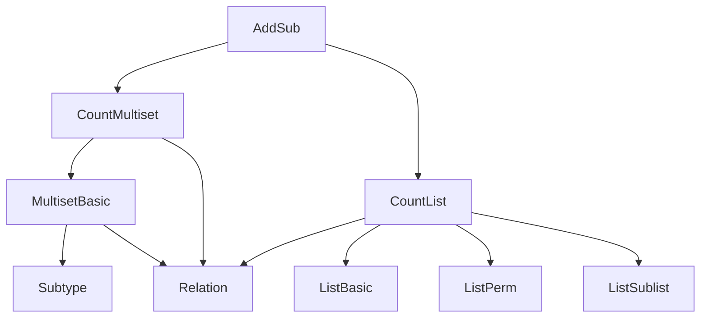
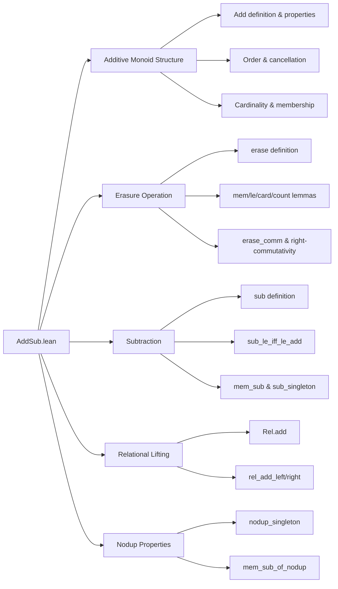

### Technical Brief: `AddSub.lean` — Multiset Addition, Subtraction, and Erasure

---

#### **1. Key Definitions & Theorems**

| Name | Type / Signature | Purpose |
|------|------------------|---------|
| `Multiset.add` | `Multiset α → Multiset α → Multiset α` | Adds multiplicities: `count a (s + t) = count a s + count a t` |
| `instance Add` | `Add (Multiset α)` | Enables notation `s + t` |
| `Multiset.sub` | `Multiset α → Multiset α → Multiset α` | Truncated subtraction of multiplicities: `count a (s - t) = max(0, count a s - count a t)` |
| `instance Sub` | `Sub (Multiset α)` | Enables notation `s - t` |
| `Multiset.erase` | `Multiset α → α → Multiset α` | Decrements multiplicity of a single element `a` by 1 |
| `coe_add` | `(s t : List α) → (s + t : Multiset α) = (s ++ t : List α)` | Compatibility of list append with multiset addition |
| `singleton_add` | `({a} + s = a ::ₘ s)` | Unit of addition is singleton multiset |
| `add_comm`, `add_assoc` | `s + t = t + s`, `s + t + u = s + (t + u)` | Commutativity and associativity of `+` |
| `zero_add`, `add_zero` | `0 + s = s`, `s + 0 = s` | Identity laws for `+` |
| `le_iff_exists_add` | `s ≤ t ↔ ∃ u, t = s + u` | Characterization of multiset inclusion via addition |
| `mem_add` | `a ∈ s + t ↔ a ∈ s ∨ a ∈ t` | Membership in sum is disjunction |
| `count_add` | `count a (s + t) = count a s + count a t` | Count distributes over `+` |
| `add_left_inj`, `add_right_inj` | `s + u = t + u ↔ s = t`, `s + t = s + u ↔ t = u` | Cancellation laws for `+` |
| `card_add` | `card (s + t) = card s + card t` | Cardinality is additive |
| `erase_zero`, `erase_cons_head`, `erase_cons_tail` | `0.erase a = 0`, `(a ::ₘ s).erase a = s`, `(b ::ₘ s).erase a = b ::ₘ s.erase a` (if `b ≠ a`) | Core properties of `erase` |
| `cons_erase` | `a ∈ s → a ::ₘ s.erase a = s` | Reinsertion law: `s` = `a` + `s.erase a` if `a ∈ s` |
| `erase_le`, `erase_lt` | `s.erase a ≤ s`, `s.erase a < s ↔ a ∈ s` | Erasure reduces size and is strict iff element present |
| `count_erase_self` | `count a (erase s a) = count a s - 1` | Multiplicity drops by 1 on erasure |
| `count_erase_of_ne` | `a ≠ b → count a (erase s b) = count a s` | Erasure of `b` doesn’t affect count of `a ≠ b` |
| `sub_le_iff_le_add` | `s - t ≤ u ↔ s ≤ u + t` | Key interaction between subtraction and order |
| `sub_le_self` | `s - t ≤ s` | Subtraction reduces multiset |
| `add_sub_cancel` | `t ≤ s → s - t + t = s` | Cancellation law for `+` and `-` |
| `sub_singleton` | `s - {a} = s.erase a` | Subtraction of singleton equals erasure |
| `mem_sub` | `a ∈ s - t ↔ t.count a < s.count a` | Membership in difference is strict inequality of counts |
| `Rel.add`, `rel_add_left`, `rel_add_right` | Lifts binary relations through `+` | Used in relational lifting for multiset semantics |

---

#### **2. Naming Conventions**

- **Prefixes**:
  - `coe_`: Coercion compatibility (e.g., `coe_add`, `coe_sub`, `coe_erase`)
  - `erase_`: Properties of `erase` (e.g., `erase_cons_head`, `erase_le`, `erase_comm`)
  - `add_`, `sub_`: General algebraic properties (e.g., `add_comm`, `sub_le_iff_le_add`)
  - `count_`, `card_`: Count/cardinality-related lemmas
  - `le_`, `lt_`, `subset_`: Order-theoretic properties
  - `mem_`: Membership lemmas
  - `Rel_`, `nodup_`: Relational and uniqueness-related properties

- **Suffixes**:
  - `_left`, `_right`: Positional variants (e.g., `add_le_add_iff_left`, `erase_add_left_pos`)
  - `_iff_`: Biconditional characterizations (e.g., `erase_le_iff_le_cons`, `le_iff_exists_add`)
  - `_pos`, `_neg`: Conditional behavior based on membership (e.g., `erase_add_left_pos`, `erase_add_right_neg`)
  - `_of_mem`, `_of_notMem`: Branches based on `a ∈ s` or `a ∉ s`

---

#### **3. Tactic Stack**

- **Core proof tactics**:
  - `Quotient.inductionOn`, `Quot.inductionOn`, `Quotient.inductionOn₂`, `Quotient.inductionOn₃`: For reasoning on quotient-defined multisets
  - `rw`, `simp`, `simp only`, `congr_arg`: Rewriting and simplification
  - `ext`: Extensionality for multiset equality (`Multiset.ext`)
  - `induction ... using Multiset.induction_on`: Structural induction on multisets
  - `by_cases`, `if_pos`, `if_neg`: Case analysis on decidable predicates
  - `exact`, `apply`, `assumption`: Direct proof steps
  - `convert`, `rwa`, `rfl`: Equality chaining and reflexivity
  - `aesop`, `ring`, `linarith`: For arithmetic goals (especially in `count_*` lemmas)

- **Notable patterns**:
  - `Quot.sound` + `perm_*` lemmas (e.g., `perm_append_comm`, `perm_cons_erase`) for well-definedness
  - `countP_add`, `count_sub` → `count_add`, `count_sub` via `countP_add _` and `DecidableEq` instance

---

#### **4. Proof Logic**

- **Well-definedness**: All operations (`add`, `sub`, `erase`) are defined via `Quotient.liftOn`/`Quot.liftOn`, requiring proofs that the operation respects permutation equivalence. This is done via `Quot.sound` and permutation lemmas like `perm_append_comm`, `perm_cons_erase`, `perm_erase_comm`.

- **Inductive structure**:
  - **Base case**: Often `List` version (e.g., `List.countP_append`, `List.count_diff`, `List.erase_cons_head`) lifted to multisets.
  - **Inductive step**: `Multiset.induction_on` or `leInductionOn` for order-theoretic lemmas.
  - **Case splits**: On `a ∈ s` or `a ∉ s`, or `a = b`, handled via `if ... then ... else ...` or `eq_or_ne`.

- **Order reasoning**:
  - Inclusion (`≤`) is often characterized via `le_iff_exists_add` or `sub_le_iff_le_add`.
  - Strict inclusion (`<`) via `erase_lt`, `card_lt_card`.

- **Arithmetic reasoning**:
  - `count_*` lemmas reduce to `Nat` arithmetic (e.g., `Nat.add_sub_assoc`, `Nat.sub_add_cancel`, `Nat.sub_pos_iff_lt`).
  - `ext` + `simp [count_*]` is the standard pattern for multiset equality proofs.

---

#### **5. Imports & Dependencies**

- **Core imports**:
  ```lean
  Mathlib.Data.Multiset.Count
  Mathlib.Data.List.Count
  ```
- **Implicit dependencies**:
  - `Mathlib.Data.Multiset.Basic` (via `Multiset` namespace and `Multiset.induction_on`)
  - `Mathlib.Data.List.Basic`, `Mathlib.Data.List.Perm`, `Mathlib.Data.List.Sublist`
  - `Mathlib.Data.Nat.Basic`, `Mathlib.Data.Nat.Sub` (for arithmetic)
  - `Mathlib.Data.Relation`, `Mathlib.Data.Subtype` (for `Rel` section)
  - `Mathlib.Logic.Relation.Basic` (for `Rel`, `rel_flip`, etc.)

- **No algebraic structures assumed**:
  - `assert_not_exists Monoid` confirms no monoid/homomorphism infrastructure is used.

---

#### **6. Mermaid Diagrams**

##### **Dependency Graph (Module-Level)**



##### **Overview of File Structure**



---

#### **7. Theory Context**

- **Purpose**: Provides foundational algebraic structure on multisets: additive monoid with subtraction and erasure.
- **Role in Mathlib**:
  - Serves as basis for `Multiset.sort`, `Multiset.filter`, `Multiset.map`, and `Multiset.bind`.
  - Underlies `Multiset.range`, `Multiset.replicate`, `Multiset.sum`, etc.
  - Enables reasoning about multisets as “bags” with multiplicities, crucial for combinatorics, formalization of multisets in rewriting, and multiset-based induction principles.

- **Design Philosophy**:
  - Avoids algebraic hierarchy (e.g., no `Monoid`, `AddCommMonoid`) to keep definitions lightweight and directly tied to list operations.
  - Uses quotient-based definition to ensure permutation invariance while leveraging `List` primitives.

--- 

Let me know if you'd like a formalized dependency graph (e.g., `.dot` or `leanpkg`-style), or a summary of how this module integrates with `Multiset.lean` or `Multiset.Sorted.lean`.
