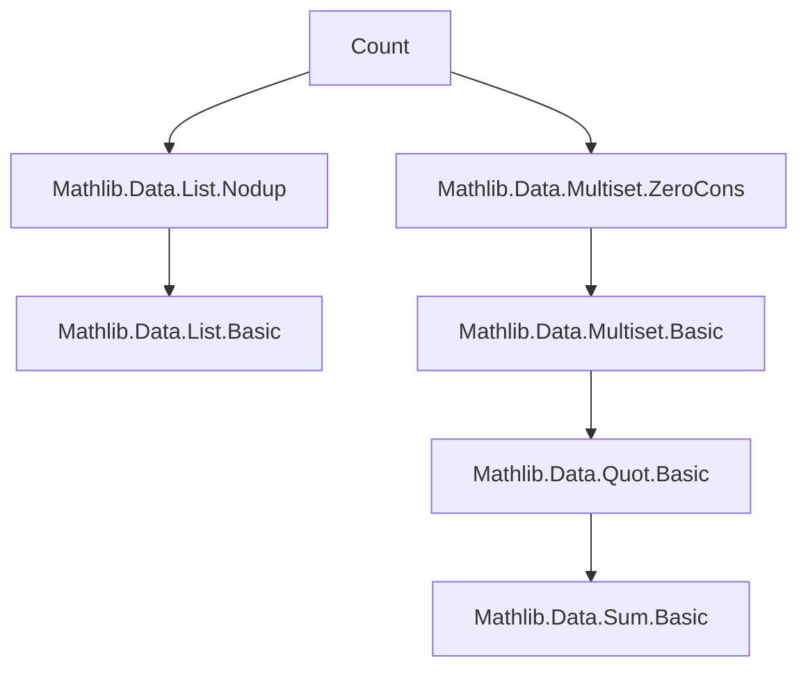
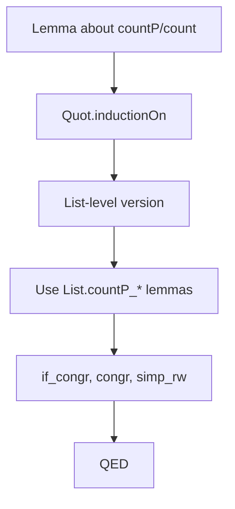

### Technical Brief: `Count.lean` — Multiplicity and Counting in Multisets

---

#### **1. Key Definitions & Theorems**

| Name | Type / Signature | Purpose |
|------|------------------|---------|
| `countP` | `countP (p : α → Prop) [DecidablePred p] : Multiset α → ℕ` | Counts how many elements in a multiset satisfy predicate `p`, with multiplicity. |
| `count` | `count (a : α) [DecidableEq α] : Multiset α → ℕ` | Multiplicity of element `a` in a multiset (i.e., `countP (a = ·)`). |
| `coe_countP` | `countP p (ofList l) = l.countP p` | Compatibility of `countP` with list embedding. |
| `countP_cons_of_pos/neg` | `p a → countP p (a ::ₘ s) = countP p s + 1`<br>`¬p a → countP p (a ::ₘ s) = countP p s` | Recursive behavior of `countP` on cons. |
| `countP_cons` | `countP p (b ::ₘ s) = countP p s + if p b then 1 else 0` | Unified cons rule using `if`. |
| `countP_le_card` | `countP p s ≤ card s` | `countP` never exceeds multiset size. |
| `card_eq_countP_add_countP` | `card s = countP p s + countP (¬p) s` | Partition of multiset by predicate and its negation. |
| `countP_True/Fasle` | `countP (fun _ ↦ True) s = card s`<br>`countP (fun _ ↦ False) s = 0` | Extreme cases of `countP`. |
| `countP_pos` | `0 < countP p s ↔ ∃ a ∈ s, p a` | Positivity of count ↔ existence of a satisfying element. |
| `countP_eq_zero` | `countP p s = 0 ↔ ∀ a ∈ s, ¬p a` | Zero count ↔ no element satisfies `p`. |
| `countP_eq_card` | `countP p s = card s ↔ ∀ a ∈ s, p a` | Full count ↔ predicate holds everywhere. |
| `count_cons_self` | `count a (a ::ₘ s) = count a s + 1` | Self-cons adds 1 to multiplicity. |
| `count_cons_of_ne` | `a ≠ b → count a (b ::ₘ s) = count a s` | Different element doesn’t affect multiplicity. |
| `count_singleton_self` | `count a ({a}) = 1` | Singleton contains exactly one copy. |
| `count_singleton` | `count a ({b}) = if a = b then 1 else 0` | Multiplicity in singleton. |
| `count_pos` | `0 < count a s ↔ a ∈ s` | Membership ↔ positive multiplicity. |
| `count_eq_zero_of_notMem` | `a ∉ s → count a s = 0` | Non-membership implies zero multiplicity. |
| `count_eq_card` | `count a s = card s ↔ ∀ x ∈ s, a = x` | Full multiplicity ↔ all elements equal `a`. |
| `ext` / `ext'` | `s = t ↔ ∀ a, count a s = count a t` | Extensionality of multisets via multiplicity. |
| `le_iff_count` | `s ≤ t ↔ ∀ a, count a s ≤ count a t` | Submultiset relation via pointwise multiplicity comparison. |
| `nodup_iff_count_le_one` | `Nodup s ↔ ∀ a, count a s ≤ 1` | No duplicates ↔ multiplicity ≤ 1 everywhere. |
| `nodup_iff_count_eq_one` | `Nodup s ↔ ∀ a ∈ s, count a s = 1` | Nodup ↔ multiplicity = 1 on support. |
| `count_eq_of_nodup` | `count a s = if a ∈ s then 1 else 0` (under `Nodup s`) | Simplified multiplicity in nodup multisets. |

---

#### **2. Naming Conventions**

- **Predicate-based counting**: `countP` (P for *predicate*).
- **Element-specific multiplicity**: `count a s` (short for `countP (a = ·) s`).
- **Simp lemmas**: `*_cons_of_pos`, `*_cons_of_neg`, `*_singleton_self`, `*_eq_zero`, `*_eq_card`, `*_le_card`, `*_pos`, `*_congr`, `*_attach`.
- **Equivalence/extensionality**: `ext`, `ext'`, `le_iff_count`.
- **Nodup-related**: `nodup_iff_*`, `count_eq_one_of_mem`, `count_eq_of_nodup`.
- **Relational lifting**: `Rel.countP_eq`.

Prefixes/suffixes:
- `countP_`, `count_`: core counting operations.
- `_cons_*`, `_singleton_*`: behavior on constructors.
- `_eq_*`, `_le_*`, `_pos`, `_zero`: relational properties.
- `_congr`, `_attach`: structural compatibility.

---

#### **3. Tactic Stack**

Frequent tactics used in proofs:
- `simp` / `simp_rw`: especially for rewriting `countP`, `count`, and list analogues.
- `Quot.inductionOn`, `Quotient.inductionOn`: to reduce to list level.
- `rfl`, `congr`, `intro`, `exact`, `apply`, `rw`, `apply_fun`.
- `if_congr`: for simplifying `if-then-else` expressions.
- `Nat.pos_of_ne_zero`, `Nat.pos_iff_ne_zero`: arithmetic reasoning.
- `aesop` (implied by `simp` + `linarith`-like reasoning in many lemmas).
- `by_contradiction`: in `count_eq_zero_of_notMem`.

---

#### **4. Proof Logic**

- **Inductive structure**: Most proofs use `Quot.inductionOn` to reduce to `List` analogues, leveraging the definition of `Multiset` as a quotient of lists by permutation.
- **Case analysis**: On whether `p a` holds (`pos`/`neg`) or `a = b` (`cons_self`/`cons_of_ne`).
- **Equational reasoning**: Heavy use of `simp` with `countP_cons`, `count_cons`, and list lemmas (`List.countP_cons`, `List.countP_eq_length`, etc.).
- **Logical equivalences**: Many theorems are biconditionals (`↔`), proven by splitting into `→` and `←`, often via `countP_pos`, `count_pos`, etc.
- **Subtype/attachment lemmas**: `countP_attach`, `count_attach` use `Subtype.ext_iff` and `quot_mk_to_coe` to relate attached multisets.

---

#### **5. Imports & Dependencies**

- `Mathlib.Data.List.Nodup`: for `List.nodup_iff_count_le_one`, etc.
- `Mathlib.Data.Multiset.ZeroCons`: for multiset constructors (`0`, `::ₘ`), basic operations.
- Core imports: `Function`, `Nat`, `Subtype`, `List`.

No algebraic structures (e.g., `Monoid`) are required — `countP` is defined purely set-theoretically.

---

#### **6. Mermaid Diagrams**

##### **Dependency Graph (Module-Level)**



##### **Overview of Theories in `Count.lean`**

```mermaid
flowchart LR
  A[Multiset α] --> B[countP p s]
  A --> C[count a s]
  B --> D[card s]
  B --> E[countP (¬p) s]
  C --> F[mem ↔ pos]
  C --> G[ext: s = t ↔ ∀a, count a s = count a t]
  C --> H[le_iff_count]
  A --> I[Nodup s]
  I --> J[count a s ≤ 1]
  I --> K[count a s = 1 on s]
  C --> L[attach compatibility]
```

##### **Proof Strategy Flow (Typical Lemma)**



---

#### **7. Theory Scope**

This module formalizes **multiplicity theory** for multisets:
- Generalized counting via predicates (`countP`).
- Element-specific multiplicity (`count`).
- Structural properties: extensionality, submultiset order, nodup equivalence.
- Compatibility with list embedding and attachment.
- No algebraic assumptions — purely combinatorial.

It serves as a foundational building block for:
- Finite set/multiset cardinality arguments.
- Probability over finite types (e.g., `Multiset.filter`, `Multiset.erase`).
- Formalization of combinatorics (e.g., pigeonhole principle, counting arguments).

---

Let me know if you'd like a **dependency graph of theorems**, **proof automation suggestions**, or **refactoring opportunities** (e.g., factoring out `countP` as a linear map in future extensions).
