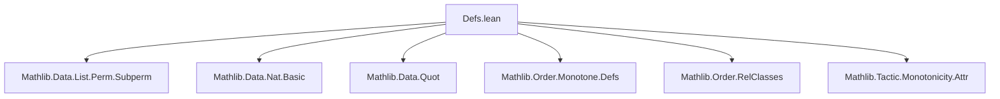
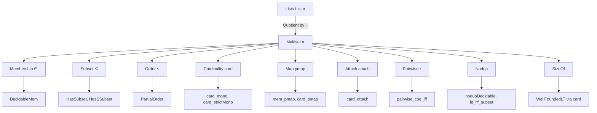

### Technical Brief: `Defs.lean` — Multiset Foundations in Lean 4

---

#### **1. Key Definitions & Theorems**

| Name | Type / Signature | Purpose |
|------|------------------|---------|
| `Multiset α` | `Type u → Type u` | Type of finite multisets over `α`, defined as `Quotient (List.isSetoid α)` |
| `ofList` | `List α → Multiset α` | Quotient map sending a list to its equivalence class (multiset) |
| `Mem` | `Multiset α → α → Prop` | Membership predicate: `a ∈ s` iff `a` appears at least once in any representative list of `s` |
| `Subset` | `Multiset α → Multiset α → Prop` | Lifted list subset: `s ⊆ t` iff every element of `s` appears in `t` (ignoring multiplicity) |
| `Le` | `Multiset α → Multiset α → Prop` | Sublist-up-to-permutation: `s ≤ t` iff `s` is a sublist of some permutation of `t` (equivalently, `count a s ≤ count a t` for all `a`) |
| `card` | `Multiset α → ℕ` | Cardinality: sum of multiplicities = length of any representative list |
| `pmap` | `(∀ a, p a → β) → Multiset α → (∀ a ∈ s, p a) → Multiset β` | Map a partial function over a multiset where all elements lie in the domain |
| `attach` | `Multiset α → Multiset { x // x ∈ s }` | Enriches each element with a proof of membership |
| `Pairwise` | `(α → α → Prop) → Multiset α → Prop` | `Pairwise r s` holds if some list representative of `s` has `r` pairwise |
| `Nodup` | `Multiset α → Prop` | No duplicates: multiplicity ≤ 1 for all elements |
| `sizeOf` | `[SizeOf α] → Multiset α → ℕ` | Size function for well-founded recursion on multisets |

**Key Theorems:**
- `coe_eq_coe`: `l₁ = l₂` in `Multiset α` iff `l₁ ~ l₂` (permutation equivalence)
- `subset_of_le`: `s ≤ t → s ⊆ t`
- `mem_of_le`: `s ≤ t → a ∈ s → a ∈ t`
- `card_le_card`: `s ≤ t → card s ≤ card t`
- `eq_of_le_of_card_le`: `s ≤ t ∧ card t ≤ card s → s = t`
- `coe_le`: `(l₁ : Multiset α) ≤ l₂ ↔ l₁ <+~ l₂` (subpermutation)
- `coe_nodup`: `Nodup l ↔ l.Nodup`
- `nodup_of_le`: `s ≤ t ∧ Nodup t → Nodup s`
- `wellFoundedLT`: `<` on multisets is well-founded via `card`

---

#### **2. Naming Conventions**

- **Predicates**: `is_`, `mem_`, `subset_`, `nodup`, `pairwise`, `decidable*`, `mono`, `strictMono`
- **Operations**: `coe_`, `pmap`, `attach`, `card_`, `sizeOf_`
- **Equivalence/Quotient**: `quot_mk_to_coe`, `lift_coe`, `Quotient.*`
- **List lifting**: `coe_*` (e.g., `coe_le`, `coe_nodup`, `coe_card`, `coe_pmap`)
- **Instance naming**: `inst*`, `decidable*`, `nonrec def` for critical definitions (`pmap`)

---

#### **3. Tactic Stack**

Frequent tactics used:
- `rfl`, `simp`, `intro`, `exact`, `apply`, `refine`
- `Quotient.inductionOn`, `Quotient.recOnSubsingleton`, `Quot.sound`, `Quotient.eq_iff_equiv`
- `subperm`-related reasoning: `Subperm.refl`, `Subperm.trans`, `Subperm.antisymm`
- `decidable_of_iff`, `decidable_of_iff'`
- `congr_arg`, `funext`, `ext`, `apply_fun`
- `lt_of_not_ge`, `mt`, `ne_of_lt`, `congr_arg _`
- `measure`, `Subrelation.wf` (for well-foundedness)

---

#### **4. Proof Logic**

- **Quotient-based reasoning dominates**:
  - Definitions lifted via `Quot.liftOn`, `Quot.recOn`, or `Quotient.recOnSubsingleton`
  - Proofs often proceed by `Quotient.inductionOn` or `leInductionOn` (induction on `≤`)
- **Induction patterns**:
  - `leInductionOn`: structural induction on `s ≤ t` using sublist relation
  - `decidable*` instances use `decidable_of_iff` + `simp`
- **Equational reasoning**:
  - `propext` used to equate propositions in quotient lifts
  - `congr_arg _` + `List.*` lemmas for lifting properties (e.g., `length_pmap`, `nodup_iff`)
- **Well-foundedness**: via `measure Multiset.card` and `card_lt_card`

---

#### **5. Imports & Dependencies**

**Core imports**:
- `Mathlib.Data.List.Perm.Subperm`: subpermutation (`<+~`) and related properties
- `Mathlib.Data.Nat.Basic`: natural numbers, `length`, `card`, arithmetic
- `Mathlib.Data.Quot`: quotient types and lifting
- `Mathlib.Order.Monotone.Defs`: monotonicity, `Monotone`, `StrictMono`
- `Mathlib.Order.RelClasses`: `PartialOrder`, `IsNonstrictStrictOrder`, `WellFoundedLT`
- `Mathlib.Tactic.Monotonicity.Attr`: monotonicity attributes (`[gcongr]`, `[mono]`)

**No algebraic structure required** (explicit `assert_not_exists Monoid OrderHom`)

---

#### **6. Mermaid Diagrams**

##### **Dependency Graph (Top-Level Imports)**

##### **Theoretical Overview**

##### **Module Scope & Role**

- **Role**: Foundational definitions for multisets *without* algebraic operations (e.g., `+`, `*`, `∩`, `∪` deferred to other files).
- **Goal**: Enable `Finset` construction with minimal imports (`Multiset.Defs` only).
- **Design principle**: All operations are defined via quotient lifting from lists; decidability and computational content preserved.

---

#### **7. Notation (Defined Later)**

> *Note: Not defined in this file, but declared in comments as future notation.*

- `0`: empty multiset  
- `{a}`: singleton multiset  
- `a ::ₘ s`: cons with multiplicity  
- `s + t`: sum (multiplicity-wise addition)  
- `s - t`: difference (multiplicity-wise subtraction, truncated at 0)  
- `s ∪ t`: max multiplicity  
- `s ∩ t`: min multiplicity  

These will be defined in `Multiset.Basic` or similar.

---

#### **8. Summary**

This file establishes the *core logical and order-theoretic structure* of multisets as `Quotient (List α)`. It prioritizes:
- **Computational content** via quotient representation,
- **Decidability** of membership, equality, and properties (`Nodup`, `Pairwise`),
- **Order-theoretic foundations** (`≤`, `⊆`, `card` monotonicity, well-founded `<`),
- **Minimal dependencies**, avoiding algebraic operations to keep `Finset` imports light.

It serves as the *minimal interface* for building `Finset` and other multiset-based structures.
