### Technical Brief: Dershowitz–Manna Ordering on Multisets (Lean 4)

---

#### **1. Key Definitions & Theorems**

| Name | Type | Purpose |
|------|------|---------|
| `IsDershowitzMannaLT` | `Multiset α → Multiset α → Prop` | Standard definition: $M <_{\text{DM}} N$ iff $M = X + Y$, $N = X + Z$, $Z \neq \emptyset$, and $\forall y \in Y, \exists z \in Z, y < z$. |
| `OneStep` *(private)* | `Multiset α → Multiset α → Prop` | Special case where $N = X + \{a\}$, i.e., replacing all elements in $Y$ by a *single* smaller element $a$. |
| `IsDershowitzMannaLT.trans` | `IsDershowitzMannaLT M N → IsDershowitzMannaLT N P → IsDershowitzMannaLT M P` | Proves transitivity of the DM ordering. |
| `acc_oneStep_cons_of_acc_lt` | `Acc LT.lt a → Acc OneStep M → Acc OneStep (a ::ₘ M)` | Inductive step for accessibility under `OneStep`, using accessibility of head element. |
| `acc_oneStep_of_acc_lt` | `(∀ x ∈ M, Acc LT.lt x) → Acc OneStep M` | Accessibility of multiset under `OneStep` follows from element-wise accessibility under `<`. |
| `isDershowitzMannaLT_singleton_wf` | `[WellFoundedLT α] → WellFounded OneStep` | `OneStep` is well-founded if the base order is. |
| `transGen_oneStep_eq_isDershowitzMannaLT` | `TransGen OneStep = IsDershowitzMannaLT` | Equivalence of the transitive closure of `OneStep` and the full DM ordering. |
| `wellFounded_isDershowitzMannaLT` | `[WellFoundedLT α] → WellFounded IsDershowitzMannaLT` | Main theorem: DM ordering on multisets is well-founded if the base order is. |
| `instWellFoundedIsDershowitzMannaLT` | `[WellFoundedLT α] → WellFoundedRelation (Multiset α)` | Instance for using DM ordering as a well-founded relation in termination proofs. |

---

#### **2. Naming Conventions**

- **Prefixes**:
  - `is_`: Predicate definitions (`isDershowitzMannaLT`, `isDershowitzMannaLT_singleton_wf`)
  - `acc_`: Accessibility lemmas (`acc_oneStep_cons_of_acc_lt`, `acc_oneStep_of_acc_lt`)
  - `transGen_`: Relating transitive closure to main ordering (`transGen_oneStep_eq_isDershowitzMannaLT`, `transGen_oneStep_of_isDershowitzMannaLT`)
- **Suffixes**:
  - `_of_`: Implication direction (e.g., `isDershowitzMannaLT_of_oneStep`)
  - `_wf`: Well-foundedness results (`isDershowitzMannaLT_singleton_wf`, `wellFounded_isDershowitzMannaLT`)
- **Structure**:
  - `OneStep` is private and used as a building block.
  - Main theorem uses `wellFounded_*` naming pattern.

---

#### **3. Tactic Stack**

| Tactic | Usage Frequency | Purpose |
|--------|------------------|---------|
| `intro` / `rintro` | High | Introduce hypotheses and destruct existential/universal quantifiers. |
| `induction` | High | Multiset induction (`Multiset.induction_on`, `Multiset.induction`), accessibility induction (`Acc.induction`). |
| `simp` / `simpa` | Very High | Simplify goals using definitional equalities, especially multiset algebra (`add_comm`, `singleton_add`, `filter_le`, etc.). |
| `rw` | High | Rewrite using lemmas (e.g., `add_right_comm`, `tsub_add_cancel_of_le`). |
| `refine` | Medium | Construct proofs with holes to be filled later. |
| `cases` / `obtain` | Medium | Case analysis on `eq_or_ne`, `mem_cons`, `filter`. |
| `exact` / `assumption` | Low | Rarely needed due to `simp`/`aesop`. |
| `aesop` | Not used | Not present in this file. |
| `ring` / `linarith` | Not used | Not needed for multiset algebra. |

---

#### **4. Proof Logic**

The proof follows a **two-phase strategy**:

1. **Approximation via `OneStep`**:
   - Define a simpler relation `OneStep` (single replacement).
   - Show `OneStep` is well-founded using accessibility induction on elements and multisets.
   - Prove equivalence: `IsDershowitzMannaLT = TransGen OneStep`.

2. **Well-foundedness transfer**:
   - Use `WellFounded.transGen` (from `WellFoundedLT α` ⇒ `WellFounded OneStep` ⇒ `WellFounded (TransGen OneStep)`).
   - Conclude via equivalence.

**Key proof techniques**:
- **Multiset induction** on `Z` (in `transGen_oneStep_of_isDershowitzMannaLT`) to reduce to singleton case.
- **Filter decomposition** (`Y.filter (· < z)`) to split `Y` into parts relative to a new element `z`.
- **Accessibility induction** on `a` and `M` to build `Acc OneStep (a ::ₘ M)`.
- **Set-theoretic multiset algebra**: use of `+`, `-`, `∩`, `filter`, `sub_le_self`, `tsub_add_cancel`.

---

#### **5. Imports & Dependencies**

| Module | Role |
|--------|------|
| `Mathlib.Algebra.Order.Sub.Unbundled.Basic` | Provides `Preorder`, `LT.lt`, `Acc`, `WellFoundedLT`, subtraction on ordered structures. |
| `Mathlib.Data.Multiset.OrderedMonoid` | Multiset arithmetic (`+`, `-`, `filter`, `singleton`, `cons`), monoid laws, order interactions. |
| `Relation` | `TransGen`, `WellFounded`, `Acc`, `WellFoundedRelation`. |

---

#### **6. Mermaid Diagrams**

##### **Dependency Graph (Theoretical)**

```mermaid
graph TD
    A[Preorder α] --> B[LT.lt on α]
    B --> C[Acc LT.lt a]
    C --> D[Acc OneStep M]
    D --> E[WellFounded OneStep]
    E --> F[WellFounded (TransGen OneStep)]
    G[IsDershowitzMannaLT = TransGen OneStep] --> F
    G --> H[WellFounded IsDershowitzMannaLT]
    H --> I[instWellFoundedIsDershowitzMannaLT]
```

##### **File Overview (Code Structure)**

```mermaid
flowchart LR
    A[Module Header] --> B[Imports]
    B --> C[Definition: IsDershowitzMannaLT]
    C --> D[Lemma: trans]
    C --> E[Definition: OneStep]
    E --> F[Lemma: isDershowitzMannaLT_of_oneStep]
    E --> G[Lemma: isDershowitzMannaLT_singleton_insert]
    G --> H[Lemma: acc_oneStep_cons_of_acc_lt]
    H --> I[Lemma: acc_oneStep_of_acc_lt]
    I --> J[Lemma: isDershowitzMannaLT_singleton_wf]
    J --> K[Lemma: transGen_oneStep_of_isDershowitzMannaLT]
    K --> L[Lemma: isDershowitzMannaLT_of_transGen_oneStep]
    L --> M[Lemma: transGen_oneStep_eq_isDershowitzMannaLT]
    M --> N[Theorem: wellFounded_isDershowitzMannaLT]
    N --> O[Instance: instWellFoundedIsDershowitzMannaLT]
```



---

#### **7. Summary**

This formalization establishes the **Dershowitz–Manna ordering** on multisets as a well-founded relation under a well-founded base order. It uses a *decomposition strategy*—first approximating the full ordering via a simpler `OneStep` relation, then proving equivalence with its transitive closure. The proof is constructive and heavily relies on multiset algebra and accessibility induction, making it suitable for termination proofs in rewriting systems and program verification.

The structure mirrors the CoLoR library’s approach (`mOrd_wf`), adapted to Lean 4’s type theory and multiset library.
