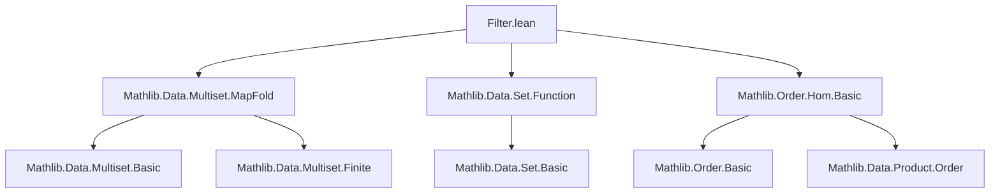

### Technical Brief: `Filter.lean` — Multiset Filtering and Mapping

---

#### **1. Key Definitions & Theorems**

| Name | Type / Signature | Purpose |
|------|------------------|---------|
| `filter p s` | `Multiset α` | Extracts elements of `s` satisfying predicate `p`, preserving multiplicities. |
| `filterMap f s` | `Multiset β` | Applies partial function `f : α → Option β`, collecting `some b` results as `b`. |
| `mem_filter` | `a ∈ filter p s ↔ a ∈ s ∧ p a` | Characterizes membership in filtered multiset. |
| `filter_cons_of_pos/neg` | `p a → filter p (a ::ₘ s) = a ::ₘ filter p s` / `¬p a → ... = filter p s` | Recursive behavior of `filter` on cons. |
| `filter_eq_self` | `filter p s = s ↔ ∀ a ∈ s, p a` | When filtering does nothing. |
| `filter_eq_nil` | `filter p s = 0 ↔ ∀ a ∈ s, ¬p a` | When filtering yields empty. |
| `filter_filter` | `filter p (filter q s) = filter (λ a ↦ p a ∧ q a) s` | Nested filtering = conjunction of predicates. |
| `filter_comm` | `filter p (filter q s) = filter q (filter p s)` | Filtering commutes (due to `∧` commutativity). |
| `filter_add_filter` | `filter p s + filter q s = filter (p ∨ q) s + filter (p ∧ q) s` | Distributivity of `+` over `filter`. |
| `filter_add_not` | `filter p s + filter (¬p) s = s` | Partition of `s` by `p` and its negation. |
| `filterMap_cons_some/none` | `f a = some b → filterMap f (a ::ₘ s) = b ::ₘ filterMap f s` / `f a = none → ... = filterMap f s` | Recursive behavior of `filterMap`. |
| `filterMap_eq_filter` | `filterMap (Option.guard p) = filter p` | `filter` is a special case of `filterMap`. |
| `filterMap_filterMap` | `filterMap g (filterMap f s) = filterMap (λ x ↦ (f x).bind g) s` | Associativity of `filterMap`. |
| `count_filter_of_pos/neg` | `p a → count a (filter p s) = count a s` / `¬p a → count a (filter p s) = 0` | Multiplicity under filtering. |
| `count_filter` | `count a (filter p s) = if p a then count a s else 0` | Unified multiplicity formula. |
| `filter_eq'` | `s.filter (· = b) = replicate (count b s) b` | Filtering by equality yields repeated element. |
| `map_filter_eq_filterMap` | `map f (filter p s) = filterMap (λ a ↦ if p a then some (f a) else none) s` | `map` on filtered multiset = `filterMap`. |
| `filter_sub` | `filter p (s - t) = filter p s - filter p t` | Compatibility of `filter` with multiset subtraction. |
| `sub_filter_eq_filter_not` | `s - s.filter p = filter (¬p) s` | Complement via subtraction. |
| `count_map_eq_count'` | `f.injective ⇒ (s.map f).count (f x) = s.count x` | Injective `map` preserves multiplicities. |
| `map_count_True_eq_filter_card` | `(s.map p).count True = card (s.filter p)` | Counting `True` in image = cardinality of filtered set. |
| `filter_attach` / `filter_attach'` | Relates filtering on `s.attach` to filtering on `s`. | Technical lemma for attaching proofs to elements. |
| `Nodup.filter` | `Nodup s → Nodup (filter p s)` | Filtering preserves distinctness. |
| `Nodup.erase_eq_filter` | `Nodup s → s.erase a = filter (≠ a) s` | Erasure = filtering out a specific element. |

---

#### **2. Naming Conventions**

- **Predicates**: `p`, `q`, `P`, `Q`
- **Multisets**: `s`, `t`, `u`
- **Elements**: `a`, `b`, `x`, `y`
- **Functions**: `f`, `g`
- **Lists (when lifted)**: `l`, `l₁`, `l₂`
- **Predicates on elements**:
  - `is_`, `mem_`, `count_`, `filter_`, `filterMap_`, `map_`, `sub_`, `card_`, `attach_`, `nodup_`
- **Suffixes**:
  - `_of_pos` / `_of_neg`: conditional behavior based on predicate truth.
  - `_congr`: congruence lemmas (e.g., `filter_congr`).
  - `_comm`: commutativity (e.g., `filter_comm`).
  - `_eq_self` / `_eq_nil`: characterizations of when result equals input or empty.
  - `_le_filter`, `_filter_le`: relational lemmas with `≤`.
  - `_map`, `_filterMap`, `_sub`: interaction lemmas with other operations.

---

#### **3. Tactic Stack**

- **Core proof automation**:
  - `rfl`, `simp`, `simp_rw`, `congr`, `ext`, `induction`, `cases`
- **Multiset-specific**:
  - `Quot.inductionOn`, `Quotient.inductionOn`, `Multiset.induction_on`
  - `filter_sublist.subperm`, `subperm.antisymm`, `card_le_card`, `card_eq_zero`
- **Decision procedures**:
  - `by_cases`, `split_ifs`, `by_contra!`, `decide`
- **Set/Logic**:
  - `subset_of_le`, `le_antisymm`, `le_iff_count`, `mem_filter.1/2`, `and_comm`, `and_imp`
- **List lifting**:
  - `congr_arg ofList`, `List.filter_append`, `List.filterMap_filterMap`, etc.

---

#### **4. Proof Logic**

- **Structure**:
  - Most proofs use **quotient induction** (`Quot.inductionOn`) to reduce to lists.
  - Then apply known `List` lemmas (e.g., `List.filter_append`, `List.filterMap_cons_some`).
  - For induction over multisets: `Multiset.induction_on` (empty + cons).
- **Common patterns**:
  - **Case analysis** on `p a` / `f a = some b` / `f a = none`.
  - **Equational reasoning** via `simp` + `congr` + `rw`.
  - **Cardinality arguments** for equality (`card_le_card`, `eq_of_length_eq_zero`).
  - **Injectivity** used to lift `map`-preservation results (`count_map_eq_count'`).
- **Decidability assumptions**:
  - `DecidablePred p` / `DecidableEq α` are pervasive; often introduced via `[...]` and used implicitly in `if ... then ... else`.

---

#### **5. Imports**

| Module | Purpose |
|--------|---------|
| `Mathlib.Data.Multiset.MapFold` | Core multiset definitions, operations, and induction. |
| `Mathlib.Data.Set.Function` | Set-theoretic operations on functions (e.g., `Set.InjOn`). |
| `Mathlib.Order.Hom.Basic` | Order embeddings (`OrderEmbedding`), used in `mapEmbedding`. |

---

#### **6. Theory Overview & Dependencies**

##### **Mermaid Diagrams**



```mermaid
graph LR
  subgraph Core
    M[Multiset]
    F[filter]
    FM[filterMap]
    C[count]
    M'[(map)]
  end

  subgraph Relations
    F -->|mem_filter| M
    FM -->|mem_filterMap| M
    C -->|count_filter| F
    M' -->|map_filter_eq_filterMap| F
    F -->|filter_add_not| FM
  end

  subgraph Algebra
    F -->|filter_sub| -
    F -->|filter_add| +
  end

  subgraph Order
    F -->|filter_le| ≤
    F -->|monotone_filter_left| Monotone
    M' -->|map_le_map_iff| ≤
  end

  subgraph Cardinality
    F -->|card_filter_le_iff| card
    C -->|countP_eq_card_filter| card
    M' -->|map_count_True_eq_filter_card| card
  end
```

##### **Summary**

- **Scope**: Formalization of multiset filtering and partial mapping (`filter`, `filterMap`), with connections to:
  - **Cardinality** (`card`, `count`, `countP`)
  - **Order theory** (`≤`, `Monotone`, `OrderEmbedding`)
  - **Set theory** (`mem`, `subset`, `InjOn`)
  - **List lifting** (via `Quot.liftOn`)
- **Key insight**: Multisets are treated as quotient of lists; all properties are proven via list analogues + quotient coherence.
- **Applications**: Used throughout Mathlib for reasoning about collections with multiplicities, especially in combinatorics, probability, and formal verification.

--- 

Let me know if you'd like a dependency graph for specific lemmas (e.g., `count_map_eq_count'`) or a tactic trace for a representative proof.
