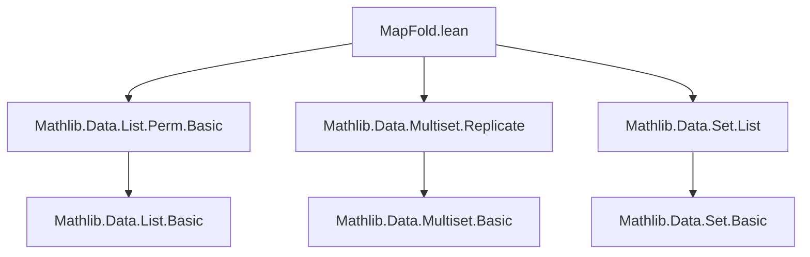

**Technical Brief: `MapFold.lean` — Multiset Mapping and Folding in Lean 4**

---

### 1. **Key Definitions & Theorems**

| Name | Type / Signature | Purpose |
|------|------------------|---------|
| `map` | `map : (α → β) → Multiset α → Multiset β` | Applies a function to each element of a multiset, preserving multiplicities. |
| `foldl` | `foldl : (β → α → β) [RightCommutative f] → β → Multiset α → β` | Left fold over a multiset; well-defined when `f` is right-commutative. |
| `foldr` | `foldr : (α → β → β) [LeftCommutative f] → β → Multiset α → β` | Right fold over a multiset; well-defined when `f` is left-commutative. |
| `mem_map` | `b ∈ map f s ↔ ∃ a, a ∈ s ∧ f a = b` | Characterizes membership in the image multiset. |
| `card_map` | `card (map f s) = card s` | Mapping preserves cardinality. |
| `map_id` | `map id s = s` | Identity preservation. |
| `map_map` | `map g (map f s) = map (g ∘ f) s` | Functoriality of `map`. |
| `map_const` | `map (const α b) s = replicate (card s) b` | Mapping a constant function yields a replicate multiset. |
| `map_injective` | `Function.Injective f → Function.Injective (map f)` | Injective functions lift to injective multiset maps. |
| `map_surjective_of_surjective` | `Function.Surjective f → Function.Surjective (map f)` | Surjective functions lift to surjective multiset maps. |
| `foldl_swap` / `foldr_swap` | `foldl f b s = foldr (fun x y ↦ f y x) b s` | Equivalence between left/right folds under commutativity. |
| `nodup_map_iff_of_injective` | `Nodup (map f s) ↔ Nodup s` when `f` injective | Injective maps preserve and reflect distinctness. |
| `Rel.map` lemmas | `Rel r (s.map f) t ↔ Rel (fun a b ↦ r (f a) b) s t` | Relates relational lifting through `map`. |
| `map_eq_map` | `s.map f = t.map f ↔ s = t` under injectivity of `f` | Injective `map` is injective on multisets. |
| `exists_multiset_eq_map_quot_mk` | Every multiset over a quotient lifts via `Quot.mk`. | Key for induction on quotient multisets. |

---

### 2. **Naming Conventions**

- **Prefixes**:
  - `map_`, `foldl_`, `foldr_`: Core operations.
  - `mem_`, `card_`, `nodup_`, `rel_`: Properties or predicates.
  - `coe_`: Coercion lemmas (e.g., `coe_foldl`, `attach_map_val`).
  - `eq_`, `le_`, `lt_`, `subset_`: Order/inequality lemmas.
  - `of_`, `on_`, `iff_`, `swap`: Structural or logical variants.

- **Suffixes**:
  - `_congr`, `_hcongr`: Congruence lemmas.
  - `_mono`, `_strictMono`: Monotonicity.
  - `_induction`, `_induction'`: Induction principles.
  - `_attach`, `_quot`, `_sub`: Contextual variants (e.g., `attach_map_val`, `map_mk_eq_map_mk_of_rel`).

- **Special**:
  - `simpNF` linter override (`[simp 1100, nolint simpNF]`) for `mem_map_of_injective`.

---

### 3. **Tactic Stack**

Frequent tactics used:

| Tactic | Usage |
|--------|-------|
| `induction` | Multiset induction (`Multiset.induction_on`, `List`-based). |
| `simp` / `simp only` | Simplification using `@[simp]` lemmas (e.g., `map_cons`, `foldl_cons`). |
| `rw` / `rwa` | Rewriting using equalities, often with `mem_map`, `map_map`, etc. |
| `exact`, `refine`, `apply` | Goal-directed proof construction. |
| `congr_arg` | Proving equality of composite terms. |
| `ext` | Extensionality for multiset equality (via `mem_map`). |
| `aesop` | Automated reasoning in `map_eq_map_of_bij_of_nodup`. |
| `cases` / `rcases` / `obtain` | Decomposing existential or conjunction hypotheses. |
| `subst`, `convert`, `lift` | Substitution and lifting via `CanLift`. |
| `quotientinduction` / `Quot.inductionOn` | Proving properties on `Multiset` (as a quotient of `List`). |

---

### 4. **Proof Logic**

- **Structure**:
  - Most proofs use **quotient induction** (`Quot.inductionOn`) to reduce to `List` lemmas.
  - For `foldl`/`foldr`, proofs rely on **commutativity assumptions** (`RightCommutative`, `LeftCommutative`) to ensure well-definedness.
  - Induction principles (`foldr_induction`, `foldl_induction`) follow standard multiset induction with inductive hypotheses on `s`.
  - `nodup` lemmas often use `List.Nodup` facts and lift via quotient.
  - `Rel` lemmas use `Rel.recOn` and `rel_flip` to reduce to cons-case reasoning.

- **Typical Flow**:
  1. Reduce to `List` via `Quot.inductionOn`.
  2. Apply known `List` lemmas (`List.map_map`, `List.foldl_append`, etc.).
  3. Reconstruct multiset-level result using `Quot.sound` or `congr_arg`.
  4. For injectivity/surjectivity: use `mem_map` ↔ and `hf` to construct preimages/inverses.

---

### 5. **Imports**

- `Mathlib.Data.List.Perm.Basic`: Permutation and list properties.
- `Mathlib.Data.Multiset.Replicate`: `replicate`, `card`, basic multiset arithmetic.
- `Mathlib.Data.Set.List`: Set-theoretic operations on lists/multisets.

> **Note**: The file is self-contained for `map`/`fold` theory, but relies on `List` and `Quot` infrastructure.

---

### 6. **Mermaid Diagrams**

#### **Dependency Graph (Module-Level)**



#### **Overview of Theory Scope**

```mermaid
flowchart LR
  subgraph Multiset
    M[Multiset α]
    map[map f s]
    foldl[foldl f b s]
    foldr[foldr f b s]
  end

  subgraph Properties
    mem[mem_map]
    card[card_map]
    nodup[Nodup preservation]
    rel[Rel lifting]
  end

  subgraph Equivalences
    map_id[map id = id]
    map_map[map g ∘ map f = map (g ∘ f)]
    fold_swap[foldl ↔ foldr]
  end

  subgraph Applications
    quot[Quotient lifting]
    attach[attach & erase]
    sub[Subtraction via fold_erase]
  end

  M --> map
  M --> foldl
  M --> foldr
  map --> mem
  map --> card
  map --> nodup
  map --> rel
  foldl --> fold_swap
  foldr --> fold_swap
  map --> quot
  map --> attach
  foldl --> sub
```

---

### 7. **Key Insights**

- **Well-definedness**: `map` is defined via quotient lift; `foldl`/`foldr` require commutativity to be independent of list representation.
- **Injectivity ↔ Nodup preservation**: Critical for reasoning about distinctness in image multisets.
- **Quotient lifting**: Enables induction on `Multiset (Quot r)` via `exists_multiset_eq_map_quot_mk`.
- **Functional extensionality**: `map_congr`, `map_hcongr` allow reasoning up to pointwise equality.
- **Subtraction**: `s - t = foldl erase s t` connects multiset subtraction to folds.

---

**End of Brief**
