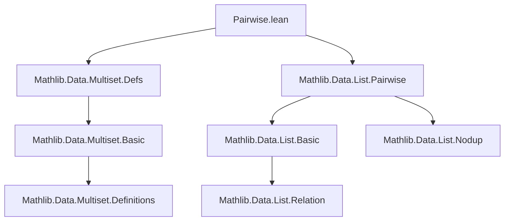
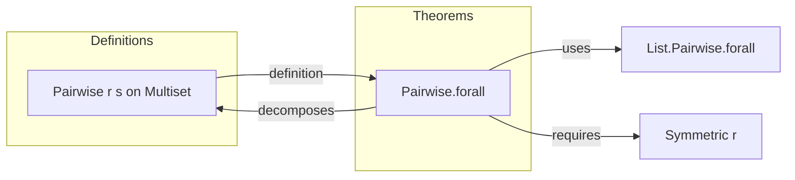

**Technical Brief: `Pairwise.lean` (Multiset.Pairwise Module)**

---

### 1. **Key Definitions & Theorems**

| Name | Type | Purpose |
|------|------|---------|
| `Multiset.Pairwise` | `r : α → α → Prop → s : Multiset α → Prop` | *Defined elsewhere* (`Mathlib.Data.Multiset.Defs`), expresses that all *distinct* elements in `s` are related by `r`. |
| `Multiset.Pairwise.forall` | `Symmetric r → Pairwise r s → ∀ a ∈ s, ∀ b ∈ s, a ≠ b → r a b` | Converts `Pairwise r s` (which is defined via a list representation) into a universal statement over *all* pairs of distinct elements in the multiset, assuming symmetry of `r`. |

---

### 2. **Naming Conventions**

- **Prefixes**:  
  - `Pairwise.` — standard prefix for multiset/list properties involving pairwise relations.  
- **Suffixes**:  
  - `.forall` — indicates a theorem that rewrites a relational property over a structure into a universal quantification over its elements.  
- **Variable naming**:  
  - `α`, `r`, `s`, `a`, `b` — conventional for type, relation, multiset, and elements.  
  - `H`, `hs` — typical for hypotheses (e.g., `H : Symmetric r`, `hs : Pairwise r s`).

---

### 3. **Tactic Stack**

- **`let ⟨_, hl₁, hl₂⟩ := hs`**  
  - Destructures the definition of `Pairwise` (which is defined as `∃ l : List α, l.Nodup ∧ l.map coe = s ∧ ∀ x ∈ l, ∀ y ∈ l, x ≠ y → r x y`).
- **`.symm ▸`**  
  - Uses symmetry of `r` to flip a relation (`r b a → r a b`).
- **`.forall`**  
  - Applies the `forall` lemma from the underlying list (`hl₂.forall H`), which is likely `List.Pairwise.forall` (not shown here but assumed).

No high-level automation tactics (`aesop`, `ring`, `simp`) appear in this snippet — proof is *constructive and low-level*.

---

### 4. **Proof Logic**

- **Strategy**:  
  1. Unpack the definition of `Pairwise r s` as existence of a nodup list `l` representing `s`.  
  2. Use symmetry (`H`) to convert the list-based pairwise condition (`∀ x y ∈ l, x ≠ y → r x y`) into a statement about multiset elements.  
  3. Apply the list version (`hl₂.forall H`) to get the desired universal quantification over multiset membership.

- **Key Insight**:  
  Since `Pairwise` on multisets is defined via a *list* representation (with `Nodup`), symmetry is required to lift the list-based pairwise property to the multiset level (where elements may repeat but are treated as distinct in membership).

---

### 5. **Imports**

| Import | Role |
|--------|------|
| `Mathlib.Data.List.Pairwise` | Provides `List.Pairwise` and related lemmas (e.g., `List.Pairwise.forall`). |
| `Mathlib.Data.Multiset.Defs` | Defines `Multiset.Pairwise` (via `∃ l : List α, l.Nodup ∧ l.map coe = s ∧ Pairwise r l`). |

---

### 6. **Dependency & Theory Overview**

#### Mermaid Diagram: Theoretical Dependencies

#### Mermaid Diagram: File Overview

---

### Summary

This file is a *minimal but critical* bridge between the list-based definition of `Pairwise` and its multiset semantics. It ensures that when `r` is symmetric, `Pairwise r s` for a multiset `s` implies the intuitive property: *any two distinct elements of `s` are related by `r`*. The proof is short but relies on careful unpacking of the multiset representation and symmetry.
