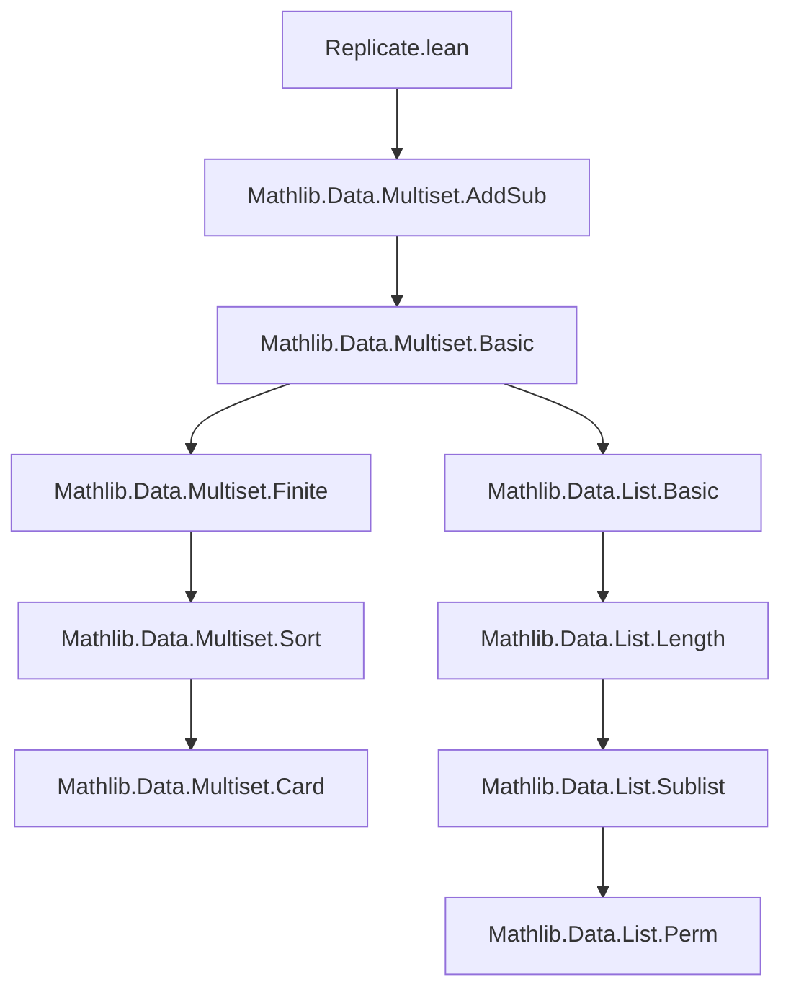

### Technical Brief: `Replicate.lean` — Multiset Replication in Lean 4 / Mathlib

---

#### **1. Key Definitions & Theorems**

| Name | Type / Signature | Purpose |
|------|------------------|---------|
| `replicate` | `ℕ → α → Multiset α` | Constructs a multiset with a single element `a` repeated `n` times. Defined as `List.replicate` coerced to `Multiset`. |
| `coe_replicate` | `(List.replicate n a : Multiset α) = replicate n a` | Justifies coercion from list to multiset. |
| `replicate_zero` | `replicate 0 a = 0` | Base case: empty multiset. |
| `replicate_succ` | `replicate (n + 1) a = a ::ₘ replicate n a` | Recursive construction via multiset cons. |
| `replicate_add` | `replicate (m + n) a = replicate m a + replicate n a` | Additivity of replication over natural addition. |
| `replicate_one` | `replicate 1 a = {a}` | Singleton multiset. |
| `card_replicate` | `card (replicate n a) = n` | Cardinality matches repetition count. |
| `mem_replicate` | `b ∈ replicate n a ↔ n ≠ 0 ∧ b = a` | Membership characterization. |
| `eq_of_mem_replicate` | `b ∈ replicate n a → b = a` | All elements in a replicate are equal to the replicated value. |
| `eq_replicate_card` | `s = replicate (card s) a ↔ ∀ b ∈ s, b = a` | Characterization of multisets with all equal elements. |
| `eq_replicate` | `s = replicate n a ↔ card s = n ∧ ∀ b ∈ s, b = a` | Refined version of above, with explicit cardinality. |
| `replicate_right_injective` | `n ≠ 0 ⇒ Injective (replicate n ·)` | Right-injectivity (same count ⇒ same element). |
| `replicate_right_inj` | `n ≠ 0 ⇒ replicate n a = replicate n b ↔ a = b` | Equational form of right-injectivity. |
| `replicate_left_injective` | `Injective (replicate · a)` | Left-injectivity (same element ⇒ different counts give different multisets). |
| `replicate_subset_singleton` | `replicate n a ⊆ {a}` | Replicate is contained in singleton multiset. |
| `replicate_le_coe` | `replicate n a ≤ l ↔ List.replicate n a <+ l` | Submultiset relation to sublist. |
| `replicate_le_replicate` | `replicate k a ≤ replicate n a ↔ k ≤ n` | Submultiset order corresponds to natural order. |
| `replicate_mono` | `k ≤ n ⇒ replicate k a ≤ replicate n a` | Monotonicity of replication in count. |
| `le_replicate_iff` | `m ≤ replicate n a ↔ ∃ k ≤ n, m = replicate k a` | Submultisets of a replicate are themselves replicates. |
| `lt_replicate_succ` | `m < replicate (n + 1) x ↔ m ≤ replicate n x` | Strict inequality characterization. |
| `count_replicate_self` | `count a (replicate n a) = n` | Multiplicity of the replicated element equals count. |
| `count_replicate` | `count a (replicate n b) = if b = a then n else 0` | General multiplicity formula. |
| `le_count_iff_replicate_le` | `n ≤ count a s ↔ replicate n a ≤ s` | Bridge between multiplicity and submultiset order. |
| `rel_replicate_left/right` | `Rel`-based characterizations of homomorphism-like behavior | Used for lifting relations to multisets. |
| `nodup_iff_le`, `nodup_iff_ne_cons_cons`, `nodup_iff_pairwise` | Various equivalent characterizations of `Nodup` | Key for reasoning about distinctness in multisets. |

---

#### **2. Naming Conventions**

- **Prefixes**:
  - `replicate_`: All functions/theorems related to replication.
  - `rel_`: For relational lifting lemmas (`rel_replicate_left`, `rel_replicate_right`).
  - `nodup_`: For distinctness properties (`nodup_iff_*`).
- **Suffixes**:
  - `_self`: When element matches the replicated one (`count_replicate_self`).
  - `_left` / `_right`: For left/right arguments in binary relations.
  - `_iff`: When equivalence (↔) is the main result.
  - `_mono`, `_injective`, `_inj`: For monotonicity/injectivity properties.

---

#### **3. Tactic Stack**

Frequently used tactics in proofs:
- `rfl`, `congr_arg`, `rw`, `simp`, `simp_rw`
- `convert` (for equational reasoning with definitional equality gaps)
- `exact`, `intro`, `cases`, `obtain`, `rwa`
- `Quot.inductionOn`, `Quotient.inductionOn` (for reasoning on quotient types like `Multiset`)
- `rel_flip`, `rel_of_forall`, `forall_congr'` (for relational reasoning)
- `card_eq_card_of_rel`, `card_mono`, `card_replicate` (cardinality lemmas)
- `sublist.`, `subperm`, `perm_replicate` (list/multiset permutation machinery)

---

#### **4. Proof Logic**

- **Inductive/Quotient Reasoning**: Most proofs about `Multiset` use `Quot.inductionOn` to reduce to list-level reasoning.
- **Equational Reasoning**: Heavy use of `rw`, `congr_arg`, and `convert` to manipulate definitions.
- **Case Analysis**: On `n = 0` or `n ≠ 0`, or on membership (`mem_replicate`).
- **Bidirectional Characterizations**: Many theorems are stated as `↔` (e.g., `le_count_iff_replicate_le`) and proven via two-directional implications.
- **Cardinality as a Proxy**: Many proofs rely on `card` to relate size and structure (e.g., `eq_replicate_card`, `le_replicate_iff`).
- **Relational Lifting**: `Rel`-based lemmas (`rel_replicate_left/right`) use `forall` quantifiers over elements and cardinality equalities.

---

#### **5. Imports & Dependencies**

- **Core**:
  - `Mathlib.Data.Multiset.AddSub` — Provides multiset addition/subtraction and basic structure.
- **Open Sections**:
  - `List`, `Subtype`, `Nat`, `Function` — Used for list-based definitions and properties.
- **Assumptions**:
  - `[DecidableEq α]` — Required for `count` and related multiplicity operations.
  - Universe polymorphism: `universe v` for type variables.

---

#### **6. Theory Overview & Dependencies**

##### **Mermaid Diagram: Module Dependencies**



##### **Mermaid Diagram: Theoretical Flow**

```mermaid
graph TD
  A[List.replicate] --> B[coe → Multiset.replicate]
  B --> C[Basic properties: zero, succ, add]
  C --> D[Cardinality & membership]
  D --> E[Equality & injectivity]
  E --> F[Submultiset order (≤, <)]
  F --> G[Multiplicity & count]
  G --> H[Relational lifting]
  H --> I[Nodup characterizations]
  I --> J[Applications: distinctness, pairwise]
```

##### **Role in Mathlib**

- `replicate` is foundational for:
  - Defining constant multisets.
  - Reasoning about multiplicities and counting.
  - Constructing examples and counterexamples in multiset algebra.
  - Lifting properties from lists to multisets.
- Used extensively in:
  - `Mathlib.Data.Multiset.Card`
  - `Mathlib.Data.Multiset.Sort`
  - `Mathlib.Data.Multiset.Finite`
  - Formalizations of combinatorics and data structures.

---

#### **7. Notable Design Choices**

- **No algebraic assumptions**: Explicitly avoids `Monoid` requirement — `replicate` is defined purely via lists.
- **List-based definition**: Leverages `List.replicate` and coercion, enabling reuse of list lemmas.
- **Decidable equality**: Required for `count`, but not for core `replicate` properties — modular design.
- **Equational vs. relational reasoning**: Dual perspectives (element-wise and order-theoretic) are fully developed.

--- 

Let me know if you'd like a formalized dependency graph (e.g., for `leanpkg` or `doc-gen`) or a proof sketch of a key theorem like `le_replicate_iff`.
