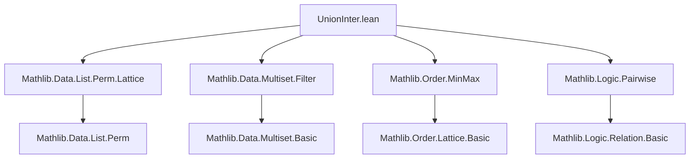
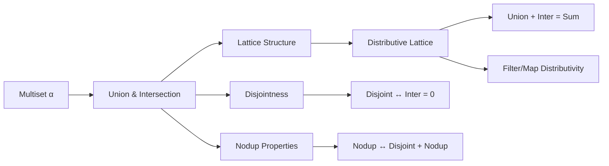

### Technical Brief: `UnionInter.lean`

---

#### **1. Key Definitions & Theorems**

| Name | Type / Signature | Purpose |
|------|------------------|---------|
| `union` | `Multiset α → Multiset α → Multiset α` | Defines multiset union as `s - t + t`; corresponds to pointwise `max` on multiplicities. |
| `inter` | `Multiset α → Multiset α → Multiset α` | Defines multiset intersection via `bagInter` on lists; corresponds to pointwise `min` on multiplicities. |
| `instLattice` | `Lattice (Multiset α)` | Constructs the lattice structure: `⊔ = ∪`, `⊓ = ∩`. |
| `instDistribLattice` | `DistribLattice (Multiset α)` | Proves distributivity: $s ∪ (t ∩ u) = (s ∪ t) ∩ (s ∪ u)$ and dually. |
| `union_comm`, `inter_comm` | `s ∪ t = t ∪ s`, `s ∩ t = t ∩ s` | Commutativity of union and intersection. |
| `union_le`, `le_inter` | `s ≤ u ∧ t ≤ u ↔ s ∪ t ≤ u`, `s ≤ t ∧ s ≤ u ↔ s ≤ t ∩ u` | Universal properties of sup/inf. |
| `mem_union`, `mem_inter` | `a ∈ s ∪ t ↔ a ∈ s ∨ a ∈ t`, `a ∈ s ∩ t ↔ a ∈ s ∧ a ∈ t` | Membership characterizations. |
| `count_union`, `count_inter` | `count a (s ∪ t) = max (count a s) (count a t)`, `count a (s ∩ t) = min (count a s) (count a t)` | Multiplicity semantics. |
| `union_add_inter` | `s ∪ t + s ∩ t = s + t` | Key distributive law linking union, intersection, and addition. |
| `inter_eq_zero_iff_disjoint` | `s ∩ t = 0 ↔ Disjoint s t` | Connects intersection with disjointness. |
| `add_eq_union_iff_disjoint` | `s + t = s ∪ t ↔ Disjoint s t` | Addition equals union iff multisets are disjoint. |
| `nodup_union` | `Nodup (s ∪ t) ↔ Nodup s ∧ Nodup t` | Union preserves list-like behavior (no duplicates) iff both operands do. |

---

#### **2. Naming Conventions**

- **Prefixes**:
  - `union_`, `inter_`: for union/intersection lemmas.
  - `mem_`, `count_`, `filter_`, `map_`: for semantic properties.
  - `disjoint_`: for disjointness-related results.
  - `nodup_`: for uniqueness/duplicate-freeness.
- **Suffixes**:
  - `_left`, `_right`: indicate which argument is fixed in monotonicity or distributivity.
  - `_distrib`: for distributive laws (e.g., `union_add_distrib`, `inter_add_distrib`).
  - `_iff`: for biconditional characterizations (e.g., `union_le_iff`, `mem_inter`).
- **Infix notation**:
  - `∪`, `∩` for union and intersection (via `Union`/`Inter` instances).
  - `⊔`, `⊓` for lattice sup/inf (via `sup_eq_union`, `inf_eq_inter`).

---

#### **3. Tactic Stack**

- **Core tactics**:
  - `rw`, `simp`, `refine`, `induction`, `cases`
- **Domain-specific simplifiers**:
  - `Multiset.count_add`, `Multiset.count_union`, `Multiset.count_inter`, `Multiset.ext`
- **Automation**:
  - `aesop`, `omega`, `tauto`, `congr_arg`, `ext`
- **Induction patterns**:
  - `Multiset.induction_on`, `Multiset.induction_on ... with | empty | cons`
- **Quotient reasoning**:
  - `Quotient.induction_on`, `Quot.sound`

---

#### **4. Proof Logic**

- **Structure**:
  - **Definition-first**: `union`, `inter` defined via list operations (`-`, `+`, `bagInter`), then lifted to multisets.
  - **Semantic lemmas first**: `mem_union`, `mem_inter`, `count_union`, `count_inter` established early to justify lattice structure.
  - **Lattice construction**: `instLattice` uses `union_le`, `le_inter`, etc., to verify lattice axioms.
  - **Distributivity**: `instDistribLattice` proves $ \max(a, \min(b,c)) = \min(\max(a,b), \max(a,c)) $ via `max_min_distrib_left`.
  - **Inductive proofs**: Many properties (e.g., `le_inter`, `nodup_union`) use `Multiset.induction_on`.
  - **Extensionality**: `ext` + `count`-based reasoning is standard for equality proofs.

- **Typical flow**:
  1. Reduce to list-level via `Quotient.induction_on`.
  2. Use `List` lemmas (e.g., `bagInter_sublist_left`, `cons_bagInter_*`).
  3. Lift back to multisets.
  4. For multiplicity-based goals: `ext`, `simp [count_*]`, then `omega`/`ring`.

---

#### **5. Imports**

| Module | Purpose |
|--------|---------|
| `Mathlib.Data.List.Perm.Lattice` | Permutation-based lattice structure on lists; used for `bagInter` properties. |
| `Mathlib.Data.Multiset.Filter` | Filtering and `filter`-related lemmas. |
| `Mathlib.Order.MinMax` | `max`, `min`, lattice-theoretic properties (e.g., `max_min_distrib_left`). |
| `Mathlib.Logic.Pairwise` | `Pairwise` and `Disjoint` reasoning. |

---

#### **8. Theory Dependency & Overview**

##### **Mermaid Diagram: Theory Dependencies**

##### **Mermaid Overview of File Structure**

##### **Summary**

This file equips `Multiset α` with a **distributive lattice** structure where:
- Union (`∪`) is the **supremum** (pointwise `max`),
- Intersection (`∩`) is the **infimum** (pointwise `min`),
- Addition (`+`) is the **monotone** operation (pointwise sum),
- Disjointness (`Disjoint`) characterizes when `+` coincides with `∪`.

It bridges multiset algebra with order-theoretic and combinatorial reasoning, enabling use of lattice theory (e.g., distributivity, modular laws) in multiset contexts. The proofs rely heavily on multiplicity-based extensionality (`ext` via `count`) and inductive reasoning over multisets.

--- 

Let me know if you'd like a formalized dependency graph (e.g., in `.dot` format) or a summary of how this fits into the broader `Mathlib` multiset hierarchy.
