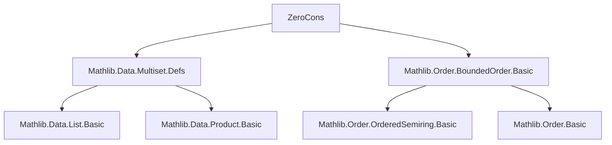

### Technical Brief: `ZeroCons.lean` — Multiset Constructors and Basic Properties

---

#### **1. Key Definitions & Theorems**

| Name | Type / Signature | Purpose |
|------|------------------|---------|
| `Multiset.zero` | `Multiset α` | Defines the empty multiset as `nil` under the quotient construction. |
| `instance Zero (Multiset α)` | `Zero (Multiset α)` | Provides `0 : Multiset α`. |
| `Multiset.cons` | `α → Multiset α → Multiset α` | Adds one occurrence of an element to a multiset. |
| `infixr ::ₘ` | `a ::ₘ s` | Notation for `cons a s`. |
| `instance Insert α (Multiset α)` | `Insert α (Multiset α)` | Links `insert a s` to `a ::ₘ s`. |
| `instance Singleton α (Multiset α)` | `Singleton α (Multiset α)` | Defines `{a} := a ::ₘ 0`. |
| `Multiset.induction` | `p 0 → (∀ a s, p s → p (a ::ₘ s)) → ∀ s, p s` | Structural induction on multisets. |
| `Multiset.rec`, `Multiset.recOn` | Dependent recursor on multisets | Enables definition by recursion on multiset structure, with coherence condition `C_cons_heq`. |
| `mem_cons` | `a ∈ b ::ₘ s ↔ a = b ∨ a ∈ s` | Membership characterization for `::ₘ`. |
| `eq_zero_of_forall_notMem` | `(∀ x, x ∉ s) → s = 0` | Characterizes emptiness via non-membership. |
| `card_cons` | `card (a ::ₘ s) = card s + 1` | Cardinality increment under `::ₘ`. |
| `Rel` | `r : α → β → Prop → Multiset α → Multiset β → Prop` | Lifts binary relation `r` to multisets via one-to-one correspondence. |
| `Rel.trans` | `IsTrans r → Rel r s t → Rel r t u → Rel r s u` | Transitivity of `Rel` under transitive `r`. |
| `rel_eq` | `Rel (· = ·) s t ↔ s = t` | Equality of multisets corresponds to `Rel` under equality. |
| `subset_cons`, `cons_subset` | Subset relations for `::ₘ` | Characterizes inclusion in/under cons. |
| `lt_cons_self` | `s < a ::ₘ s` | Strict inequality under multiset ordering. |
| `le_singleton`, `lt_singleton` | `s ≤ {a}`, `s < {a}` | Full description of sub-singleton multisets. |

---

#### **2. Naming Conventions**

- **Prefixes**:
  - `cons_`: operations involving `::ₘ` (e.g., `cons_inj_left`, `cons_subset`, `cons_le_cons`).
  - `card_`: cardinality-related lemmas (e.g., `card_cons`, `card_eq_one`).
  - `rel_`: properties of `Rel` (e.g., `rel_flip`, `rel_cons_left`, `rel_eq`).
  - `nodup_`: properties of `Nodup` (e.g., `nodup_cons`, `Nodup.of_cons`).
  - `mem_`: membership lemmas (e.g., `mem_cons`, `mem_singleton`, `mem_cons_of_mem`).
  - `zero_`: properties of the empty multiset (e.g., `zero_subset`, `zero_le`, `zero_ne_cons`).
  - `singleton_`: properties of `{a}` (e.g., `singleton_inj`, `singleton_subset`).

- **Suffixes**:
  - `_iff`: equivalence characterizations (e.g., `cons_inj_left`, `card_eq_zero`, `subset_zero`).
  - `_heq`: coherence conditions for dependent recursion (`C_cons_heq`).
  - `_on`: induction/recursion principles (`induction_on`, `recOn`).

---

#### **3. Tactic Stack**

Frequently used tactics in proofs:

| Tactic | Usage |
|--------|-------|
| `Quot.inductionOn` / `Quotient.inductionOn` | Eliminate quotient-based multiset definitions. |
| `simp` / `simp_rw` | Simplify using `@[simp]` lemmas (e.g., `mem_cons`, `card_cons`). |
| `rfl` | Reflexivity for definitional equalities. |
| `exact` / `intro` / `apply` | Basic proof construction. |
| `rcases` / `obtain` / `cases` | Decompose existential or conjunction hypotheses. |
| `rw` / `rwa` | Rewrite using lemmas or assumptions. |
| `congr'` / `congr 1` | Prove congruence of constructors. |
| `have` / `suffices` | Introduce intermediate goals. |
| `induction` / `induction_on` | Structural induction on multisets or lists. |
| `aesop` / `linarith` | Not heavily used here; mostly manual reasoning. |
| `ext` / `funext` | Extensionality for functions/relations (rarely needed due to quotient model). |

---

#### **4. Proof Logic**

- **Inductive Structure**: Proofs rely on the *quotient model* of multisets as lists modulo permutation (`List α / ~`). Thus, most proofs proceed by:
  1. **Lifting** to lists via `Quot.inductionOn`.
  2. Using list lemmas (e.g., `List.mem_cons`, `List.nodup_cons`, `List.length_eq_one`).
  3. **Pushing back** to multisets via `Quot.sound` or `quot_mk_to_coe''`.

- **Induction Principles**:
  - `Multiset.induction` and `Multiset.induction_on` are the primary tools.
  - For dependent recursion (`Multiset.rec`), a coherence condition `C_cons_heq` ensures well-definedness under permutation.

- **Order-Theoretic Reasoning**:
  - Multisets are ordered by `≤` defined via `subperm` (sublist-up-to-permutation).
  - Proofs of `≤`, `<`, `⊂` often reduce to list-theoretic facts like `sublist_cons_self`, `length_lt_length_iff_sublist`.

- **Relational Lifting**:
  - `Rel` is inductively defined; proofs use `Rel.rec` or `induction` on `Rel` hypotheses.
  - Key lemmas like `Rel.trans` require transitivity of the base relation and careful handling of permutations.

---

#### **5. Imports & Dependencies**

| Module | Purpose |
|--------|---------|
| `Mathlib.Data.Multiset.Defs` | Core multiset definitions (quotient model, `coe`, `perm`, etc.). |
| `Mathlib.Order.BoundedOrder.Basic` | Provides `OrderBot`, `bot`, `≤`, `<`, `ssubset`, etc. used for multiset ordering. |
| `List`, `Subtype`, `Nat`, `Function` | Standard libraries used for lifting proofs to multisets. |

> **Note**: No algebraic structures (`Monoid`, `OrderHom`) are imported — this is a *low-level* multiset foundation file.

---

#### **6. Mermaid Diagrams**

##### **Dependency Graph (Top-Level)**



##### **File Overview & Theory Flow**

```mermaid
flowchart LR
  A[Quotient Model of Multisets] --> B[Empty Multiset 0]
  A --> C[Cons a s = a ::ₘ s]
  A --> D[Singleton {a} = a ::ₘ 0]
  B --> E[Membership & Non-Membership]
  C --> E
  D --> E
  E --> F[Induction & Recursion Principles]
  F --> G[Cardinality]
  F --> H[Subset & Order]
  H --> I[Relational Lifting Rel r]
  I --> J[Pairwise & Nodup]
  G --> K[Cardinality ↔ Existence of Elements]
```

##### **Multiset Construction Hierarchy**

```mermaid
graph TD
  List α -->|quotient by ~| Multiset α
  Multiset α --> 0 [Empty: 0]
  Multiset α --> {a} [Singleton: {a}]
  Multiset α --> a ::ₘ s [Cons]
  0 -->|subset| s
  {a} -->|subset| s ↔ a ∈ s
  a ::ₘ s -->|card| card s + 1
  a ::ₘ s -->|order| s < a ::ₘ s
```

---

#### **7. Summary**

`ZeroCons.lean` is a foundational module for multiset reasoning in Lean 4. It establishes:

- **Syntax**: `0`, `{a}`, `a ::ₘ s`.
- **Semantics**: via quotient of lists by permutation.
- **Core Logic**: induction, recursion, membership, cardinality, subset, and relational lifting.
- **Order Theory**: multiset ordering via `subperm`, with `0` as the bottom element.

It serves as the basis for higher-level multiset libraries (e.g., `Multiset.Defs`, `Multiset.Symmetric`, `Multiset.Finset`), ensuring correctness through careful handling of the quotient structure and coherence conditions.

--- 

Let me know if you'd like a formal dependency graph (e.g., `leanpkg` or `lake`-style), or a visualization of `Rel`'s proof structure.
