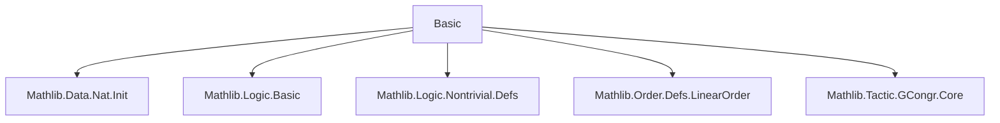
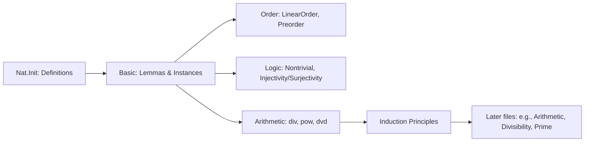

### Technical Brief: `Basic.lean` (Mathlib4)

---

#### **1. Key Definitions & Theorems**

| Name | Type / Signature | Purpose |
|------|------------------|---------|
| `instLinearOrder` | `LinearOrder ℕ` | Establishes `ℕ` as a linearly ordered semiring (via `Nat.le`, `Nat.lt`). |
| `instNontrivial` | `Nontrivial ℕ` | Proves `0 ≠ 1`, ensuring `ℕ` is nontrivial. |
| `succ_injective` | `Injective Nat.succ` | `succ` is injective: `succ a = succ b → a = b`. |
| `div_right_comm` | `a / b / c = a / c / b` | Division is right-commutative (nontrivial, relies on `div_div_eq_div_mul`). |
| `pow_left_injective` | `n ≠ 0 → Injective (λ a, a ^ n)` | Exponentiation with fixed nonzero exponent is injective in base. |
| `pow_right_injective` | `2 ≤ a → Injective (λ n, a ^ n)` | Exponentiation with base ≥ 2 is injective in exponent. |
| `pow_sub_one` | `x ≠ 0 ∧ a ≠ 0 → x^(a-1) = x^a / x` | Relates subtraction in exponent to division (when nonzero). |
| `leRecOn_injective` | Injectivity of bounded recursion under injective step. | Enables reasoning about uniqueness of inductively constructed terms. |
| `leRecOn_surjective` | Surjectivity of bounded recursion under surjective step. | Enables existence of preimages in bounded recursion. |
| `set_induction_bounded` | Bounded induction on subsets closed under `succ`. | Generalizes induction from `k` upward. |
| `set_induction` | Full induction from `0` upward. | Standard induction principle for `ℕ`. |
| `dvd_left_injective` | `Injective ((· ∣ ·) : ℕ → ℕ → Prop)` | Divisibility relation is injective in left argument (i.e., `∀ a, a ∣ m ↔ a ∣ n → m = n`). |
| `dvd_sub_self_left` | `n ∣ n - m ↔ m = 0 ∨ n ≤ m` | Characterizes when `n` divides `n - m`. |
| `dvd_sub_self_right` | `n ∣ m - n ↔ n ∣ m ∨ m ≤ n` | Characterizes when `n` divides `m - n`. |

---

#### **2. Naming Conventions**

- **Prefixes**:
  - `inst*`: Typeclass instances (`instLinearOrder`, `instNontrivial`).
  - `dvd_*`: Divisibility lemmas (`dvd_left_injective`, `dvd_sub_self_left/right`).
  - `pow_*`: Power lemmas (`pow_left_injective`, `pow_right_injective`, `pow_sub_one`).
  - `leRecOn_*`: Bounded recursion lemmas (`leRecOn_injective`, `leRecOn_surjective`).
  - `set_induction*`: Induction principles (`set_induction_bounded`, `set_induction`).

- **Suffixes**:
  - `_left`, `_right`: Argument position in binary operation (e.g., `dvd_left_injective`).
  - `_self`: Self-reference or symmetric case (e.g., `dvd_sub_self_left`).
  - `_injective`, `_surjective`: Proof of injectivity/surjectivity.

- **Other**:
  - `succ_injective`: Standard functional property naming (`_injective`, `_surjective`).
  - `right_comm`: Commutativity-like property where order of operations can be swapped.

---

#### **3. Tactic Stack**

| Tactic | Usage Frequency | Purpose |
|--------|-----------------|---------|
| `simp` | Very High | Simplification using `@[simp]` lemmas, especially for `dvd`, `pow`, `div`. |
| `rw` | High | Rewriting using equalities (e.g., `div_div_eq_div_mul`, `mul_comm`). |
| `induction` | Medium | Structural induction on `Nat.le`, especially in `leRecOn_*` proofs. |
| `rcases` | Medium | Case analysis on `le_or_gt`, `eq_or_ne`, `or` disjunctions. |
| `grind` | Low | Goal-driven simplifier for arithmetic inequalities (used in `dvd_sub_self_left`). |
| `congr_fun` | Low | Used in `dvd_left_injective` to extract pointwise equality. |
| `rwa`, `refine`, `obtain` | Medium | Proof scripting helpers for rewriting, goal construction, and destructuring. |

---

#### **4. Proof Logic**

- **Inductive structure**: Most proofs use induction on `Nat.le` or `Nat` itself (e.g., `leRecOn`, `set_induction`).
- **Case analysis**: Heavy use of `le_or_gt`, `eq_or_ne`, and `or` elimination via `rcases`.
- **Equational reasoning**: Rewriting chains (`rw`) with algebraic laws (`div_div_eq_div_mul`, `pow_le_pow_iff_*`).
- **Logical equivalence**: Many lemmas are `↔`-statements, proven by double implication (`iff_of_eq`, `iff_iff_iff`).
- **Nontriviality & positivity**: Key assumptions like `n ≠ 0`, `2 ≤ a`, `k ≤ n` are used to avoid division-by-zero or degenerate cases.

---

#### **5. Imports**

| Module | Role |
|--------|------|
| `Mathlib.Data.Nat.Init` | Foundational definitions of `ℕ`, `zero`, `succ`, `add`, `mul`, `le`, `lt`, `div`, `mod`, `pow`. |
| `Mathlib.Logic.Basic` | Core logic: `Function`, `Prop`, `Subtype`, `Decidable`, etc. |
| `Mathlib.Logic.Nontrivial.Defs` | `Nontrivial` typeclass. |
| `Mathlib.Order.Defs.LinearOrder` | `LinearOrder`, `Preorder`, `PartialOrder` typeclasses. |
| `Mathlib.Tactic.GCongr.Core` | `gcongr` tactic and attributes (used for monotonicity lemmas like `succ_le_succ`, `div_le_div`). |

---

#### **6. Dependency & Theory Overview (Mermaid Diagrams)**

##### **Module Dependency Graph**

##### **Theoretical Flow Overview**

##### **Key Proof Dependencies**
- `instLinearOrder` depends on `Nat.le_*` lemmas from `Nat.Init`.
- `pow_left_injective`, `pow_right_injective` rely on `pow_le_pow_iff_*` lemmas (likely in `Nat.Init` or `Mathlib.Data.Nat.Lemmas`).
- `dvd_left_injective` uses `dvd_right_iff_eq`, which may be in `Mathlib.Data.Nat.Dvd`.
- `set_induction_bounded` uses `leRecOn`, which is defined in this file.

---

#### **7. Notes**

- **Excluded hierarchy**: The file explicitly avoids importing algebraic structures (`Monoid`, etc.) to keep dependencies minimal.
- **TODO**: `LinearOrder ℕ` instance may be moved to `Order.Nat` (see GitHub PR #13092).
- **Foundational role**: This file serves as a bridge between `Nat.Init` (primitive recursion/induction) and higher-level algebraic/arithmetic developments.

--- 

Let me know if you'd like a formal dependency graph (e.g., `.dot` format) or a list of files that import `Basic.lean`.
