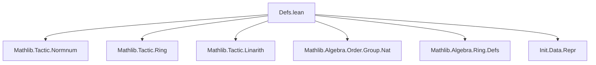
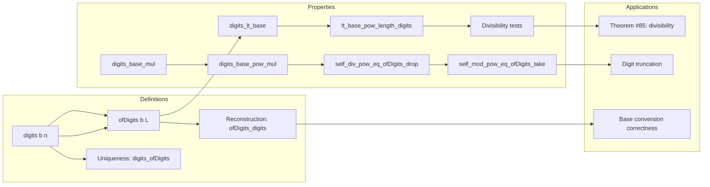
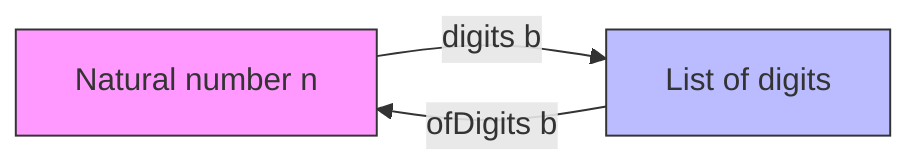

### Technical Brief: `Nat.digits` and `ofDigits` in Lean 4 (from `Defs.lean`)

---

#### **1. Key Definitions & Theorems**

| Name | Type / Signature | Purpose |
|------|------------------|---------|
| `digitsAux0`, `digitsAux1`, `digitsAux` | `ℕ → List ℕ` (auxiliary) | Internal helpers to define `digits` with definitional unfolding; handle special cases `b = 0, 1, ≥2`. |
| `digits : ℕ → ℕ → List ℕ` | `digits b n` | Returns the *little-endian* list of base-`b` digits of `n`. Special cases: `digits 0 n = [n]` (except `[]` for `n=0`), `digits 1 n = [1,1,...,1]` (n times), `digits (b+2) n = n % (b+2) :: digits (b+2) (n / (b+2))`. |
| `ofDigits {α : Type*} [Semiring α] : ℕ → List ℕ → α` | `ofDigits b L` | Interprets list `L` as digits in base `b` (semiring coefficient), i.e., `foldr (λ x y, x + b * y) 0`. |
| `digits_def'` | `1 < b → 0 < n → digits b n = n % b :: digits b (n / b)` | Core recursive definition for bases ≥ 2 and positive `n`. |
| `ofDigits_digits` | `ofDigits b (digits b n) = n` | Reconstruction theorem: interpreting digits of `n` in base `b` gives back `n`. |
| `digits_ofDigits` | `1 < b → (∀ l ∈ L, l < b) → L ≠ [] → L.getLast ≠ 0 → digits b (ofDigits b L) = L` | Inverse reconstruction: digits of a valid digit-list give back the list. |
| `digits.injective` | `Function.Injective (digits b)` | Digits uniquely determine numbers. |
| `digits_inj_iff` | `digits b n = digits b m ↔ n = m` | Immediate corollary of injectivity. |
| `lt_base_pow_length_digits` | `1 < b → n < b ^ (digits b n).length` | Upper bound on `n` in terms of its digit count. |
| `digits_lt_base` | `1 < b → d ∈ digits b n → d < b` | All digits are strictly less than base (for `b ≥ 2`). |
| `digits_base_mul` | `1 < b → 0 < m → digits b (b * m) = 0 :: digits b m` | Multiplying by base appends a zero digit. |
| `digits_base_pow_mul` | `digits b (b^k * m) = replicate k 0 ++ digits b m` | Multiplying by `b^k` prepends `k` zeros. |
| `self_div_pow_eq_ofDigits_drop` | `2 ≤ p → n / p^i = ofDigits p ((p.digits n).drop i)` | Division by `p^i` corresponds to dropping `i` least significant digits. |
| `self_mod_pow_eq_ofDigits_take` | `2 ≤ p → n % p^i = ofDigits p ((p.digits n).take i)` | Modulo by `p^i` corresponds to taking `i` least significant digits. |
| `ofDigits_div_eq_ofDigits_tail`, `ofDigits_div_pow_eq_ofDigits_drop` | Generalizations of above for arbitrary digit lists. |
| `ofDigits_add_ofDigits_eq_ofDigits_zipWith_of_length_eq` | `ofDigits b l1 + ofDigits b l2 = ofDigits b (l1.zipWith (+) l2)` (if same length) | Digit-wise addition corresponds to sum of numbers. |
| `digit_sum_le` | `List.sum (digits p n) ≤ n` | Sum of digits ≤ number (for any base). |
| `ofDigits_monotone` | `p ≤ q → ofDigits p L ≤ ofDigits q L` | Monotonicity of `ofDigits` in base. |
| `toDigits_length`, `repr_length` | Bounds on length of `Nat.toDigits` / `Nat.repr` strings. | Used for complexity/size analysis of string representations. |

---

#### **2. Naming Conventions**

- **Prefixes**:
  - `digits_`: properties of `digits` function (e.g., `digits_zero`, `digits_one`, `digits_add`, `digits_base_mul`).
  - `ofDigits_`: properties of `ofDigits` (e.g., `ofDigits_cons`, `ofDigits_append`, `ofDigits_digits`).
  - `coe_`: coercion lemmas (e.g., `coe_ofDigits`).
  - `self_`: relating `n` directly to its digit representation (e.g., `self_div_pow_eq_ofDigits_drop`).
- **Suffixes**:
  - `_aux`: auxiliary definitions (`digitsAux0`, `digitsAux1`, `digitsAux`).
  - `_def`: definitional lemmas (`digitsAux_def`, `digits_def'`).
  - `_iff`: biconditional characterizations (`digits_eq_nil_iff_eq_zero`, `digits_inj_iff`).
  - `_length`: length-related bounds (`lt_base_pow_length_digits`, `toDigits_length`).
  - `_pow`: involving powers of base (`digits_base_pow_mul`, `self_div_pow_eq_ofDigits_drop`).
- **Special**:
  - `'` (prime): variants for base `b+2` or slightly shifted parameters (`digits_lt_base'`, `lt_base_pow_length_digits'`, `ofDigits_lt_base_pow_length'`).

---

#### **3. Tactic Stack**

Frequently used tactics in proofs:

| Tactic | Role |
|--------|------|
| `simp` / `simp only` | Simplify using `@[simp]` lemmas (e.g., `digits_zero`, `ofDigits_nil`, `ofDigits_cons`). |
| `induction` | Structural (on `List`) or well-founded (on `ℕ` via `strongRecOn`) induction. |
| `rw` / `congr` / `convert` | Rewrite using equalities, especially `ofDigits_digits`, `digits_def'`, `mod_add_div`. |
| `rcases` / `cases` | Decompose `b`, `n`, or lists (e.g., `rcases b with (_ | _ | b)`). |
| `linarith` / `lia` | Linear arithmetic for inequalities (e.g., `div_lt_self`, `mod_lt`). |
| `ring` | Prove polynomial identities (e.g., in `ofDigits_append`, `mul_ofDigits`). |
| `aesop` / `grind` | Not used here (file uses older tactics), but `grind` appears in `toDigitsCore_lens_eq`. |
| `push_cast` | Cast numeric expressions (e.g., in `coe_ofDigits`). |
| `ac_rfl` | Prove equalities up to associativity/commutativity (e.g., in `ofDigits_add_ofDigits_eq_ofDigits_zipWith_of_length_eq`). |

---

#### **4. Proof Logic**

- **Inductive structure**: Most proofs proceed by:
  1. **Case analysis** on base `b` (0, 1, ≥2) or number `n` (0, >0).
  2. **Induction** on `n` (often strong induction) or list `L`.
  3. **Rewriting** using definitional lemmas (`digits_def'`, `ofDigits_cons`, `mod_add_div`).
  4. **Bounding arguments** for inequalities (e.g., `mod_lt`, `div_lt_self`, `lt_of_lt_of_le`).
  5. **Uniqueness arguments**: Show two digit lists with same `ofDigits` value must be equal (via `ofDigits_inj_of_len_eq` or `digits_ofDigits`).
- **Key logical pattern**:
  - Prove `digits b (ofDigits b L) = L` under constraints (`l < b`, `L ≠ []`, `getLast ≠ 0`) via induction on `L`.
  - Prove `ofDigits b (digits b n) = n` via strong induction on `n`, using `mod_add_div`.
  - Derive arithmetic properties (e.g., divisibility tests) by combining `digits`, `ofDigits`, and modular arithmetic.

---

#### **5. Imports & Dependencies**

| Import | Purpose |
|--------|---------|
| `Mathlib.Tactic.Normnum`, `Ring`, `Linarith` | Automation for numeric reasoning. |
| `Mathlib.Algebra.Order.Group.Nat` | Order and group properties of `ℕ`. |
| `Mathlib.Algebra.Ring.Defs` | Semiring/ring infrastructure (used in `ofDigits`). |
| `Init.Data.Repr` | For `Nat.toDigitsCore` (core implementation). |

---

#### **6. Mermaid Diagrams**

##### **Dependency Graph (Module-Level)**

##### **Conceptual Overview of Theory**

##### **Data Flow: `digits` ↔ `ofDigits`**

- **Correctness**: `ofDigits_digits` ensures `ofDigits b (digits b n) = n`.
- **Injectivity**: `digits_inj_iff` ensures `digits b n = digits b m ↔ n = m`.
- **Inverse**: `digits_ofDigits` ensures `digits b (ofDigits b L) = L` for valid `L`.

---

#### **7. Notes & TODOs**

- **Missing tactic**: `norm_digits` for proving `digits a b = l` (not yet ported).
- **Linter workarounds**: `set_option linter.flexible false` used in several lemmas due to `simp` leaving one goal.
- **Distinction from core**: `digits b 0 = []`, while `Nat.toDigits b 0 = ['0']`.
- **Little-endian**: Least significant digit first (e.g., `digits 10 123 = [3,2,1]`).

--- 

This module forms the foundation for digit-based reasoning in Lean 4, especially for number representation, base conversion, and divisibility proofs (e.g., sum-of-digits tests for 3/9).
