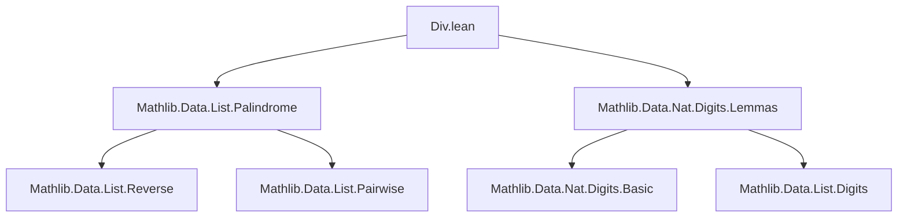

### Technical Brief: `Div.lean` — Divisibility Tests via Digit Expansions

---

#### **1. Key Definitions & Theorems**

| Name | Type | Purpose |
|------|------|---------|
| `modEq_three_digits_sum` | `n ≡ (digits 10 n).sum [MOD 3]` | Congruence of `n` modulo 3 with sum of its decimal digits. |
| `modEq_nine_digits_sum` | `n ≡ (digits 10 n).sum [MOD 9]` | Congruence of `n` modulo 9 with sum of its decimal digits. |
| `modEq_eleven_digits_sum` | `n ≡ (digits 10 n).map (↑) .alternatingSum [ZMOD 11]` | Congruence of `n` modulo 11 with alternating sum of its decimal digits (as integers). |
| `dvd_iff_dvd_digits_sum` | `b ∣ n ↔ b ∣ (digits b' n).sum` under `b' % b = 1` | General divisibility criterion: divisibility by `b` iff divisibility of digit sum in base `b'`. |
| `three_dvd_iff`, `nine_dvd_iff` | `b ∣ n ↔ b ∣ (digits 10 n).sum` for `b = 3, 9` | Standard divisibility-by-3 and -9 rules. |
| `dvd_iff_dvd_ofDigits` | `b ∣ n ↔ (b : ℤ) ∣ ofDigits c (digits b' n)` under `(b : ℤ) ∣ (b' : ℤ) - c` | Generalized digit-based divisibility using `ofDigits` with base conversion weight `c`. |
| `eleven_dvd_iff` | `11 ∣ n ↔ (11 : ℤ) ∣ alternatingSum (map ↑ (digits 10 n))` | Divisibility-by-11 rule via alternating digit sum. |
| `eleven_dvd_of_palindrome` | `Palindrome (digits 10 n) ∧ Even (length (digits 10 n)) → 11 ∣ n` | If decimal digits of `n` form an even-length palindrome, then `11 ∣ n`. |

---

#### **2. Naming Conventions**

- **Prefixes**:
  - `modEq_`: Congruence statements (`[MOD b]` or `[ZMOD b]`)
  - `dvd_iff_`: Biconditional divisibility characterizations
  - `eleven_`, `three_`, `nine_`: Specific divisibility rules
- **Suffixes**:
  - `_digits_sum`: Sum of digits in base 10 (or base `b'`)
  - `_ofDigits`: Use of `ofDigits` with custom base/weight
  - `_palindrome`: Special case using palindrome structure

---

#### **3. Tactic Stack**

Frequent tactics used:
- `simp` — simplification of arithmetic and base conversions
- `rw` — rewriting using lemmas and hypotheses
- `conv_lhs => rw [...]` — localized rewriting in left-hand side of equation
- `exact`, `refine`, `apply` — proof construction
- `rwa` — rewrite + assumption
- `unfold Int.ModEq` — explicit unfolding of modular equivalence on integers
- `have := ...; rw ... at this` — intermediate lemma extraction and transformation

---

#### **4. Proof Logic**

- **Congruence proofs** (`modEq_*`): Apply `modEq_digits_sum` or `zmodeq_ofDigits_digits`, then simplify or rewrite using known identities (e.g., `ofDigits_neg_one`).
- **Divisibility biconditionals** (`dvd_iff_*`):
  - Use `dvd_iff_mod_eq_zero` to reduce to modular arithmetic.
  - Apply `ofDigits_mod` and simplify using hypothesis `b' % b = 1`.
- **Generalized digit-weighted divisibility** (`dvd_iff_dvd_ofDigits`):
  - Lift to integers via `Int.natCast_dvd_natCast`.
  - Apply `dvd_iff_dvd_of_dvd_sub` and `zmodeq_ofDigits_digits`.
- **Palindromic divisibility** (`eleven_dvd_of_palindrome`):
  - Use `alternatingSum_reverse` and palindrome symmetry.
  - Use `neg_one_pow` and even-length assumption to show alternating sum = 0.

---

#### **5. Imports**

- `Mathlib.Data.List.Palindrome`: For palindrome-related lemmas (e.g., `alternatingSum_reverse`, `reverse_eq`).
- `Mathlib.Data.Nat.Digits.Lemmas`: Core digit lemmas: `modEq_digits_sum`, `ofDigits_digits`, `zmodeq_ofDigits_digits`, `ofDigits_neg_one`, `ofDigits_one`, `ofDigits_mod`.

---

#### **6. Mermaid Diagrams**

##### **Dependency Graph (Module-Level)**



##### **Theoretical Overview (Conceptual Flow)**

```mermaid
flowchart LR
  A[digits b n] --> B[Sum of digits]
  A --> C[Alternating sum of digits]
  B --> D[Divisibility by 3, 9]
  C --> E[Divisibility by 11]
  A --> F[ofDigits c (digits b n)]
  F --> G[Generalized divisibility via weight c]
  G --> H[Palindromic numbers ⇒ 11 ∣ n]
```

---

#### **7. Theory Scope**

This module formalizes classical **digit-based divisibility tests** for natural numbers in base 10 (and generalized to base `b'`). It connects:
- Modular arithmetic (`ModEq`, `ZMOD`)
- Digit expansions (`digits`, `ofDigits`)
- Integer lifting (`Int.natCast`, `Int.ModEq`)
- Combinatorics on lists (`Palindrome`, `alternatingSum`)

It completes **Theorem #85** from Freek Wiedijk’s *100 Formalized Theorems* list:  
> *“A number is divisible by 3 iff the sum of its digits is divisible by 3.”*  
and extends it to 9 and 11, plus a novel palindrome-based corollary.

--- 

Let me know if you'd like a formalized dependency graph (e.g., `leanpkg` tree) or a proof sketch for `eleven_dvd_of_palindrome`.
