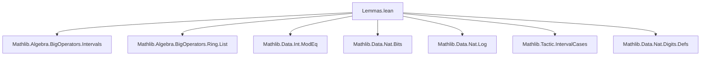
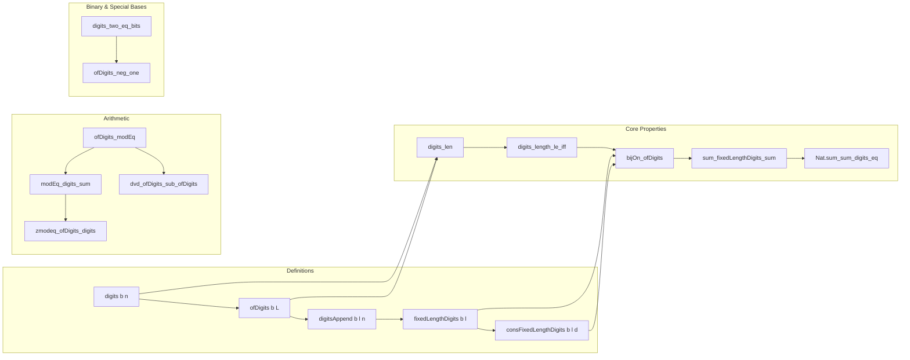

### Technical Brief: `Lemmas.lean` — Digits of Natural Numbers in Lean 4

---

#### **1. Key Definitions & Theorems**

| Name | Type / Signature | Purpose |
|------|------------------|---------|
| `ofDigits` | `ℕ → List ℕ → ℕ` | Interprets a list of digits as a number in base `b`. |
| `digits` | `ℕ → ℕ → List ℕ` | Returns the list of base-`b` digits of `n` (least significant first). |
| `digits_len` | `1 < b → n ≠ 0 → (digits b n).length = b.log n + 1` | Relates digit length to logarithm. |
| `digits_length_le_iff` | `1 < b → (digits b n).length ≤ k ↔ n < b ^ k` | Connects digit length bound with power bound on `n`. |
| `lt_digits_length_iff` | `1 < b → k < (digits b n).length ↔ b ^ k ≤ n` | Contrapositive of above. |
| `getLast_digit_ne_zero` | `m ≠ 0 → (digits b m).getLast _ ≠ 0` | Last digit (most significant) is nonzero for `m ≠ 0`. |
| `digits_append_digits` | `0 < b → digits b n ++ digits b m = digits b (n + b ^ len_n * m)` | Concatenation of digit lists corresponds to arithmetic shift. |
| `digits_append_zeroes_append_digits` | `1 < b → 0 < m → digits b n ++ 0^k ++ digits b m = digits b (n + b^(len_n + k) * m)` | Generalized shift with zero-padding. |
| `pow_length_le_mul_ofDigits` | `l ≠ [] ∧ l.getLast ≠ 0 → (b+2)^l.length ≤ (b+2) * ofDigits (b+2) l` | Lower bound on `ofDigits` using length. |
| `base_pow_length_digits_le` | `1 < b → m ≠ 0 → b ^ len ≤ b * m` | Lower bound on `m` in terms of digit length. |
| `sub_one_mul_sum_div_pow_eq_sub_sum_digits` | `(p-1) * ∑_{i < len} n/p^{i+1} = n - L.sum` | Summation identity linking division and digit sum. |
| `sub_one_mul_sum_log_div_pow_eq_sub_sum_digits` | `(p-1) * ∑_{i < log_p n + 1} n/p^{i+1} = n - (digits p n).sum` | Specialized version using `log`. |
| `digits_two_eq_bits` | `digits 2 n = n.bits.map (λ b ↦ if b then 1 else 0)` | Binary digits correspond to `bits` representation. |
| `dvd_ofDigits_sub_ofDigits` | `k ∣ a - b ⇒ k ∣ ofDigits a L - ofDigits b L` | Polynomial divisibility lemma for `ofDigits`. |
| `ofDigits_modEq'` | `b ≡ b' [MOD k] ⇒ ofDigits b L ≡ ofDigits b' L [MOD k]` | Congruence preservation under base change. |
| `ofDigits_modEq` | `ofDigits b L ≡ ofDigits (b % k) L [MOD k]` | Reduction of base modulo `k`. |
| `ofDigits_mod` | `ofDigits b L % k = ofDigits (b % k) L % k` | Explicit modulo computation. |
| `ofDigits_mod_eq_head!` | `ofDigits b l % b = l.head! % b` | Remainder modulo base is first digit. |
| `head!_digits` | `b ≠ 1 ⇒ (digits b n).head! = n % b` | Most significant digit is `n % b`. |
| `ofDigits_zmodeq'` | `b ≡ b' [ZMOD k] ⇒ ofDigits b L ≡ ofDigits b' L [ZMOD k]` | Integer modular analog. |
| `modEq_digits_sum` | `b' % b = 1 ⇒ n ≡ (digits b' n).sum [MOD b]` | Digit sum modulo `b` when base ≡ 1. |
| `zmodeq_ofDigits_digits` | `b' ≡ c [ZMOD b] ⇒ n ≡ ofDigits c (digits b' n) [ZMOD b]` | Base change modulo representation. |
| `ofDigits_neg_one` | `ofDigits (-1) L = alternatingSum (L.map ↑)` | Alternating sum for base `-1`. |
| `getD_digits` | `2 ≤ b ⇒ (digits b n).getD i 0 = n / b^i % b` | Explicit digit extraction formula. |
| `digitsAppend` | `ℕ → ℕ → ℕ → List ℕ` | Pads digit list to fixed length with zeros. |
| `fixedLengthDigits` | `1 < b → ℕ → Finset (List ℕ)` | Finite set of digit lists of fixed length `< b`. |
| `consFixedLengthDigits` | `1 < b → ℕ → ℕ → Finset (List ℕ)` | Lists with fixed head digit. |
| `bijOn_ofDigits` | `1 < b → l → Set.BijOn (ofDigits b) {L | len = l ∧ digits < b} {n | n < b^l}` | Bijection between digit lists and numbers < `b^l`. |
| `bijOn_digitsAppend` | `1 < b → l → Set.BijOn (digitsAppend b l) {n < b^l} {L | len = l ∧ digits < b}` | Inverse bijection. |
| `sum_fixedLengthDigits_sum` | `∑_{L ∈ fixedLengthDigits b l} L.sum = l * b^{l-1} * (b choose 2)` | Sum of digit sums over all digit lists of fixed length. |
| `Nat.sum_sum_digits_eq` | `∑_{n < b^l} (digits b n).sum = l * b^{l-1} * (b choose 2)` | Sum of digit sums over range `0..b^l-1`. |

---

#### **2. Naming Conventions**

- **Prefixes**:
  - `digits_`: functions/lemmas about digit *lists* (e.g., `digits_len`, `digits_append_digits`).
  - `ofDigits_`: lemmas about interpreting digit lists as numbers (e.g., `ofDigits_mod`, `ofDigits_neg_one`).
  - `pow_length_`, `base_pow_length_`: bounds involving `b ^ (digits b n).length`.
  - `sub_one_mul_sum_`: identities involving `(p-1)` and sums of quotients.
  - `modEq`, `zmodeq`: modular arithmetic lemmas.
  - `getLast_digit_`, `head!_digits`: structural properties of digit lists.
  - `fixedLengthDigits`, `consFixedLengthDigits`: finite sets of digit lists.

- **Suffixes**:
  - `_eq_`: definitions or equalities (e.g., `digits_two_eq_bits`).
  - `_iff_`: equivalence characterizations (e.g., `digits_length_le_iff`).
  - `_le_`, `_lt_`: inequality lemmas (e.g., `lt_digits_length_iff`).
  - `_append_`, `_replicate_`: list manipulation lemmas.
  - `_bijOn`, `_invOn`: bijection/inverse properties.

---

#### **3. Tactic Stack**

- **Core tactics**: `simp`, `rw`, `induction`, `congr`, `ring`, `linarith`, `aesop`, `grind`.
- **Arithmetic & big operators**: `sum_range_succ`, `sum_Ico_consecutive`, `mul_add`, `pow_add`, `div_lt_self`, `log_div_base`, `tsub_add_cancel_of_le`.
- **List & finite sets**: `List.mapIdx_eq_zipIdx_map`, `List.zipIdx_eq_zip_range'`, `List.dropLast_append_getLast`, `Finset.sum_disjiUnion`, `Finset.card_range`.
- **Modular arithmetic**: `Nat.mod_eq_of_lt`, `Int.emod_emod`, `Nat.div_div_eq_div_mul`.
- **Case analysis**: `trichotomous`, `em`, `eq_or_ne`, `le_or_gt`, `decide`.
- **Set-theoretic reasoning**: `Set.MapsTo`, `Set.InjOn`, `Set.BijOn`, `Finset.mem_image`, `Finset.disjiUnion_eq_biUnion`.

---

#### **4. Proof Logic**

- **Induction patterns**:
  - Strong induction (`Nat.strong_induction_on`, `Nat.strongRecOn`) for digit-length properties.
  - Structural induction on lists (`List.induction_on`) for `ofDigits` lemmas.
  - Binary recursion (`Nat.binaryRecFromOne`) for binary-specific lemmas (`digits_two_eq_bits`).
- **Case splitting**:
  - On `n = 0` vs `n ≠ 0`, `b = 1` vs `1 < b` vs `b < 1`.
  - On list emptiness (`L = []` vs `L ≠ []`) and head/tail decomposition.
- **Arithmetic reasoning**:
  - Use of `log_lt_iff_lt_pow`, `digits_length_le_iff`, `div_lt_self`, `pow_succ'`.
  - Conversion between `ofDigits` and `digits` via `ofDigits_digits`, `digits_ofDigits`.
- **Bijection-based reasoning**:
  - Prove bijection via `setInvOn_digitsAppend_ofDigits`, then lift to `Finset` via `bijOn_ofDigits'`.
  - Use `Finset.sum_nbij` to transfer sums over digit lists ↔ numbers.

---

#### **5. Imports**

| Module | Purpose |
|--------|---------|
| `Mathlib.Algebra.BigOperators.Intervals` | Summation over intervals (`range`, `Ico`), `Finset` arithmetic. |
| `Mathlib.Algebra.BigOperators.Ring.List` | Sum over lists, `List.mapIdx`, `zipWith`, etc. |
| `Mathlib.Data.Int.ModEq` | Modular arithmetic (`ModEq`, `ZMOD`). |
| `Mathlib.Data.Nat.Bits` | Binary representation (`bits`, `bit`). |
| `Mathlib.Data.Nat.Log` | Logarithm for naturals (`log`, `log_pos`, `log_div_base`). |
| `Mathlib.Tactic.IntervalCases` | Case analysis on bounded naturals. |
| `Mathlib.Data.Nat.Digits.Defs` | Core definitions of `digits`, `ofDigits`. |

---

#### **6. Mermaid Diagrams**

##### **Dependency Graph (Module-Level)**



##### **Theoretical Overview (Conceptual Flow)**



##### **Proof Strategy Flow (Example: `Nat.sum_sum_digits_eq`)**

```mermaid
graph TD
  A[∑_{n < b^l} (digits b n).sum] --> B[Use bijection ofDigits]
  B --> C[Replace sum over n with sum over digit lists L]
  C --> D[Apply sum_digits_ofDigits_eq_sum]
  D --> E[Compute ∑ L.sum over fixedLengthDigits]
  E --> F[Use induction on l + combinatorics]
  F --> G[Final formula: l * b^{l-1} * (b choose 2)]
```

---

#### **7. Domain Scope**

This module formalizes **positional numeral systems** over `ℕ`, with emphasis on:

- **Digit extraction & reconstruction** (`digits`, `ofDigits`, `getD_digits`)
- **Length & magnitude bounds** (`digits_len`, `digits_length_le_iff`)
- **Modular arithmetic compatibility** (`ofDigits_modEq`, `modEq_digits_sum`)
- **Bijections between numbers and digit strings** (`bijOn_ofDigits`, `bijOn_digitsAppend`)
- **Combinatorial sums over digit representations** (`sum_fixedLengthDigits_sum`, `Nat.sum_sum_digits_eq`)
- **Binary & signed-digit special cases** (`digits_two_eq_bits`, `ofDigits_neg_one`)

It serves as a foundational library for reasoning about digit expansions, especially in contexts involving:
- Digit sums and digital roots,
- Divisibility tests (e.g., base-10 rules),
- Cryptographic or algorithmic digit manipulations,
- Formal verification of numeral system algorithms.

--- 

Let me know if you'd like a **dependency graph of theorems**, **proof automation patterns**, or **exported API summary**.
