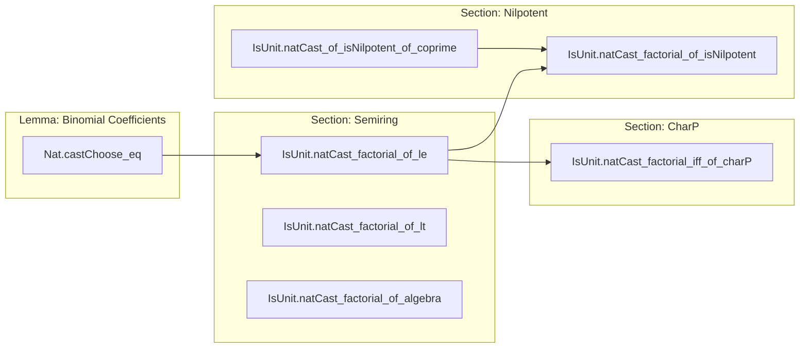

### Technical Brief: `NatCast.lean` — Invertibility of Factorials in Rings and Semirings

---

#### **1. Key Definitions & Theorems**

| Name | Type / Signature | Purpose |
|------|------------------|---------|
| `IsUnit.natCast_factorial_of_le` | `{n m : ℕ} → IsUnit (n! : A) → m ≤ n → IsUnit (m! : A)` | Downward closure: if `n!` is invertible, then all smaller factorials are too. |
| `IsUnit.natCast_factorial_of_lt` | `{n m : ℕ} → IsUnit ((n-1)! : A) → m < n → IsUnit (m! : A)` | Strict version of the above, using `m < n ⇒ m ≤ n-1`. |
| `IsUnit.natCast_factorial_of_algebra` | `{K A : Type*} → [Semifield K] [CharZero K] [Algebra K A] → (n : ℕ) → IsUnit (n! : A)` | In characteristic zero algebras over semifields, all `n!` are units (since `n! ≠ 0` in `K`, and algebra maps preserve units). |
| `IsUnit.natCast_factorial_iff_of_charP` | `{A : Type*} [Ring A] {p : ℕ} [Fact p.Prime] [CharP A p] → (n : ℕ) → IsUnit (n! : A) ↔ n < p` | In a ring of characteristic `p` (prime), `n!` is a unit **iff** `n < p`. |
| `IsUnit.natCast_of_isNilpotent_of_coprime` | `{A : Type*} [CommRing A] {p n : ℕ} → IsNilpotent (p : A) → p.Coprime n → IsUnit (n : A)` | If `p` is nilpotent and coprime to `n`, then `n` is invertible (via Bézout identity). |
| `IsUnit.natCast_factorial_of_isNilpotent` | `{A : Type*} [CommRing A] {p n : ℕ} [Fact p.Prime] → IsNilpotent (p : A) → n < p → IsUnit (n! : A)` | If `p` is nilpotent and `n < p`, then `n!` is invertible (since each factor `≤ n < p` is coprime to `p`). |
| `Nat.castChoose_eq` | `{A : Type*} [CommSemiring A] {m k} → IsUnit (m! : A) → k ∈ antidiagonal m → choose m k.1 = m! * (k.1!)⁻¹ * (k.2!)⁻¹` | Expresses binomial coefficients in terms of factorials and their inverses, assuming `m!` is invertible. |

---

#### **2. Naming Conventions**

- **Prefix `natCast_`**: All theorems about casted natural numbers (especially factorials) being units.
- **Suffix `_of_le` / `_of_lt`**: Indicate monotonicity conditions (`≤` or `<`) on indices.
- **Suffix `_of_charP` / `_of_algebra` / `_of_isNilpotent`**: Contextual hypotheses (characteristic `p`, algebra over char-zero field, nilpotent element).
- **`isUnit_` / `isNilpotent_`**: General predicates on elements (e.g., `IsUnit`, `IsNilpotent`).
- **`gcdA`, `gcdB`**: Extended Euclidean algorithm coefficients (used in Bézout identity).
- **`antidiagonal`**: Refers to `Finset.antidiagonal m`, i.e., pairs `(k, m-k)`.

---

#### **3. Tactic Stack**

| Tactic | Usage Frequency | Purpose |
|--------|-----------------|---------|
| `induction` | High | Structural induction on `n`, often with `generalizing` or `with` branches. |
| `rw` | Very High | Rewriting using lemmas like `factorial_succ`, `cast_mul`, `ih`, `Nat.cast_commute`, etc. |
| `simp` / `simpa` | Medium | Simplifying goals using `isUnit_iff_ne_zero`, `factorial_succ`, `Nat.cast_commute`, etc. |
| `exact` / `exacts` | Medium | Supplying proofs of subgoals (e.g., `exacts [le_add_right, le_add_left]`). |
| `obtain` / `have` | Medium | Extracting witnesses (e.g., `⟨k, rfl⟩`, `⟨a, b, h⟩`). |
| `norm_cast` | Low | Normalizing casts between `ℕ`, `ℤ`, and `A`. |
| `ring` / `linarith` (`lia`) | Low | Solving polynomial equalities or linear arithmetic (e.g., `by lia`). |
| `apply` | Low | Applying lemmas like `.of_mul_eq_one`, `.natCast_factorial_of_le`. |

---

#### **4. Proof Logic**

- **Inductive structure**: Most proofs proceed by induction on `n`, often with case analysis on `k` (e.g., `zero` vs `succ`).
- **Monotonicity reasoning**: For `natCast_factorial_of_le`, the key idea is to write `n = m + k`, then induct on `k`, using multiplicativity of `cast` and `factorial_succ`.
- **Characteristic `p` dichotomy**: In `natCast_factorial_iff_of_charP`, the proof leverages:
  - `p` prime ⇒ `p` divides `n!` iff `p ≤ n`.
  - `IsUnit (n! : A)` ⇔ `p ∤ n!` (since in `CharP A p`, `n!` is a unit iff it’s not divisible by `p`).
- **Nilpotent + coprime ⇒ unit**: Uses Bézout identity: `p^m a + n b = 1` ⇒ `n b ≡ 1 mod p^m`, and since `p^m = 0`, `n b = 1`.
- **Binomial coefficient formula**: Derives from the identity  
  $$
  \binom{m}{k} \cdot k! \cdot (m-k)! = m!
  $$
  and invertibility of `m!`, allowing division.

---

#### **5. Imports**

| Module | Role |
|--------|------|
| `Mathlib.Algebra.Algebra.Defs` | Basic algebra definitions (semiring, algebra, etc.). |
| `Mathlib.Algebra.CharP.Invertible` | Characteristic `p` theory, invertibility of `n : A`. |
| `Mathlib.Data.Finset.NatAntidiagonal` | Antidiagonal of `ℕ × ℕ` (used for binomial coefficient identities). |
| `Mathlib.Data.Nat.Choose.Basic` | Basic binomial coefficient properties (`choose`, factorial identities). |

---

#### **6. Mermaid Diagrams**

##### **Dependency Graph (Theories & Lemmas)**

```mermaid
graph TD
  A[IsUnit.natCast_factorial_of_le] --> B[IsUnit.natCast_factorial_of_lt]
  A --> C[IsUnit.natCast_factorial_of_algebra]
  A --> D[IsUnit.natCast_factorial_iff_of_charP]
  D --> E[CharP.isUnit_natCast_iff]
  D --> F[Nat.Prime.coprime_iff_not_dvd]
  D --> G[Nat.not_dvd_of_pos_of_lt]
  D --> H[Nat.add_one_le_iff]
  C --> I[isUnit_iff_ne_zero]
  C --> J[n.factorial_ne_zero]
  D --> K[CharP]
  E --> K
  L[IsUnit.natCast_of_isNilpotent_of_coprime] --> M[IsUnit.natCast_factorial_of_isNilpotent]
  L --> N[Int.gcd_eq_one]
  L --> O[ Nat.gcd_eq_gcd_ab]
  M --> P[Nat.Prime.coprime_iff_not_dvd]
  Q[Nat.castChoose_eq] --> R[Finset.antidiagonal]
  Q --> S[choose m k * k! * (m-k)! = m!]
  Q --> A
```

##### **Overview of File Structure**



---

#### **7. Theory Scope**

This file sits at the intersection of:
- **Ring theory** (units, nilpotents, characteristic),
- **Combinatorics** (factorials, binomial coefficients),
- **Algebra over fields** (characteristic zero, algebras).

It provides foundational tools for:
- Defining binomial coefficients in rings where `n!` is invertible (e.g., ℚ-algebras),
- Understanding when binomial expansions make sense (e.g., in positive characteristic),
- Constructing inverses of integers modulo nilpotent ideals (via Bézout).

---

Let me know if you'd like a formalized dependency graph in `leanpkg` format or a visualization of the proof DAG for a specific theorem.
