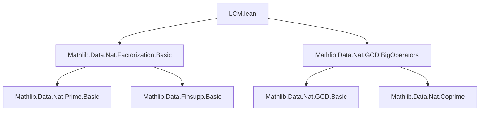

### Technical Brief: `LCM.lean`

---

#### **1. Key Definitions & Theorems**

| Name | Type / Signature | Purpose |
|------|------------------|---------|
| `factorizationLCMLeft` | `Nat → Nat → Nat` | Extracts the part of `lcm a b` whose prime factors are *dominated* by those of `a` (i.e., where `b.factorization p ≤ a.factorization p`). Defined via `Finsupp.prod` over `lcm a b`'s factorization. |
| `factorizationLCMRight` | `Nat → Nat → Nat` | Extracts the complementary part of `lcm a b`, where `a.factorization p < b.factorization p`. |
| `factorizationLCMLeft_zero_left` | `factorizationLCMLeft 0 b = 1` | Simplifies left-zero case. |
| `factorizationLCMLeft_zero_right` | `factorizationLCMLeft a 0 = 1` | Simplifies right-zero case. |
| `factorizationLCMRight_zero_left` | `factorizationLCMRight 0 b = 1` | Simplifies left-zero case. |
| `factorizationLCMRight_zero_right` | `factorizationLCMRight a 0 = 1` | Simplifies right-zero case. |
| `factorizationLCMLeft_pos` | `0 < factorizationLCMLeft a b` | Positivity of the left component. |
| `factorizationLCMRight_pos` | `0 < factorizationLCMRight a b` | Positivity of the right component. |
| `coprime_factorizationLCMLeft_factorizationLCMRight` | `(factorizationLCMLeft a b).Coprime (factorizationLCMRight a b)` | The two components are coprime. |
| `factorizationLCMLeft_mul_factorizationLCMRight` | `(a ≠ 0) → (b ≠ 0) → factorizationLCMLeft a b * factorizationLCMRight a b = lcm a b` | Decomposition of `lcm` into coprime parts. |
| `factorizationLCMLeft_dvd_left` | `factorizationLCMLeft a b ∣ a` | Left component divides `a`. |
| `factorizationLCMRight_dvd_right` | `factorizationLCMRight a b ∣ b` | Right component divides `b`. |

---

#### **2. Naming Conventions**

- **Prefixes**:
  - `factorizationLCMLeft_`, `factorizationLCMRight_`: Indicates which component of the `lcm` factorization is being referenced.
- **Suffixes**:
  - `_zero_left`, `_zero_right`: Handle zero arguments.
  - `_pos`: Positivity lemmas.
  - `_dvd_left`, `_dvd_right`: Divisibility properties.
  - `_coprime`: Coprimality property.
- **No infix operators** — all are named lemmas/definitions.

---

#### **3. Tactic Stack**

Frequently used tactics in proofs:
- `simp` / `simp only`: For simplification using `@[simp]` lemmas and definitions.
- `rw`: Rewriting using equalities (e.g., `factorization_prod_pow_eq_self`, `factorization_lcm`).
- `rcases`: To split on `eq_or_ne` cases (`rfl | ha`).
- `nth_rewrite`: To rewrite at a specific position (e.g., `nth_rewrite 2`).
- `congr`: Congruence closure for equality of functions/products.
- `ext`: Extensionality for function equality (e.g., `ext p n`).
- `split_ifs`: To split `if ... then ... else ...` expressions.
- `apply`, `intro`, `intro h`, `intro hp`, etc.: Standard intro/apply.
- `rwa`, `rfl`, `exact`, `by_cases`: Common proof automation.
- `refine`: To construct proofs with holes (e.g., `refine coprime_prod_left_iff.mpr ...`).
- `dsimp only`: Simplify definitional unfoldings.

---

#### **4. Proof Logic**

- **Structure**:
  - Most proofs follow a **case analysis on zero/non-zero** arguments (`eq_or_ne a 0`, `eq_or_ne b 0`).
  - For non-zero cases, use `factorization_prod_pow_eq_self` to lift natural numbers to their prime factorization.
  - Use `prod_of_support_subset` to restrict products to the support of `lcm a b`.
  - Apply `prod_dvd_prod_of_dvd` or `pow_dvd_pow` to handle divisibility.
  - For coprimality, use `coprime_prod_left_iff` and `coprime_pow_primes`, reducing to disjointness of prime supports.
  - Positivity proofs rely on `Finsupp.prod_ne_zero_iff` and contradiction via `by_cases`.

- **Typical flow**:
  1. Eliminate zero cases.
  2. Lift to factorization domain.
  3. Compare exponents via `sup` (for `lcm`) and case-split on inequality.
  4. Use properties of `Finsupp.prod`, divisibility, and coprimality.

---

#### **5. Imports**

- `Mathlib.Data.Nat.Factorization.Basic`: Core factorization machinery (`factorization`, `prod_pow_eq_self`, etc.).
- `Mathlib.Data.Nat.GCD.BigOperators`: Provides `lcm`, `gcd`, and related lemmas like `factorization_lcm`.

> **Note**: This file was split off to reduce transitive dependencies — it isolates lemmas about `factorizationLCMLeft`/`factorizationLCMRight` to avoid pulling heavy GCD machinery into other modules.

---

#### **6. Mermaid Diagrams**

##### **Dependency Graph (Module-Level)**



##### **Overview of Theory Flow**

```mermaid
graph LR
  Nat -->|factorization| Finsupp
  Finsupp -->|prod| Nat
  Nat -->|lcm| Nat
  Nat -->|factorizationLCMLeft| Nat
  Nat -->|factorizationLCMRight| Nat
  factorizationLCMLeft & factorizationLCMRight -->|coprime| Coprime
  factorizationLCMLeft * factorizationLCMRight -->|product| lcm
  lcm -->|factorization| Finsupp
```

##### **Proof Strategy Flow (Example: `factorizationLCMLeft_dvd_left`)**

```mermaid
graph TD
  Start[Start: a, b] --> Case1{a = 0?}
  Case1 -- Yes --> DvdZero[dvd_zero]
  Case1 -- No --> Case2{b = 0?}
  Case2 -- Yes --> Simplify[simp [factorizationLCMLeft]]
  Case2 -- No --> Lift[← factorization_prod_pow_eq_self]
  Lift --> Restrict[prod_of_support_subset]
  Restrict --> Apply[prod_dvd_prod_of_dvd]
  Apply --> Split[split_ifs]
  Split --> DvdPow[pow_dvd_pow]
  DvdPow --> Done
```

---

#### **7. Summary**

This module isolates structural lemmas about the decomposition of `lcm a b` into two coprime factors:
- `factorizationLCMLeft a b`: the part “controlled” by `a`’s exponents,
- `factorizationLCMRight a b`: the part “controlled” by `b`’s exponents.

It enables modular reasoning about `lcm` in contexts where one wants to separate contributions from each argument — especially useful in proofs involving divisibility, coprimality, or unique factorization.

--- 

Let me know if you'd like a formalized dependency graph for the *proof terms* or a visualization of how `factorizationLCMLeft`/`factorizationLCMRight` relate to `gcd`/`lcm` in the broader `Mathlib` ecosystem.
