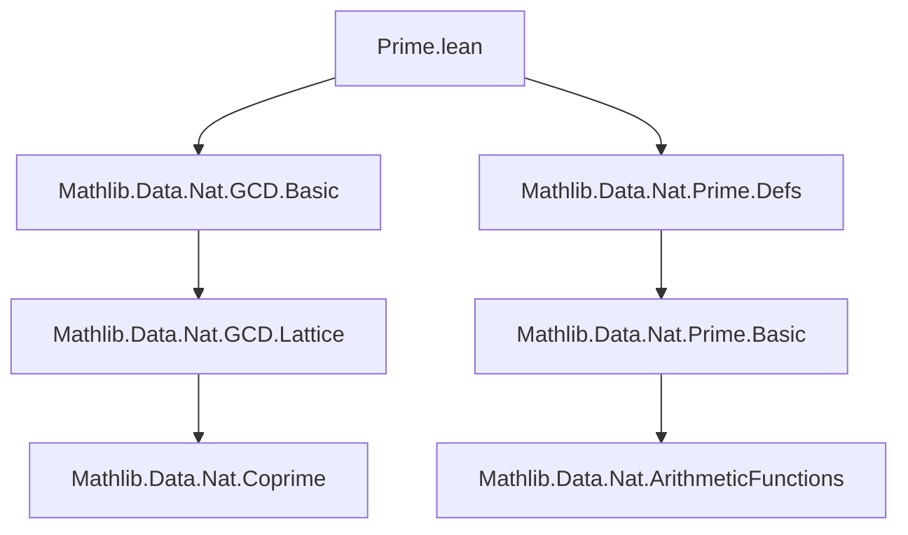
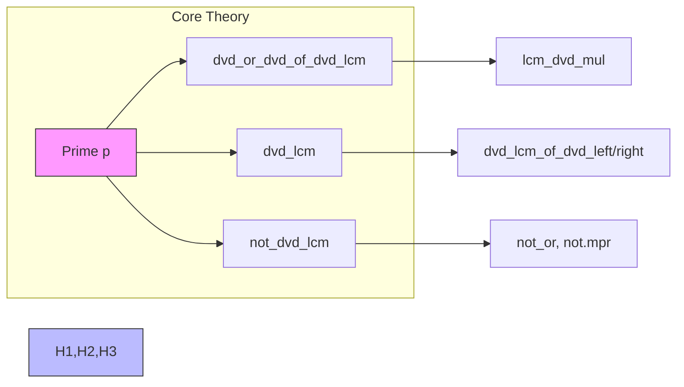

**Technical Brief: `Prime.lean` Module**

---

### 1. **Key Definitions & Theorems**

| Name | Type | Purpose |
|------|------|---------|
| `dvd_or_dvd_of_dvd_lcm` | `p ∣ lcm a b → p ∣ a ∨ p ∣ b` | Shows that a prime dividing an LCM must divide at least one argument. |
| `dvd_lcm` | `p ∣ lcm a b ↔ p ∣ a ∨ p ∣ b` | Characterizes divisibility by a prime in terms of LCM — a biconditional strengthening of the above. |
| `not_dvd_lcm` | `¬ p ∣ a → ¬ p ∣ b → ¬ p ∣ lcm a b` | Contrapositive of `dvd_lcm`: if a prime divides neither `a` nor `b`, it divides their LCM neither. |

All theorems assume `hp : Prime p`, and use `include hp` to make `hp` available implicitly.

---

### 2. **Naming Conventions**

- **Prefixes**:
  - `dvd_`: for divisibility lemmas (`dvd_or_dvd_of_dvd_lcm`, `dvd_lcm`, `not_dvd_lcm`).
  - `not_`: for negated divisibility (`not_dvd_lcm`).
- **Suffixes**:
  - `_of_dvd_`: indicates derivation *from* a divisibility hypothesis (`dvd_or_dvd_of_dvd_lcm`).
  - `_lcm`: indicates involvement of `lcm`.

---

### 3. **Tactic Stack**

- `trans`: used to chain divisibility (`h.trans (lcm_dvd_mul a b)`).
- `⟨·, ·⟩`: for constructing biconditional proofs (intro + elim).
- `Or.elim · (·) (·)`: case analysis on disjunction.
- `not_or.mpr`: converts `¬(A ∨ B)` to `A → ¬B` and vice versa.
- `not.mpr`: modus tollens (contrapositive intro).

No heavy automation (`aesop`, `ring`, `simp_rw`) is used — proofs are mostly direct and rely on existing lemmas like `lcm_dvd_mul`.

---

### 4. **Proof Logic**

- **Structure**: All proofs are *direct* and *constructive*.
- **`dvd_or_dvd_of_dvd_lcm`**: Uses `dvd_or_dvd` (a known lemma for primes dividing products) and the fact that `lcm a b ∣ a * b`.
- **`dvd_lcm`**: Proves both directions:
  - `→`: via `dvd_or_dvd_of_dvd_lcm`.
  - `←`: uses `Or.elim` on `p ∣ a ∨ p ∣ b`, applying `dvd_lcm_of_dvd_left` / `dvd_lcm_of_dvd_right`.
- **`not_dvd_lcm`**: Applies contrapositive reasoning: `¬(p ∣ a ∨ p ∣ b) ↔ (¬p ∣ a ∧ ¬p ∣ b)`, then uses `dvd_lcm` and `not.mpr`.

Induction or case analysis on `p` is *not* needed — relies on prime-specific lemmas from `Mathlib.Data.Nat.Prime.Defs`.

---

### 5. **Imports**

- `Mathlib.Data.Nat.GCD.Basic`: provides `lcm`, `lcm_dvd_mul`, `dvd_lcm_of_dvd_left/right`.
- `Mathlib.Data.Nat.Prime.Defs`: provides `Prime`, `dvd_or_dvd`, and foundational prime divisibility properties.

> **Design rationale**: Separated from `GCD.Basic` to avoid circular imports and keep `Prime`-centric lemmas modular.

---

### 6. **Mermaid Diagrams**

#### **Dependency Graph**

#### **Overview of File Content**

---

### 7. **Summary**

This module formalizes the *prime divisibility characterization of LCM* in `ℕ`. It leverages foundational prime and GCD theory to give concise, reusable lemmas — essential for later work on unique factorization, coprimality, and arithmetic functions. The design reflects Lean’s modular philosophy: minimal imports, clear naming, and proof structure aligned with mathematical intuition.
