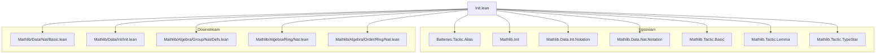
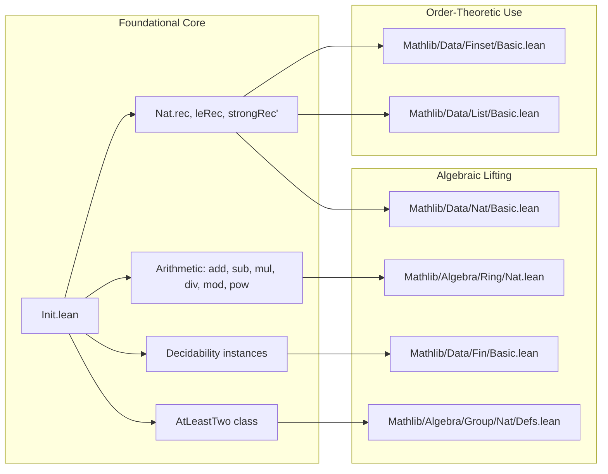

### Technical Brief: `Init.lean` (Natural Numbers)

---

#### **1. Key Definitions & Theorems**

| Name | Type / Signature | Purpose |
|------|------------------|---------|
| `leRec` | `{n m : ℕ} → (motive : (m : ℕ) → n ≤ m → Sort*) → motive n (le_refl n) → (∀ k h, motive k h → motive (k+1) (le_succ h)) → ∀ {m} (h : n ≤ m), motive m h` | Recursion/induction starting at arbitrary `n`, not just `0`. |
| `leRecOn` | `{n m : ℕ} → n ≤ m → (∀ k, C k → C (k+1)) → C n → C m` | Eliminator version of `leRec`, for induction proofs. |
| `strongRec'` | `(∀ n, (∀ m < n, p m) → p n) → ∀ n, p n` | Strong induction based on `<`, not `≤`. |
| `strongRecOn'` | `∀ n, (∀ m < n, P m) → P n` | Application of `strongRec'` to a specific `n`. |
| `decreasingInduction` | `(∀ k < n, P (k+1) → P k) → P n → ∀ m ≤ n, P m` | Induction *downwards* from `n` to smaller numbers. |
| `decreasingInduction'` | Weaker variant of `decreasingInduction`, allowing extra hypothesis `m ≤ k`. |
| `twoStepInduction` | `P 0 → P 1 → (∀ n, P n → P (n+1) → P (n+2)) → ∀ a, P a` | Induction with two base cases (`0`, `1`). |
| `diag_induction` | `(∀ a, P (a+1)(a+1)) → (∀ b, P 0 (b+1)) → (∀ a b, a < b → P (a+1) b → P a (b+1) → P (a+1)(b+1)) → ∀ a b, a < b → P a b` | Double induction over strict inequality `a < b`. |
| `pincerRecursion` | `(∀ m, P m 0) → (∀ n, P 0 n) → (∀ x y, P x (y+1) → P (x+1) y → P (x+1)(y+1)) → ∀ n m, P n m` | Recursion over 2D grid using “pincer” step. |
| `strongSubRecursion` | `(∀ m n, (∀ x < m, y < n, P x y) → P m n) → ∀ n m, P n m` | Strong recursion over 2D with rectangular well-foundedness. |
| `two_lt_of_ne` | `n ≠ 0 → n ≠ 1 → n ≠ 2 → 2 < n` | Characterization of numbers > 2. |
| `two_le_iff` | `2 ≤ n ↔ n ≠ 0 ∧ n ≠ 1` | Equivalent condition for `2 ≤ n`. |
| `div_lt_self'` | `(a + 1) / (b + 2) < a + 1` | Divisibility bound using successors. |
| `two_mul_odd_div_two` | `n % 2 = 1 → 2 * (n / 2) = n - 1` | Odd number decomposition. |
| `dvd_right_iff_eq`, `dvd_left_iff_eq` | `(∀ a, m ∣ a ↔ n ∣ a) ↔ m = n` | Equality via shared divisors/multiples. |
| `ext_div_mod`, `ext_div_mod_iff` | `a = b ↔ a / n = b / n ∧ a % n = b % n` | Division algorithm characterization. |
| `AtLeastTwo` | `class AtLeastTwo (n : ℕ) : Prop := prop : 2 ≤ n` | Typeclass for naturals ≥ 2. |
| `not_two_dvd_bit1` | `¬ 2 ∣ 2 * n + 1` | Odd numbers not divisible by 2. |

---

#### **2. Naming Conventions**

- **Prefixes**:
  - `leRec`, `leRecOn`, `decreasingInduction`, `strongRec'`, `strongRecOn'`: recursion/induction principles.
  - `twoStep`, `diag`, `pincer`, `strongSub`: descriptive of the induction scheme.
  - `succ`, `of_succ`, `of_le_succ`: operations involving successor.
  - `dvd_`, `mod_`, `div_`: arithmetic operations.
  - `ne`, `lt`, `le`: relational predicates.

- **Suffixes**:
  - `'` (prime): weaker or alternative version (e.g., `strongRec'`, `decreasingInduction'`).
  - `On`: applied to a specific argument (e.g., `leRecOn`, `strongRecOn'`).
  - `_iff`, `_iff_eq`: equivalence lemmas.
  - `spec`, `beta`: β-reduction or specification lemmas (e.g., `strongRec'_spec`, `strongRecOn'_beta`).

- **Aliases**:
  - `alias _root_.LT.lt.nat_succ_le := succ_le_of_lt`
  - `alias ⟨of_le_succ, _⟩ := le_succ_iff`

---

#### **3. Tactic Stack**

Frequent tactics used in proofs:

| Tactic | Usage |
|--------|-------|
| `simp` | Simplification of `le`, `lt`, `succ`, `add`, `mul`, `div`, `mod`, `dvd`. |
| `rw` | Rewriting using lemmas like `leRec_succ`, `div_add_mod`, `dvd_add_self_left`. |
| `induction` | Structural, `leRec`, `decreasingInduction`, `strongRecOn'`, `twoStepInduction`, `diag_induction`. |
| `cases` | Case analysis on `n`, `h`, `hmn`, etc. |
| `congrArg`, `congrFun`, `ext` | Extensionality and congruence. |
| `lia`, `linarith` | Linear arithmetic over `ℕ`, `ℤ`. |
| `grind` | Custom tactic for grind-style reasoning (e.g., `ext_div_mod`). |
| `conv` | Convolutional rewriting (e.g., in `leRec_succ`). |
| `dsimp`, `unfold`, `simp only` | Delaboration and unfolding definitions. |
| `by_cases`, `rcases`, `obtain` | Case splits and destructuring. |
| `convert`, `exact`, `apply` | Proof term construction. |

---

#### **4. Proof Logic**

- **Induction Patterns**:
  - **Standard induction**: `induction n` → base `0`, step `n → n+1`.
  - **Le-based induction**: `induction h using Nat.leRec` or `Nat.le_induction`.
  - **Strong induction**: `induction n using strongRecOn'`.
  - **Downward induction**: `induction h using decreasingInduction`.
  - **Two-step**: `induction a using twoStepInduction`.
  - **Diagonal/2D**: `induction a b using diag_induction`, `pincerRecursion`, `strongSubRecursion`.

- **Common Flow**:
  1. **Base case**: often `rfl`, `simp`, or `refl`.
  2. **Inductive step**: use `induction` with appropriate principle, then:
     - `rw` key lemmas (e.g., `leRec_succ`, `decreasingInduction_succ`).
     - `apply ih` or `exact ih ...`.
     - Use `lia`/`linarith` for arithmetic goals.
  3. **Equational reasoning**: often `conv` + `rw` for nested recursor reductions.

- **Lemmas often proved by**:
  - `induction` + `simp` + `rw`.
  - `ext` + `funext` + `congrArg` for extensionality.
  - `by_cases` on `h : n = 0`, `n = 1`, etc., for small-case analysis.

---

#### **5. Imports**

| Import | Purpose |
|--------|---------|
| `Batteries.Tactic.Alias` | Tactics for aliasing lemmas. |
| `Mathlib.Init` | Core definitions and notations. |
| `Mathlib.Data.Int.Notation`, `Mathlib.Data.Nat.Notation` | Notation for `ℤ`, `ℕ`. |
| `Mathlib.Tactic.Basic`, `Mathlib.Tactic.Lemma`, `Mathlib.Tactic.TypeStar` | Tactic infrastructure. |

> **Note**: This file avoids importing algebraic hierarchies (`Monoid`, etc.) to remain foundational.

---

#### **6. Library Note: “Foundational Algebra Order Theory”**

This module implements a **non-typeclass-mediated** development of `ℕ` and `ℤ`, used to bootstrap:
- Finiteness (`Fin`, `Finset`)
- Indexing (lists, arrays)
- Powers in groups/rings
- Order-theoretic reasoning (e.g., `≤`, `<`, `min`, `max`)

Later files (e.g., `Mathlib/Data/Nat/Basic.lean`, `Mathlib/Algebra/Ring/Nat.lean`) extend this with typeclass instances.

---

#### **7. Mermaid Diagrams**

##### **Dependency Graph (Top-Level)**

##### **Overview of Theory Structure**

---

#### **8. Summary**

`Init.lean` is a **foundational module** for `ℕ` in Lean 4, providing:
- **Non-typeclass arithmetic** (for bootstrapping),
- **Custom induction/recursion principles** (`leRec`, `strongRec'`, `decreasingInduction`, etc.),
- **Decidability infrastructure** for bounded quantifiers,
- **Typeclasses** like `AtLeastTwo` for lightweight numeric constraints.

It avoids algebraic typeclasses to remain lightweight and upstreamable, while enabling rich reasoning about naturals in later libraries.

--- 

Let me know if you'd like a formalized dependency graph (e.g., `.lean`-level imports), or a tactic usage heatmap.
