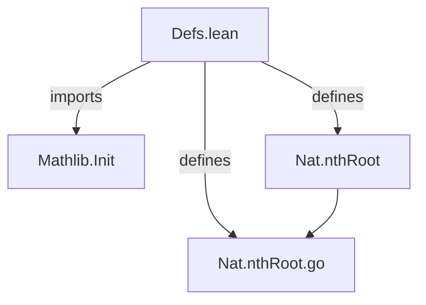
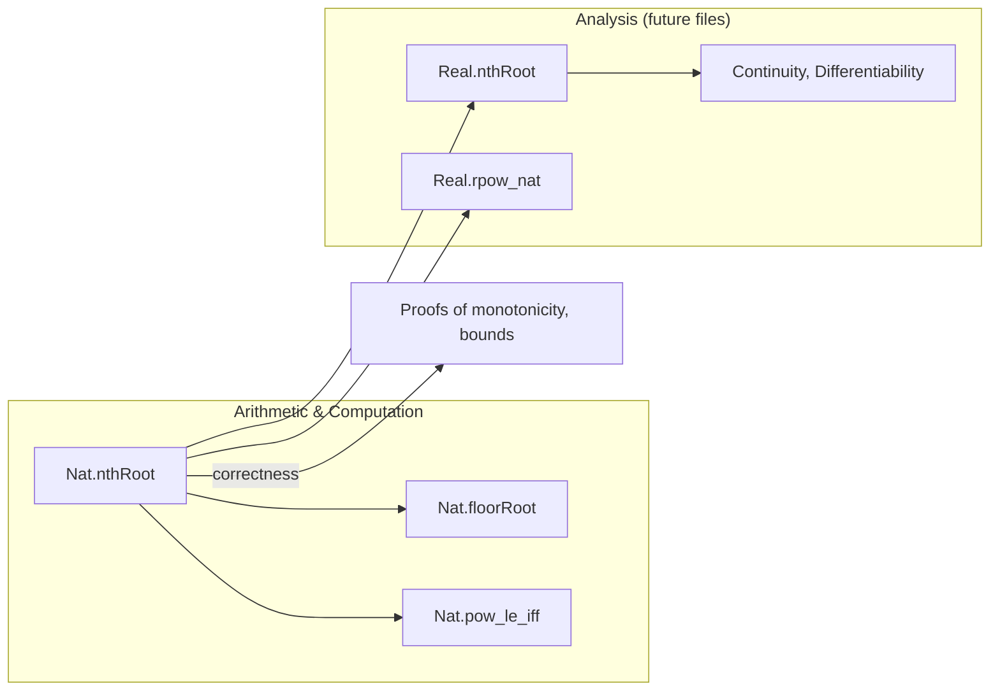

**Technical Brief: `Nat.nthRoot` Definition (Defs.lean)**  
*Domain: Formalized Real Analysis / Computational Number Theory*  
*Framework: Lean 4 (Mathlib)*  

---

### 1. **Key Definitions & Theorems**

| Name | Type | Purpose |
|------|------|---------|
| `Nat.nthRoot` | `Nat → Nat → Nat` | Computes the *floor* of the $n$-th root of $a$, i.e., $\lfloor a^{1/n} \rfloor$, using Newton’s method. Handles edge cases: `nthRoot 0 a = 1`, `nthRoot 1 a = a`. |
| `Nat.nthRoot.go` | `Nat → Nat → Nat → Nat → Nat` | Tail-recursive auxiliary function implementing Newton iterations for $x^{n+2} = a$. Maintains `guess` (current approximation) and `fuel` (iteration budget). Returns $\lfloor a^{1/(n+2)} \rfloor$ when `fuel` is sufficient. |

> **Note**: No external theorems are stated in this file—only the *definition* of the function. Correctness (e.g., convergence, bounds) is deferred to later files.

---

### 2. **Naming Conventions**

- **Prefixes**:
  - `nthRoot` — main function name (standard mathematical naming).
  - `go` — common Lean idiom for tail-recursive helpers (e.g., `List.go`, `Nat.findGo`).
- **Suffixes**:
  - None prominent here; naming is functional and descriptive.
- **Pattern**:
  - `n + k` for inductive structure (e.g., `n + 2` for root order ≥ 2).
  - `fuel`, `guess` — descriptive variable names reflecting algorithmic semantics.

---

### 3. **Tactic Stack**

- **No tactics used in definitions** (as expected for *definitions*, not proofs).
- **Expected tactics in proofs** (inferred from context):
  - `aesop` — for simple arithmetic/inequality reasoning.
  - `ring` / `norm_num` — for algebraic simplifications.
  - `induction` — on `fuel` or `n`.
  - `simp` / `simp_rw` — for unfolding `nthRoot.go`.
  - `le_of_not_lt`, `lt_of_not_ge` — for bounding the result.

---

### 4. **Proof Logic (Inferred for Subsequent Proofs)**

The definition suggests the following proof strategy for correctness:

1. **Base Cases** (`n = 0`, `n = 1`) — direct verification.
2. **Inductive Step** (`n ≥ 2`):
   - Show `nthRoot.go` preserves the invariant:  
     $\lfloor a^{1/(n+2)} \rfloor \le \text{guess}_k \le \text{fuel}$.
   - Prove monotonic decrease of `guess` until convergence.
   - Use superexponential convergence of Newton’s method to bound `fuel`.
3. **Termination & Correctness**:
   - Show `next < guess` implies strict improvement.
   - Prove fixed point satisfies $x^{n+2} \le a < (x+1)^{n+2}$.

---

### 5. **Imports & Dependencies**

| Import | Role |
|--------|------|
| `Mathlib.Init` | Core Lean infrastructure (prelude + basic utilities). |
| *No external Mathlib analysis/real imports* — definition is *self-contained* in `Nat`. |

> **Design Goal**: Avoid dependencies on `Real`, `Floor`, or `Cauchy` sequences to ensure computational efficiency and definitional simplicity.

---

### 6. **Mermaid Diagrams**

#### **Dependency Graph (Module-Level)**



#### **Overview of `nthRoot.go` Execution Flow**

```mermaid
flowchart TD
  Start[Start: n, a, fuel, guess] --> Check{fuel = 0?}
  Check -->|Yes| ReturnGuess[Return guess]
  Check -->|No| ComputeNext[Compute next = (a / guess^(n+1) + (n+1)*guess) / (n+2)]
  ComputeNext --> Compare{next < guess?}
  Compare -->|Yes| Recurse[Recurse: fuel-1, next]
  Compare -->|No| ReturnGuess
  Recurse --> Check
```

#### **Theoretical Context (Place in Mathlib)**



---

### 7. **Key Observations**

- **Computational Efficiency**: Tail recursion + `fuel` budget ensures compilation to efficient loops.
- **Definitional Clarity**: No reliance on real numbers avoids definitional overhead (e.g., `Real.ofNat`, `Floor`).
- **Mathematical Soundness**: Newton’s method is classically guaranteed to converge for $a > 0$, but the definition works constructively for all `a : Nat`.

--- 

*End of Brief*
