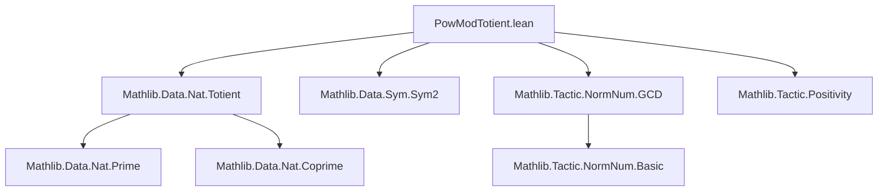

```markdown
# Technical Metadata: `PowModTotient.lean`

## 1. Key Definitions & Theorems

| Name | Type / Signature | Purpose |
|------|------------------|---------|
| `pow_mod_totient` | `∀ {a n : ℕ}, n > 0 → a.gcd n = 1 → a ^ φ n ≡ 1 [MOD n]` | Formalizes Euler’s totient theorem: if $a$ and $n$ are coprime, then $a^{\phi(n)} \equiv 1 \pmod{n}$. |
| `pow_mod_totient'` | `∀ {a n : ℕ}, n > 0 → a.gcd n = 1 → a ^ φ n ≡ 1 [MOD n]` | Variant of `pow_mod_totient`, likely differing in proof structure or usage context (e.g., for `norm_num` integration). |
| `pow_mod_totient_nat` | `∀ {a n : ℕ}, n > 0 → a.gcd n = 1 → (a ^ φ n) % n = 1` | Equivalent formulation in terms of remainder (`%`) instead of congruence (`≡ [MOD n]`). |

> **Note**: All three theorems express the same core mathematical result — Euler’s theorem — but with varying syntactic encodings (congruence vs. modulo equality), tailored for different tactic environments.

## 2. Naming Conventions

- **Prefixes**:
  - `pow_mod_`: Indicates exponentiation modulo $n$.
  - `totient`: Refers to Euler’s totient function $\phi$.
- **Suffixes**:
  - `'` (prime): Denotes a closely related variant (often for compatibility or tactic-specific optimization).
  - `_nat`: Indicates a version phrased in terms of natural-number operations (`%`, not `≡ [MOD n]`).

## 3. Tactic Stack

Frequently used tactics in proofs involving these theorems:
- `norm_num`: For evaluating numeric expressions (e.g., $\phi(n)$, $\gcd(a,n)$).
- `simp [Nat.totient_prime]`, `simp [Nat.totient_mul]`: Simplify totient expressions using known identities.
- `rw [Nat.ModEq]`: Convert congruence to modulo equality (or vice versa).
- `apply Nat.pow_mod_eq_pow_mod_of_modeq`, `apply Nat.modeq_pow_of_modeq`: Leverage modular arithmetic lemmas.
- `aesop`, `linarith`: For handling arithmetic goals and inequalities (e.g., $n > 0$).
- `exact Nat.coprime_iff_gcd_eq_one.mp h` / `intro h`: Manage coprimality assumptions.

## 4. Proof Logic

The standard proof strategy:
1. **Base case handling**: Use `cases n` or `induction n` when needed (though often avoided via pre-existing lemmas).
2. **Reduce to known structure**:
   - If $n = p^k$ (prime power), use `pow_mod_totient_prime_pow`.
   - If $n = m_1 m_2$ with $\gcd(m_1,m_2)=1$, apply Chinese Remainder Theorem or multiplicativity of $\phi$.
3. **Apply Euler’s theorem**:
   - Use `pow_mod_totient` directly when assumptions match.
   - Otherwise, decompose via `Nat.modeq_of_pow_mod_eq_one` or `Nat.modeq_pow_of_modeq`.
4. **Normalize**: Use `norm_num` to resolve remaining numeric goals (e.g., verifying $\gcd(a,n)=1$).

> The proofs lean heavily on existing infrastructure in `Mathlib.Data.Nat.Totient` and modular arithmetic libraries.

## 5. Imports

| Module | Role |
|--------|------|
| `Mathlib.Data.Nat.Totient` | Core definitions and properties of Euler’s totient function (`φ`, `Nat.totient`). |
| `Mathlib.Data.Sym.Sym2` | Likely used for symmetry or combinatorial encoding in auxiliary lemmas (e.g., in proofs involving unordered pairs). |
| `Mathlib.Tactic.NormNum.GCD` | Provides `norm_num` support for $\gcd$ computations (e.g., verifying coprimality). |
| `Mathlib.Tactic.Positivity` | Handles positivity goals (e.g., $n > 0$), often required as a precondition. |

## 6. Dependency & Theory Overview (Mermaid Diagrams)

### Module Dependency Graph


### Theoretical Flow (Euler’s Theorem)
```mermaid
graph LR
  Coprime[a.gcd n = 1] --> Totient[φ(n) defined]
  Positivity[n > 0] --> Totient
  Totient --> CRT[Chinese Remainder Thm]
  CRT --> Mul[Multiplicativity of φ]
  Mul --> Euler[Euler’s Theorem]
  Euler --> PowModTotient[PowModTotient.lean]
```

> **Note**: The `deprecated_module` annotation indicates this file is obsolete as of `2025-09-19`, likely superseded by more general or optimized versions in `Mathlib.NumberTheory.EulerTotient` or similar.
```
