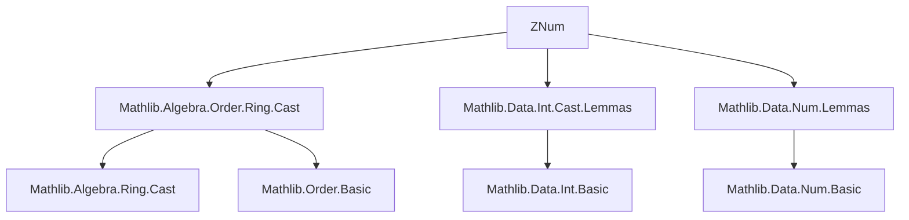
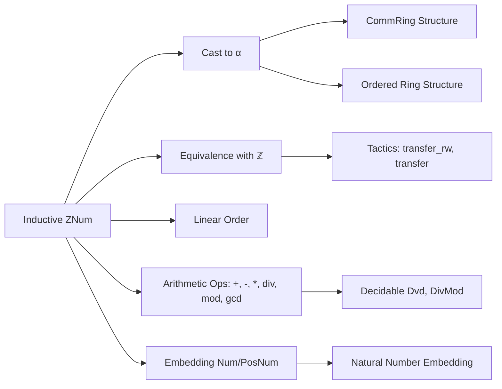

### Technical Brief: `ZNum.lean`

---

#### **1. Key Definitions & Theorems**

| Name | Type / Signature | Purpose |
|------|------------------|---------|
| `ZNum` | inductive type | Representation of integers using binary digit constructors (`zero`, `pos`, `neg`, `bit0`, `bit1`, `bitm1`, `succ`, `pred`) over `PosNum` and `Num`. |
| `cast_zero`, `cast_one`, `cast_pos`, `cast_neg`, `cast_zneg` | `((n : ZNum) : α) = n` | Canonical embedding of `ZNum` into any additive group with one (`AddGroupWithOne α`). |
| `cast_add`, `cast_mul`, `cast_sub` | `((m + n : ZNum) : α) = m + n`, etc. | Compatibility of arithmetic operations with casting to `α`. |
| `of_to_int`, `to_of_int` | `((n : ℤ) : ZNum) = n`, `((n : ZNum) : ℤ) = n` | Bidirectional equivalence between `ZNum` and `ℤ`. |
| `ofInt'_eq`, `of_to_int'` | `ZNum.ofInt' n = n` | `ofInt'` is the inverse of casting to `ℤ`. |
| `cmp_to_int`, `lt_to_int`, `le_to_int` | Ordering compatibility: `(m : ℤ) < n ↔ m < n`, etc. | Embedding of ordering on `ZNum` into `ℤ`. |
| `cast_inj`, `cast_lt`, `cast_le` | `(m : α) = n ↔ m = n`, etc. | Injectivity and order-preservation of casting into ordered rings. |
| `transfer_rw`, `transfer` | macros | Tactics to automate proof transfer between `ZNum` and `ℤ`. |
| `divMod_to_nat`, `div'_to_nat`, `mod'_to_nat` | `(n / d : ℕ) = n / d`, etc. | Correctness of division/modulo operations on `Num`/`PosNum` w.r.t. natural division. |
| `gcd_to_nat` | `(gcd a b : ℕ) = Nat.gcd a b` | GCD on `Num`/`ZNum` matches natural GCD. |
| `dvd_iff_mod_eq_zero` | `m ∣ n ↔ n % m = 0` | Divisibility characterization via modulo. |
| `instance commRing : CommRing ZNum` | `CommRing ZNum` | `ZNum` is a commutative ring. |
| `instance linearOrder : LinearOrder ZNum` | `LinearOrder ZNum` | `ZNum` is linearly ordered. |

---

#### **2. Naming Conventions**

- **Prefixes**:
  - `cast_`: casting from `ZNum`/`PosNum`/`Num` to another type.
  - `of_`: constructing `ZNum` from `ℤ`/`ℕ`.
  - `to_`: converting `ZNum`/`Num`/`PosNum` to `ℤ`/`ℕ`.
  - `bit0`, `bit1`, `bitm1`: binary digit constructors.
  - `succ`, `pred`: successor/predecessor.
  - `divMod`, `div'`, `mod'`, `gcd`: arithmetic functions.

- **Suffixes**:
  - `'`: variant of a theorem (e.g., `cast_zero'`).
  - `Aux`: auxiliary lemmas (e.g., `divMod_to_nat_aux`, `gcd_to_nat_aux`).
  - `Rec`: recursive definitions (e.g., `nsmulRec`, `zsmulRec`).

- **Special**:
  - `toZNum`, `toZNumNeg`: embedding `Num` into `ZNum`.
  - `ofZNum`, `ofZNum'`: inverse of `toZNum`.

---

#### **3. Tactic Stack**

Frequently used tactics in proofs:

| Tactic | Usage |
|--------|-------|
| `rfl` | Reflexivity for definitional equalities. |
| `cases n <;> rfl` | Structural induction on `ZNum`/`Num`/`PosNum`. |
| `simp` | Simplification using `@[simp]` lemmas (e.g., `cast_*`, `add_zero`, `neg_neg`). |
| `rw [...]` | Rewriting using lemmas like `cast_add`, `cast_mul`, `of_to_int`, etc. |
| `congr_arg` | Congruence for function application (e.g., `congr_arg pos`). |
| `have := ...; rwa [...]` | Intermediate lemma + rewrite. |
| `transfer_rw`, `transfer` | Custom macros for transferring goals to `ℤ`. |
| `lia`, `grw`, `gcongr` | Linear arithmetic and congruence reasoning. |
| `decide` | For decidable propositions (e.g., `0 < 1`). |
| `induction n with` | Induction on `Num` (with `one`, `bit0`, `bit1` cases). |

---

#### **4. Proof Logic**

- **Structural Induction**: Most proofs on `ZNum`, `Num`, `PosNum` proceed by induction on the inductive structure (e.g., `0`, `pos p`, `neg p`, or `bit0`, `bit1`, `bitm1`).
- **Case Analysis**: After induction, case analysis on `e : ...` or `rcases e : ...` is common to handle subcases (e.g., `pred' p = 1` vs `pred' p = a + 1`).
- **Transfer Strategy**: Many ring/order properties are proven by:
  1. Transferring to `ℤ` using `cast_to_int`, `lt_to_int`, etc.
  2. Proving in `ℤ` (often via `simp`, `transfer`, or `decide`).
  3. Transferring back.
- **Normalization via `norm_cast`**: Many `cast_*` lemmas are marked `norm_cast`, enabling automatic normalization of casts during simplification.

---

#### **5. Imports**

| Module | Purpose |
|--------|---------|
| `Mathlib.Algebra.Order.Ring.Cast` | General theory of ring casts and order compatibility. |
| `Mathlib.Data.Int.Cast.Lemmas` | Lemmas about `Int.cast`. |
| `Mathlib.Data.Num.Lemmas` | Core lemmas about `Num`/`PosNum` (split off to keep under 1500 lines). |

---

#### **6. Mermaid Diagrams**

##### **Dependency Graph (Module-Level)**



##### **Overview of `ZNum` Theory**



##### **Proof Strategy Flow (Example: `cast_add`)**

```mermaid
flowchart TD
  A[Goal: ((m + n : ZNum) : α) = m + n] --> B{Case split on m, n}
  B -->|0, *| C[zero_add]
  B -->|*, 0| D[add_zero]
  B -->|pos, pos| E[PosNum.cast_add]
  B -->|pos, neg| F[PosNum.cast_sub']
  B -->|neg, pos| G[PosNum.cast_sub' + add_comm]
  B -->|neg, neg| H[PosNum.cast_add + neg_add_rev]
```

---

#### **7. Summary**

`ZNum.lean` formalizes the **binary representation of integers** (`ZNum`) and proves its equivalence to `ℤ`, including:
- Ring and order structure,
- Arithmetic operations (`+`, `-`, `*`, `/`, `%`, `gcd`),
- Embeddings from `Num`/`PosNum`,
- Decidability of divisibility,
- Tactics for automated reasoning via transfer to `ℤ`.

It serves as a foundational module for efficient integer arithmetic in Lean’s mathlib, especially where binary representation is needed (e.g., for decidability or performance-critical code).
