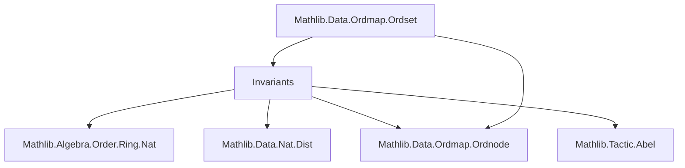
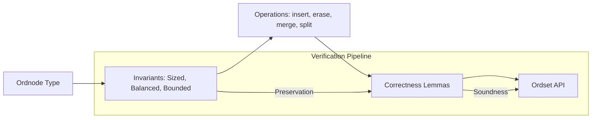

Here's a structured technical brief based on the provided `Invariants.lean` file:

---

## **Technical Brief: Invariants for `Ordnode` Verification**

### **1. Key Definitions & Theorems**

| Name | Type / Signature | Purpose |
|------|------------------|---------|
| `realSize : Ordnode α → ℕ` | `Ordnode α → ℕ` | Computes actual element count (ignores cached `size`). Recursive traversal. |
| `Sized : Ordnode α → Prop` | `Ordnode α → Prop` | Invariant: cached `size` field matches `realSize`. Defined inductively. |
| `BalancedSz (l r : ℕ) : Prop` | `ℕ → ℕ → Prop` | Local balance condition: `l + r ≤ 1 ∨ l ≤ δ * r ∧ r ≤ δ * l`. Used for node children. |
| `Balanced : Ordnode α → Prop` | `Ordnode α → Prop` | Global balance invariant: `BalancedSz` holds at every node, recursively. |
| `Bounded lo hi t : Prop` | *Not defined in this file* | (Mentioned in intro) Enforces strict increasing order of elements with bounds. |
| `node' : Ordnode α → α → Ordnode α → Ordnode α` | `Ordnode α → α → Ordnode α → Ordnode α` | Constructor for balanced trees (ignores invariants). |
| `rotateL / rotateR` | `Ordnode α → α → Ordnode α → Ordnode α` | Local rebalancing operations (left/right rotations). |
| `balanceL' / balanceR' / balance'` | `Ordnode α → α → Ordnode α → Ordnode α` | Higher-level rebalancing combinators. `balance'` is the canonical version. |
| `dual : Ordnode α → Ordnode α` | `Ordnode α → Ordnode α` | Tree mirror: swaps left/right subtrees. Used to reduce proofs via symmetry. |
| `node3L / node3R / node4L / node4R` | `Ordnode α → α → Ordnode α → α → Ordnode α → α → Ordnode α` | Tree constructors for 3- and 4-node concatenations. |
| `Sized.node'` | `Sized l → Sized r → Sized (node' l x r)` | `node'` preserves `Sized`. |
| `Sized.size_eq` | `Sized t → size t = realSize t` | `Sized` implies cached size equals actual size. |
| `BalancedSz.symm` | `BalancedSz l r → BalancedSz r l` | Symmetry of local balance condition. |
| `Balanced.dual` | `Balanced t → Balanced (dual t)` | `dual` preserves `Balanced`. |
| `Sized.rotateL / Sized.rotateR` | `Sized l → Sized r → Sized (rotateL l x r)` | Rotations preserve `Sized`. |
| `Sized.balance'` | `Sized l → Sized r → Sized (balance' l x r)` | `balance'` preserves `Sized`. |
| `size_balance'` | `Sized l → Sized r → size (balance' l x r) = size l + size r + 1` | Size correctness of `balance'`. |
| `all_balance'` | `All P (balance' l x r) ↔ All P l ∧ P x ∧ All P r` | Element-wise predicate preservation under `balance'`. |
| `balance_eq_balance'` | `Balanced l → Balanced r → Sized l → Sized r → balance l x r = balance' l x r` | Equivalence of manual and abstract balance definitions. |
| `Raised n m : Prop` | `ℕ → ℕ → Prop` | `m = n ∨ m = n + 1`. Used to model near-equal sizes in balance proofs. |

---

### **2. Naming Conventions**

- **Prefixes**:
  - `is_`, `has_`: *Not used* — invariants are named directly (`Sized`, `Balanced`).
  - `real_`: for computed (non-cached) values (`realSize`).
  - `dual_`: for dual/mirror operations (`dual`, `dual_rotateL`, `dual_balance'`).
  - `node3_`, `node4_`: for multi-node constructors.
  - `balance_`, `rotate_`: for rebalancing operations.
  - `Sz`: suffix for size-based predicates (`BalancedSz`, `Raised`).
- **Suffixes**:
  - `'` (prime): often denotes a more abstract or proof-friendly variant (`balance'`, `balanceL'`).
  - `L`/`R`: left/right variants (`rotateL`, `balanceR`).
  - `'` in `node'`: primed constructor (ignores invariants).
- **Prefixes for predicates**:
  - `All`, `Any`, `Emem`, `Amem`: for element-wise properties (not defined here but used).
- **Constants**:
  - `delta := 3`: global balance parameter.
  - `ratio`: used in `rotateL`/`rotateR` conditionals (not defined in this snippet).

---

### **3. Tactic Stack**

Frequently used tactics in proofs:

| Tactic | Usage |
|--------|-------|
| `simp` | Simplification of definitions (`Sized`, `Balanced`, `size`, `dual`, `node'`, etc.). |
| `cases` | Inductive case analysis on `Ordnode` or `BalancedSz`. |
| `rw` | Rewriting using lemmas (e.g., `size_eq_realSize`, `dual_dual`). |
| `split_ifs` | Handling `if`-expressions in definitions (`rotateL`, `balance'`). |
| `abel` | Solving linear arithmetic over `ℕ` (e.g., size equations). |
| `decide` | Deciding simple arithmetic facts (e.g., `1 ≤ delta`). |
| `lia` / `linarith` | Linear integer arithmetic (used in `balanceL_eq_balance'`). |
| `congr_arg` | Congruence for function extensionality (e.g., `findMin_dual`). |
| `induction` | Structural induction on trees (e.g., `Sized.induction`). |
| `obtain` / `rcases` | Destructuring existential/universal hypotheses. |
| `dsimp` | Simplifying definitions with `unfold` + `simp`. |
| `symm` | Swapping equality/relation sides (e.g., `BalancedSz.symm`). |

---

### **4. Proof Logic**

- **Inductive structure**: Proofs follow the inductive definition of `Ordnode` (`nil`, `node`).
- **Case splitting**: Heavy use of `cases` on tree shape (`nil`, `node _ l x r`) and balance conditions (`BalancedSz`).
- **Size arithmetic**: Most proofs reduce to verifying size equations using:
  - `size_node`, `node3L_size`, `node4L_size`, `size_dual`.
  - `Sized.size_eq`, `size_eq_realSize`.
- **Balance reasoning**:
  - Local balance (`BalancedSz`) handled via `balancedSz_up/down`, `balancedSz_zero`.
  - Global balance (`Balanced`) preserved via induction and symmetry (`Balanced.dual`).
- **Duality principle**: Many properties (e.g., `rotateL`, `balanceL`) are proven via `dual`, reducing work by half.
- **Equivalence lemmas**: Key strategy: prove correctness for `balance'`, then show `balance = balance'` under invariants (`balance_eq_balance'`).
- **Arithmetic lemmas**: `Raised` used to model near-equality of sizes; `delta_lt_false` rules out impossible size ratios.

---

### **5. Imports & Dependencies**

| Module | Purpose |
|--------|---------|
| `Mathlib.Algebra.Order.Ring.Nat` | Ordered semiring structure on `ℕ`, used for `delta`, `ratio`, inequalities. |
| `Mathlib.Data.Nat.Dist` | Distance function `Nat.dist`, used in `Raised.dist_le`. |
| `Mathlib.Data.Ordmap.Ordnode` | Defines `Ordnode` inductive type (not shown here). |
| `Mathlib.Tactic.Abel` | `abel` tactic for additive commutative monoid arithmetic. |

---

### **6. Mermaid Diagrams**

#### **Dependency Graph (Module-Level)**

- `Invariants.lean` depends on `Ordnode.lean` (defines the data type).
- `Ordset.lean` (not shown) depends on `Invariants.lean` to use verified operations.

#### **File Overview (Conceptual)**

- **Goal**: Prove that all `Ordnode` operations preserve `Sized` and `Balanced`.
- **Result**: Enables safe use in `Ordset` (a verified ordered set implementation).

---

### **7. Status & TODO**

- **Completed**: Core invariants (`Sized`, `Balanced`), `dual`, `rotate*`, `balance*`, `node*`, `toList`, `findMin/Max`, `eraseMin/Max`, `merge`, `insert`, `dual`-based symmetry.
- **Incomplete**: Full verification of all `Ordnode` operations (e.g., `glue`, `split`, `partition`).
- **TODO**: Finish verification of remaining primitives; extend to `Bounded` (order) invariants.

--- 

Let me know if you'd like a formalized summary of a specific theorem (e.g., `balance_eq_balance'`) or a proof sketch for a key lemma.
