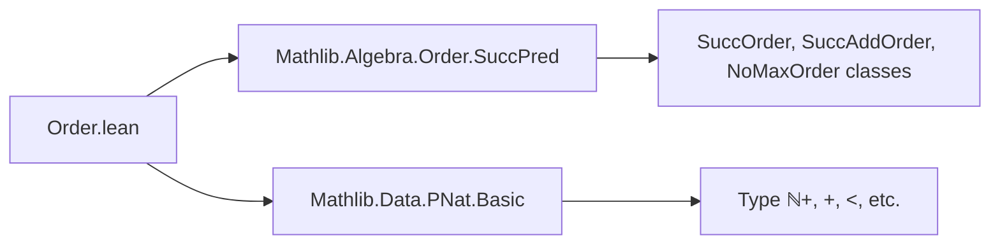
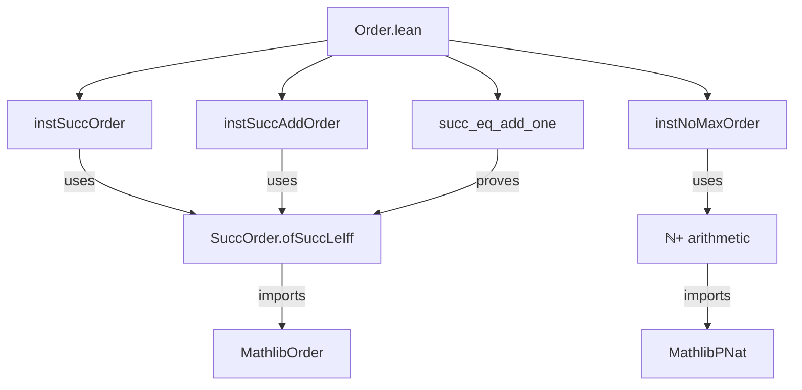

**Technical Brief: `Order.lean` (PNat Order Instances)**

---

### 1. **Key Definitions & Theorems**

| Name | Type | Purpose |
|------|------|---------|
| `instSuccOrder` | `SuccOrder ℕ+` | Constructs a `SuccOrder` instance on `ℕ+` via `ofSuccLeIff`, using `n + 1` as the successor and equivalence `n + 1 ≥ m ↔ n ≥ m - 1` (implicit via `Iff.rfl`). |
| `instSuccAddOrder` | `SuccAddOrder ℕ+` | Equips `ℕ+` with a `SuccAddOrder` structure, asserting `succ n = n + 1` definitionally (`rfl`). |
| `instNoMaxOrder` | `NoMaxOrder ℕ+` | Proves `ℕ+` has no maximum element: for any `n : ℕ+`, `n + 1` is strictly greater (`lt_succ_self n`). |
| `succ_eq_add_one` | `∀ n : ℕ+, Order.succ n = n + 1` | A simplification lemma identifying the order-theoretic successor with arithmetic successor; marked `@[simp]`. |

---

### 2. **Naming Conventions**

- **Instance naming**: Uses `inst*` prefix (e.g., `instSuccOrder`, `instSuccAddOrder`, `instNoMaxOrder`) — standard Lean/Mathlib convention for typeclass instances.
- **Lemma naming**: `succ_eq_add_one` follows `*eq*` pattern for definitional equalities involving operations (`succ`, `add_one`).
- **No custom prefixes/suffixes beyond Mathlib norms**.

---

### 3. **Tactic Stack**

- `rfl` — used for definitional equalities (`succ_eq_add_one`, `instSuccAddOrder`).
- `lt_succ_self` — used as a *lemma* (not a tactic), but invoked directly in `exists_gt`.
- `ofSuccLeIff` — constructor for `SuccOrder`, applied with a lambda and `Iff.rfl`.
- Implicit use of `intro`, `exact`, `apply` via `instance`/`lemma` elaboration.

No heavy automation (e.g., `aesop`, `ring`, `simp`) beyond `rfl` and lemma application.

---

### 4. **Proof Logic**

- **Instance construction**:
  - `instSuccOrder`: Define successor as `λ n ↦ n + 1`; prove `succ_le_iff` holds by `Iff.rfl` (i.e., definitionally).
  - `instSuccAddOrder`: Directly provide proof term `rfl` for `succ n = n + 1`.
  - `instNoMaxOrder`: For arbitrary `n`, construct witness `n + 1` and supply proof `lt_succ_self n`.
- **Lemma**: Trivial definitional equality (`rfl`), justified by how `Order.succ` is defined in `SuccOrder`.

All proofs are *computational* and rely on definitional equality or basic order properties of `ℕ`.

---

### 5. **Imports**

- `Mathlib.Algebra.Order.SuccPred` — provides `SuccOrder`, `SuccAddOrder`, `NoMaxOrder`, and related infrastructure.
- `Mathlib.Data.PNat.Basic` — defines `ℕ+` (positive naturals) and basic operations (`+`, `succ`, order).

These imports define the *algebraic-order* and *data* layers required to build the instances.

---

### 8. **Mermaid Diagrams**

#### Dependency Graph (Module-Level)

#### Overview of File Structure

#### Theory Context (Position in Mathlib)

- Part of the **order-theoretic extension** of `ℕ+`.
- Complements `Mathlib.Algebra.Order.SuccPred` by providing concrete instances for `ℕ+`.
- Enables use of `SuccOrder`, `SuccAddOrder`, and `NoMaxOrder` lemmas (e.g., monotonicity of `succ`, induction principles) on positive naturals.

--- 

**Summary**: This module establishes foundational order-theoretic structure on `ℕ+`, aligning its successor with arithmetic `+1`, and confirming it behaves as a discrete unbounded ordered semiring without maximum. All proofs are short, definitional, and leverage existing `ℕ` order theory.
