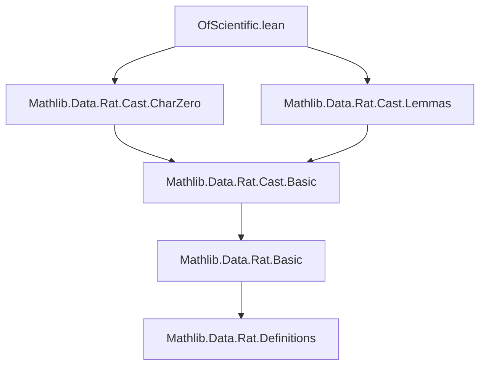
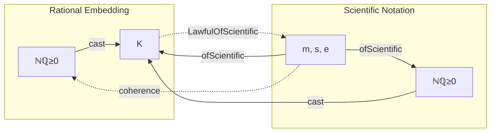

**Technical Brief: `OfScientific` Instance for Characteristic Zero Fields**

---

### 1. **Key Definitions & Theorems**

| Name | Type / Signature | Purpose |
|------|------------------|---------|
| `LawfulOfScientific` | `Class` (structure) | Ensures that `ofScientific` behaves as expected w.r.t. field operations (e.g., preserves addition/multiplication where defined). |
| `ofScientific_def` | `LawfulOfScientific.ofScientific_def {m s e}` | A field-specific proof obligation in `LawfulOfScientific`, asserting correctness of `ofScientific` definition via rational representation. |
| `NNRat.cast_ofScientific` | Lemma | Relates `ofScientific` on `ℕℚ≥0` (non-negative rationals) to its embedding into a characteristic-zero field `K`. |
| `NNRatCast.toOfScientific_def` | Lemma | Connects the canonical embedding `ℕℚ≥0 → K` with the `ofScientific` representation. |

> **Purpose of the main result**: To show that in any characteristic-zero field $K$, the `ofScientific` function (which interprets scientific notation $m \cdot s \cdot 10^e$) coincides with the field operation induced from $\mathbb{Q}_{\ge 0}$, i.e., the embedding is *lawful*.

---

### 2. **Naming Conventions**

- **Prefixes**:
  - `ofScientific_`: Pertains to the interpretation of scientific notation in a type.
  - `LawfulOfScientific`: Indicates a *lawful* (i.e., algebraically coherent) instance.
  - `NNRat.cast_`: Relates to canonical embedding of non-negative rationals.
- **Suffixes**:
  - `_def`: Denotes a definitional or proof obligation for a class method.
  - `toOfScientific`: Indicates conversion *to* the `ofScientific` representation.

---

### 3. **Tactic Stack**

The proof uses a minimal but precise tactic pipeline:

| Tactic | Role |
|--------|------|
| `rw` | Rewrites using lemmas `← NNRat.cast_ofScientific` and `NNRatCast.toOfScientific_def`. |
| `simp only [...]` | Simplifies using the definition of `LawfulOfScientific.ofScientific_def`. |
| `split` | Handles the two cases of `ofScientific` (positive exponent vs. negative exponent). |
| `norm_cast` | Pushes embeddings through arithmetic operations (e.g., casting from `ℕℚ≥0` to $K$). |
| `simp` | Final simplification after norm_cast, resolving remaining trivial goals. |

No heavy automation (e.g., `linarith`, `ring`) is needed—this is a definitional coherence proof.

---

### 4. **Proof Logic**

The proof proceeds as follows:

1. **Goal**: Show `ofScientific m s e` in $K$ equals the image of the corresponding rational under the canonical embedding.
2. **Rewrite** using:
   - `← NNRat.cast_ofScientific`: expresses `ofScientific` in $K$ as the cast of the rational version.
   - `NNRatCast.toOfScientific_def`: identifies the rational version with `ofScientific` on `NNRat`.
3. **Simplify** using the definition of `LawfulOfScientific.ofScientific_def`.
4. **Case split** on the structure of `ofScientific` (typically `if e ≥ 0 then ... else ...`).
5. **Normalize** the cast (via `norm_cast`) to reduce to arithmetic in $K$.
6. **Simplify** again to close both branches.

This is a *definitional coherence* proof: it shows the implementation of `ofScientific` in $K$ matches the expected one via the universal property of characteristic-zero fields (which factor through $\mathbb{Q}$).

---

### 5. **Imports**

| Import | Role |
|--------|------|
| `Mathlib.Data.Rat.Cast.CharZero` | Provides the canonical embedding of $\mathbb{Q}$ into any characteristic-zero field. |
| `Mathlib.Data.Rat.Cast.Lemmas` | Supplies lemmas about rational embeddings, including `cast_ofScientific`, `toOfScientific_def`. |

> **Note**: The module is built on top of `Mathlib.Data.Rat.Cast`, indicating it assumes the standard rational embedding machinery.

---

### 6. **Mermaid Diagrams**

#### Dependency Graph (Module-Level)

#### Overview of Theoretical Flow

> **Interpretation**: The diagram shows that `ofScientific` in $K$ factors through $\mathbb{Q}_{\ge 0}$, and the `LawfulOfScientific` instance certifies that this factorization commutes.

---

### 7. **Formal Statement Summary**

Let $K$ be a field of characteristic zero. Then the canonical map $\mathbb{Q}_{\ge 0} \to K$ satisfies:

$$
\text{ofScientific}_K(m, s, e) = \text{cast}(\text{ofScientific}_{\mathbb{Q}_{\ge 0}}(m, s, e))
$$

and this equality is witnessed by the `ofScientific_def` field of the `LawfulOfScientific K` instance.

--- 

Let me know if you'd like the corresponding Coq or Isabelle formalization sketch.
