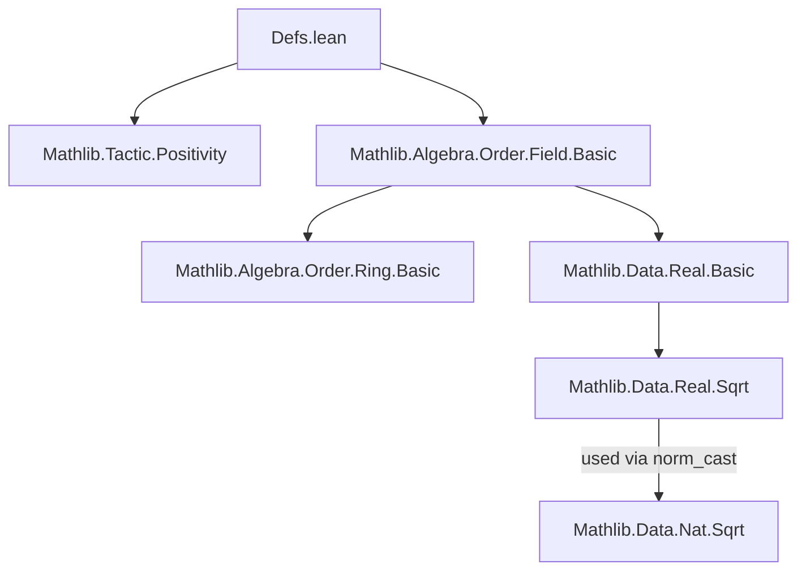
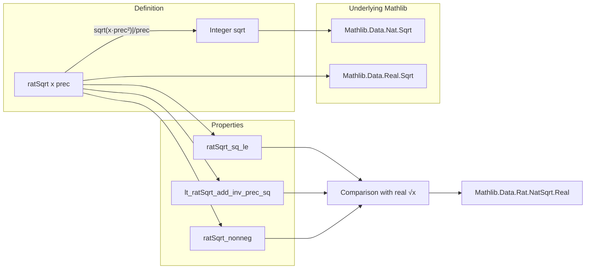

**Technical Brief: `Defs.lean` – Rational Approximation of Square Roots**

---

### 1. **Key Definitions & Theorems**

| Name | Type / Signature | Purpose |
|------|------------------|---------|
| `ratSqrt` | `def ratSqrt (x : ℕ) (prec : ℕ) : ℚ` | Approximates $\sqrt{x}$ as a rational number within error $1/\text{prec}$. Defined as $\frac{\sqrt{x \cdot \text{prec}^2}}{\text{prec}}$, where the numerator is the integer square root lifted to ℚ. |
| `ratSqrt_nonneg` | `theorem ratSqrt_nonneg (x prec : ℕ) : 0 ≤ ratSqrt x prec` | Proves non-negativity of `ratSqrt`. |
| `ratSqrt_sq_le` | `theorem ratSqrt_sq_le (x : ℕ) {prec : ℕ} (h : 0 < prec) : (ratSqrt x prec)^2 ≤ x` | Shows the square of the rational approximation is ≤ $x$. |
| `lt_ratSqrt_add_inv_prec_sq` | `theorem lt_ratSqrt_add_inv_prec_sq (x : ℕ) {prec : ℕ} (h : 0 < prec) : x < (ratSqrt x prec + 1 / prec)^2` | Establishes a lower bound: $x$ is strictly less than $(\text{ratSqrt}(x,\text{prec}) + 1/\text{prec})^2$, i.e., the approximation is within $1/\text{prec}$ in *value*, not just square. |

---

### 2. **Naming Conventions**

- **Prefixes**:
  - `ratSqrt_`: for definitions and properties of the rational square root approximation.
- **Suffixes**:
  - `_nonneg`: for non-negativity lemmas.
  - `_sq_le`: for upper bounds on the *square* of the approximation.
  - `lt_..._sq`: for lower bounds involving the *square* of a perturbed approximation.

- **Variable naming**:
  - `x : ℕ`: the input natural number.
  - `prec : ℕ`: precision parameter (denominator scale).
  - `h : 0 < prec`: positivity hypothesis, often required to avoid division by zero.

---

### 3. **Tactic Stack**

- `unfold`: to expand `ratSqrt` definition.
- `rw [div_pow, div_le_iff₀, add_mul, mul_pow, div_mul_cancel₀]`: algebraic rewrites in ℚ.
- `norm_cast`: to lift integer arithmetic to ℚ (and vice versa).
- `exact sqrt_le'` / `exact lt_succ_sqrt'`: core lemmas from `Mathlib.Data.Real.Sqrt` about integer square root.
- ` positivity`: from `Mathlib.Tactic.Positivity`, used repeatedly to discharge positivity goals (e.g., `prec ≠ 0`, `prec ^ 2 > 0`).
- `all_goals`: used to apply `norm_cast; positivity` to remaining goals.

---

### 4. **Proof Logic**

- **Structure**: All proofs follow a standard pattern:
  1. **Unfold** `ratSqrt`.
  2. **Rewrite** rational expressions using field arithmetic (`div_pow`, `div_le_iff₀`, etc.).
  3. **Lift to integers** via `norm_cast` to apply integer square root lemmas.
  4. **Apply known inequalities**:
     - `sqrt_le'`: $\sqrt{n}^2 \le n$
     - `lt_succ_sqrt'`: $n < (\lfloor \sqrt{n} \rfloor + 1)^2$
  5. **Re-discharge** rational inequalities using `div_le_iff₀` / `mul_lt_mul_iff_of_pos_right`.
  6. **Close positivity side conditions** with ` positivity`.

- **No induction** is used — the proofs are direct algebraic manipulations leveraging properties of integer square roots and ℚ arithmetic.

---

### 5. **Imports**

| Import | Role |
|--------|------|
| `Mathlib.Tactic.Positivity` | Automated discharge of positivity/negativity goals (e.g., `prec ≠ 0`). |
| `Mathlib.Algebra.Order.Field.Basic` | Provides basic order-field theory (e.g., `div_le_iff₀`, `mul_lt_mul_iff_of_pos_right`). |

> **Note**: Though not explicitly imported here, the proofs rely on `Mathlib.Data.Real.Sqrt` (via `sqrt_le'`, `lt_succ_sqrt'`), which is part of the transitive closure of `Mathlib.Algebra.Order.Field.Basic` and `Mathlib.Data.Real.Basic`.

---

### 6. **Mermaid Diagrams**

#### **Dependency Graph (Module-Level)**

#### **Overview of `ratSqrt` Theory**

> **Note**: The comment in the file explicitly references `Mathlib.Data.Rat.NatSqrt.Real` as a related theory for comparing `ratSqrt` with the *real* square root — suggesting this module is a building block for a larger rational approximation pipeline.

--- 

Let me know if you'd like a formalization of the comparison with `real.sqrt` or a correctness theorem (e.g., $|\text{ratSqrt}(x,\text{prec}) - \sqrt{x}| < 1/\text{prec}$).
