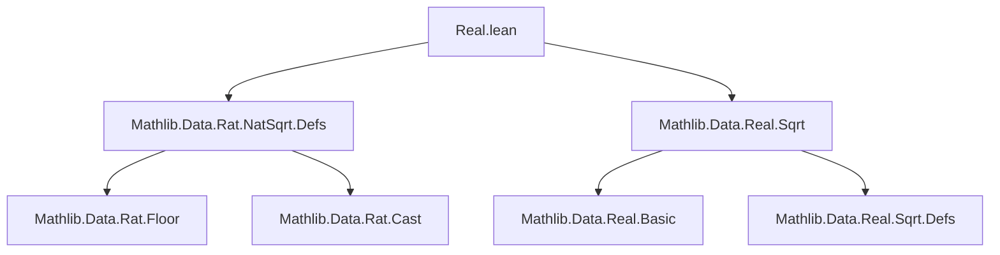

**Technical Brief: `Real.lean` Module (Real Square Root Approximation)**  
*Source: `Real.lean`, Lean 4, Mathlib-based*

---

### 1. **Key Definitions & Theorems**

| Name | Type | Purpose |
|------|------|---------|
| `ratSqrt` | `ℕ → ℕ → ℚ` | Rational approximation of $\sqrt{x}$ with precision parameter `prec`; returns the largest rational $q = a / \text{prec}$ such that $q^2 \le x$. Defined in `Mathlib.Data.Rat.NatSqrt.Defs`. |
| `realSqrt` | `ℝ → ℝ` | Real square root function; defined in `Mathlib.Data.Real.Sqrt`. |
| `ratSqrt_le_realSqrt` | `∀ x : ℕ, 0 < prec → ratSqrt x prec ≤ √x` | Lower bound: rational approximation is ≤ real square root. |
| `realSqrt_lt_ratSqrt_add_inv_prec` | `∀ x : ℕ, 0 < prec → √x < ratSqrt x prec + 1 / prec` | Upper bound: real square root is strictly less than rational approximation plus $1/\text{prec}$. |
| `realSqrt_mem_Ico` | `∀ x : ℕ, 0 < prec → √x ∈ [ratSqrt x prec, ratSqrt x prec + 1 / prec)` | Combines above to show $\sqrt{x}$ lies in the half-open interval $[q, q + 1/\text{prec})$. |
| `ratSqrt_mem_Ioc` | `∀ x : ℕ, 0 < prec → q ∈ (\sqrt{x} - 1/\text{prec}, \sqrt{x}]` | Equivalent containment: rational approximation lies in $(\sqrt{x} - 1/\text{prec}, \sqrt{x}]$. |

> Note: All theorems assume `prec > 0`. The rational `ratSqrt x prec` is cast to `ℝ` via `↑`.

---

### 2. **Naming Conventions**

- **Prefixes**:
  - `ratSqrt_`: rational approximation-related lemmas.
  - `realSqrt_`: real square root-related lemmas.
- **Suffixes**:
  - `_le_`, `_lt_`: inequality direction.
  - `_mem_Ico`, `_mem_Ioc`: membership in interval (`Ico` = `[a, b)`, `Ioc` = `(a, b]`).
- **Pattern**: `ratSqrt_le_realSqrt`, `realSqrt_lt_ratSqrt_add_inv_prec`, `ratSqrt_mem_Ioc`.

---

### 3. **Tactic Stack**

| Tactic | Frequency | Role |
|--------|-----------|------|
| `have` | High | Intermediate lemma extraction (e.g., squaring, casting). |
| `norm_cast` | High | Move between `ℚ` and `ℝ` (e.g., `(↑q)^2 = ↑(q^2)`). |
| `rwa` / `rw` | Medium | Rewrite using known equalities (e.g., `Real.sqrt_sq`). |
| `push_cast` | Medium | Push casts inward (e.g., `↑(a + b) = ↑a + ↑b`). |
| `simp` / `simp only` | Medium | Simplify using known facts (e.g., `ratSqrt_nonneg`). |
| `grind` | Medium | High-level automation for interval membership proofs; used with explicit pattern tuning. |
| `exact` / `simpa` | Low | Final proof step or simplification + exact. |

> **Adaptation note** highlights `grind` sensitivity to pattern selection — a sign of evolving automation heuristics.

---

### 4. **Proof Logic Flow**

Typical proof pattern:

1. **Start from known rational bounds** (e.g., `ratSqrt_sq_le`, `lt_ratSqrt_add_inv_prec_sq`).
2. **Cast to reals** (`norm_cast`) to compare with `√x`.
3. **Apply monotonicity/strict monotonicity** of `Real.sqrt`:
   - `Real.sqrt_monotone` for non-strict inequality.
   - `Real.sqrt_lt_sqrt` for strict inequality (requires positivity).
4. **Rewrite using algebraic identities**:
   - `Real.sqrt_sq` (for nonnegative reals).
   - `Rat.cast_pow`, `Rat.cast_add`, etc.
5. **Conclude interval membership** via `grind` or `interval_mem` lemmas.

Induction is *not* used — proofs are direct and rely on algebraic properties and monotonicity.

---

### 5. **Imports & Dependencies**

| Module | Role |
|--------|------|
| `Mathlib.Data.Rat.NatSqrt.Defs` | Defines `ratSqrt`, basic properties (`ratSqrt_sq_le`, `lt_ratSqrt_add_inv_prec_sq`, `ratSqrt_nonneg`). |
| `Mathlib.Data.Real.Sqrt` | Defines `Real.sqrt`, monotonicity (`Real.sqrt_monotone`), strict inequality (`Real.sqrt_lt_sqrt`), and algebraic laws (`Real.sqrt_sq`). |

> No additional dependencies (e.g., topology, analysis) are needed — only basic order and field theory.

---

### 6. **Mermaid Diagrams**

#### **Dependency Graph (Module-Level)**



#### **Theoretical Overview (Proof Structure)**

```mermaid
flowchart LR
  A[ratSqrt definition] --> B[ratSqrt_sq_le]
  A --> C[lt_ratSqrt_add_inv_prec_sq]
  B --> D[Cast to ℝ: (ratSqrt)^2 ≤ x]
  C --> E[Cast to ℝ: x < (ratSqrt + 1/prec)^2]
  D --> F[Real.sqrt_monotone]
  E --> G[Real.sqrt_lt_sqrt]
  F --> H[ratSqrt ≤ √x]
  G --> I[√x < ratSqrt + 1/prec]
  H & I --> J[realSqrt_mem_Ico]
  H --> K[ratSqrt_mem_Ioc]
```

---

### 7. **Domain Summary**

This module formalizes **error bounds for rational approximations of real square roots** of natural numbers. It shows that for any `prec > 0`, the real square root $\sqrt{x}$ lies within an interval of width $1/\text{prec}$ around the rational approximation `ratSqrt x prec`. This is foundational for:
- Constructive analysis,
- Verified numerical algorithms,
- Formalization of continuity/differentiability of $\sqrt{x}$.

The proofs are elementary but require careful handling of:
- Rational-to-real casts,
- Monotonicity of `Real.sqrt`,
- Interval membership logic.

--- 

Let me know if you'd like a formalized dependency graph of `ratSqrt` definitions or a tactic trace for one of the proofs.
