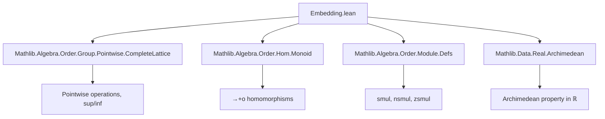

### Technical Brief: Embedding of Archimedean Ordered Additive Groups into ℝ

---

#### **1. Key Definitions & Theorems**

| Name | Type / Signature | Purpose |
|------|------------------|---------|
| `ratLt x` | `Set ℚ` | Set of rationals $ r = \frac{p}{q} $ such that $ p • 1 < q • x $ in $ M $. Used to approximate $ x \in M $ from below. |
| `ratLt' x` | `Set ℝ` | Image of `ratLt x` under canonical embedding $ \mathbb{Q} \hookrightarrow \mathbb{R} $. |
| `embedRealFun x` | `ℝ` | Supremum of `ratLt' x`, i.e., $ \sup \{ r \in \mathbb{Q} \mid r • 1 < x \} $. Defines the candidate embedding. |
| `embedReal M` | `M →+o ℝ` | Bundled order-preserving additive monoid homomorphism (i.e., `→+o`) from $ M $ to $ \mathbb{R} $, preserving $ 1 $. |
| `embedReal_injective` | `Function.Injective (embedReal M)` | Injectivity of the embedding. |
| `embedReal_one` | `(embedReal M) 1 = 1` | The embedding preserves the unit element. |
| `exists_orderAddMonoidHom_real_injective` | `∃ f : M →+o ℝ, Function.Injective f` | For any archimedean $ M $, there exists an injective order-preserving additive monoid map into $ \mathbb{R} $. |

---

#### **2. Naming Conventions**

- **Prefixes**:
  - `ratLt`, `ratLt'`: rational lower bounds.
  - `embedReal`, `embedRealFun`: embedding into reals.
- **Suffixes**:
  - `'` (prime): often denotes real-closure or extension (e.g., `ratLt'` is the real version of `ratLt`).
  - `'_bddAbove`, `'_nonempty`: properties of sets used in supremum construction.
- **Functional style**:
  - `num_smul_one_lt_den_smul_add`, `num_le_nat_mul_den`: lemmas about rational approximations using numerator/denominator notation.

---

#### **3. Tactic Stack**

Frequently used tactics in proofs:

| Tactic | Role |
|--------|------|
| `rw` / `conv` | Rewriting definitions (e.g., `ratLt`, `smul`, `mkRat`). |
| `simp` / `simpa` | Simplification using algebraic laws (`smul_smul`, `zsmul`, `nsmul`). |
| `exact`, `apply`, `refine` | Goal-directed proof construction. |
| `linarith`, `arith` | Handling linear arithmetic over ordered structures. |
| `exists_rat_btwn` | Constructing rationals between reals (key for density arguments). |
| `csSup_le`, `le_csSup_iff` | Reasoning about suprema in `ℝ`. |
| `zsmul_lt_zsmul_right`, `nsmul_lt_nsmul_iff_left` | Strict monotonicity of scalar multiplication. |
| `abel` | Simplifying expressions in additive groups. |
| `sub_pos.mpr`, `lt_of_lt_of_le`, `add_lt_add` | Order reasoning. |

---

#### **4. Proof Logic**

The proof strategy follows a standard **Dedekind-cut-style construction**, adapted to archimedean ordered additive groups:

1. **Approximation via rationals**:
   - Define `ratLt x` as rationals $ r $ with $ r • 1 < x $.
   - Show `ratLt x` is nonempty and bounded above using the archimedean property.

2. **Supremum definition**:
   - Define `embedRealFun x := sup (ratLt' x)`.
   - Prove `ratLt' x` is nonempty and bounded above → supremum exists in $ \mathbb{R} $.

3. **Homomorphism properties**:
   - **Additivity**: Prove `ratLt (x + y) = ratLt x + ratLt y` (key lemma `ratLt_add`), then lift to suprema.
   - **Monotonicity**: Show strict monotonicity via density of $ \mathbb{Q} $ in $ \mathbb{R} $ and archimedean property.

4. **Unit preservation**:
   - Use rational approximations to $ 1 $ and properties of `ratLt 1` to show `embedReal 1 = 1`.

5. **General existence** (without unit assumption):
   - Reduce to the unital case via absolute value: define $ 1 := |a| $ for some nonzero $ a $, then apply `embedReal`.

---

#### **5. Imports & Dependencies**

| Module | Role |
|--------|------|
| `Mathlib.Algebra.Order.Group.Pointwise.CompleteLattice` | Provides lattice-theoretic tools for pointwise operations, suprema/infima. |
| `Mathlib.Algebra.Order.Hom.Monoid` | Defines `→+o`, the type of order-preserving additive monoid homomorphisms. |
| `Mathlib.Algebra.Order.Module.Defs` | Defines scalar multiplication (`•`) in ordered modules/groups. |
| `Mathlib.Data.Real.Archimedean` | Contains the archimedean property for $ \mathbb{R} $, used to derive archimedean behavior in $ M $. |

---

#### **6. Mermaid Diagrams**

##### **Dependency Graph (Module-Level)**



##### **Theory Overview (Embedding Construction)**

```mermaid
flowchart LR
  A[Archimedean Ordered Additive Group M] --> B[Define ratLt x = {r ∈ ℚ | r•1 < x}]
  B --> C[Show ratLt x is nonempty & bounded above]
  C --> D[Define embedRealFun x := sup(ratLt' x)]
  D --> E[Prove additivity: ratLt(x+y) = ratLt x + ratLt y]
  E --> F[Prove monotonicity: x < y ⇒ embedRealFun x < embedRealFun y]
  F --> G[Construct bundled map embedReal : M →+o ℝ]
  G --> H[Show injective & preserves 1]
  H --> I[Generalize to any archimedean M (no unit assumed)]
```

---

#### **7. Summary**

This file formalizes the classical result that **every archimedean ordered additive group embeds order-preservingly and additively into $ \mathbb{R} $**. The construction is explicit and constructive in the sense that the embedding is defined via Dedekind cuts over $ \mathbb{Q} $, leveraging the archimedean property to ensure boundedness and nonemptiness of the cut. The key insight is that the rational approximations $ \frac{p}{q} $ correspond to $ p • 1 < q • x $, and the group structure ensures compatibility with addition.

The formalization is robust: it handles both unital (`[One M]`) and non-unital cases, and the final theorem `exists_orderAddMonoidHom_real_injective` gives a clean existential statement without extra assumptions.

--- 

Let me know if you'd like a formalization checklist or a plan for extending this to $ \mathbb{R}^n $-valued embeddings.
