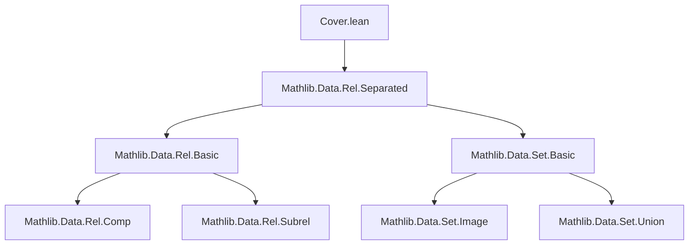
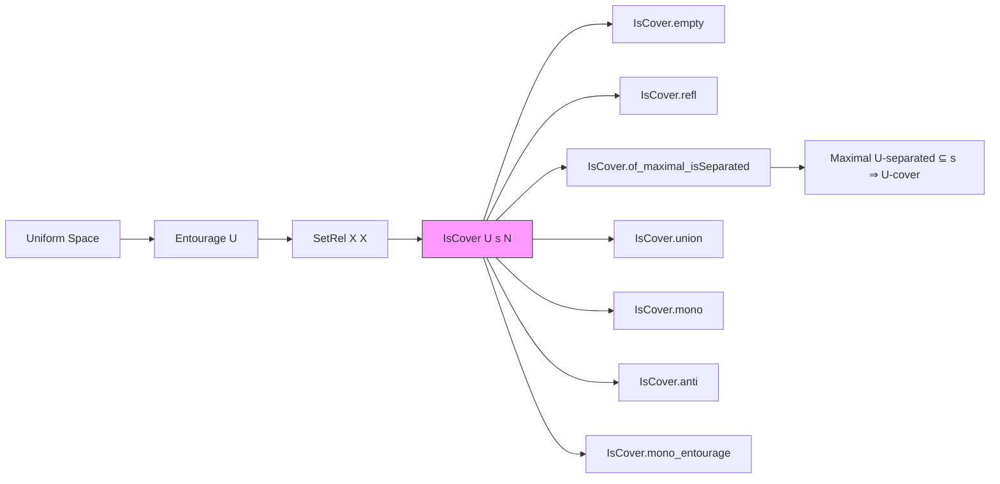

### Technical Brief: `Cover.lean` — Covers in Uniform Spaces

---

#### **1. Key Definitions & Theorems**

| Name | Type / Signature | Purpose |
|------|------------------|---------|
| `IsCover` | `def IsCover (U : SetRel X X) (s N : Set X) : Prop` | Defines a *$U$-cover*: every $x \in s$ is $U$-close to some $y \in N$. |
| `isCover_empty_right` | `IsCover U s ∅ ↔ s = ∅` | Characterizes when the empty set is a cover. |
| `IsCover.nonempty` | `IsCover U s N → s.Nonempty → N.Nonempty` | A cover of a nonempty set must be nonempty. |
| `IsCover.refl` / `IsCover.rfl` | `[U.IsRefl] → IsCover U s s` | Reflexivity of $U$ implies $s$ is a $U$-cover of itself. |
| `isCover_univ` | `IsCover univ s N ↔ s.Nonempty → N.Nonempty` | When the universal relation is used, covers correspond to nonempty preimages. |
| `IsCover.mono` | `N₁ ⊆ N₂ → IsCover U s N₁ → IsCover U s N₂` | Monotonicity in the covering set. |
| `IsCover.anti` | `s ⊆ t → IsCover U t N → IsCover U s N` | Antitonicity in the covered set. |
| `IsCover.mono_entourage` | `U ⊆ V → IsCover U s N → IsCover V s N` | Monotonicity in the entourage. |
| `IsCover.union` | `IsCover U s N₁ → IsCover U t N₂ → IsCover U (s ∪ t) (N₁ ∪ N₂)` | Covers behave well under unions. |
| `IsCover.of_maximal_isSeparated` | `[U.IsRefl][U.IsSymm] → Maximal (...) N → IsCover U s N` | A maximal $U$-separated subset of $s$ is a $U$-cover of $s$. |
| `isCover_id` | `IsCover .id s N ↔ s ⊆ N` | For the identity relation, $U$-closeness is membership. |

---

#### **2. Naming Conventions**

- **Prefixes**:
  - `isCover_`: for lemmas involving `IsCover`, often with `@[simp]`.
  - `IsCover.`: for instance lemmas (e.g., `IsCover.refl`, `IsCover.mono`).
- **Suffixes**:
  - `_right`, `_left`: for lemmas where one side of a biconditional is trivial (e.g., `isCover_empty_right`).
- **Case style**:
  - `PascalCase` for definitions (`IsCover`).
  - `snake_case` for lemmas (`isCover_empty_right`, `isCover_id`).

---

#### **3. Tactic Stack**

Frequently used tactics in proofs:
- `simp` / `simp_rw`: simplification using `IsCover` definition and relational properties.
- `by_contra!`: for contradiction arguments (e.g., in `of_maximal_isSeparated`).
- `let` / `have`: local definitions and intermediate claims.
- `exact`, `rintro`, `intro`: standard intro/elimination.
- `subset_insert`, `insert_subset_iff`, `mem_insert`: set-theoretic reasoning around insertions.
- `rfl`, `symm`, `trans`: when using relational properties (reflexivity, symmetry, transitivity).
- `aesop`: likely used for routine automation (not explicitly shown but implied by Lean 4 style).

---

#### **4. Proof Logic**

- **Structure**:
  - Most proofs follow a *direct* pattern: unfold `IsCover`, apply quantifier elimination, construct witness.
  - For `of_maximal_isSeparated`, a *contrapositive + maximality* argument:
    1. Assume $x \in s$ is not $U$-close to any $y \in N$.
    2. Show $N \cup \{x\}$ is $U$-separated and strictly larger — contradicting maximality.
  - Uses `Maximal` from `Rel.Separated`, leveraging `insert` and separation preservation.

- **Induction**: Not used here (finite unions handled constructively).
- **Case analysis**: On membership in unions (`inl`, `inr`) or empty/nonempty.

---

#### **5. Imports**

- `Mathlib.Data.Rel.Separated`: Provides `IsSeparated`, `Maximal`, and relational properties (`IsRefl`, `IsSymm`, etc.).
- `Set`: Standard set operations (`subset`, `union`, `insert`, `Nonempty`, etc.).

---

#### **6. Mermaid Diagrams**

##### **Dependency Graph**

##### **Overview of Theory Flow**

---

#### **7. Notes & Context**

- **Terminology**: `IsCover` is also called a *$U$-net* in metric/dynamical contexts.
- **Motivation**: Quantifies compactness via entourages — foundational for metric entropy, covering numbers, and VC theory.
- **Reference**: Vershynin’s *High Dimensional Probability*, §4.2.
- **Future extensions**:
  - `Metric.IsCover`: via `Metric.entourage`.
  - `Dynamics.IsDynCoverOf`: via dynamical entourages.

--- 

Let me know if you'd like the corresponding `Metric` or `Dynamics` cover files formalized similarly.
