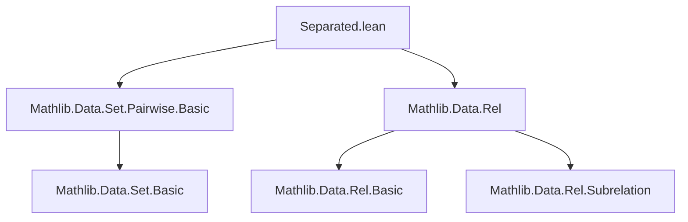
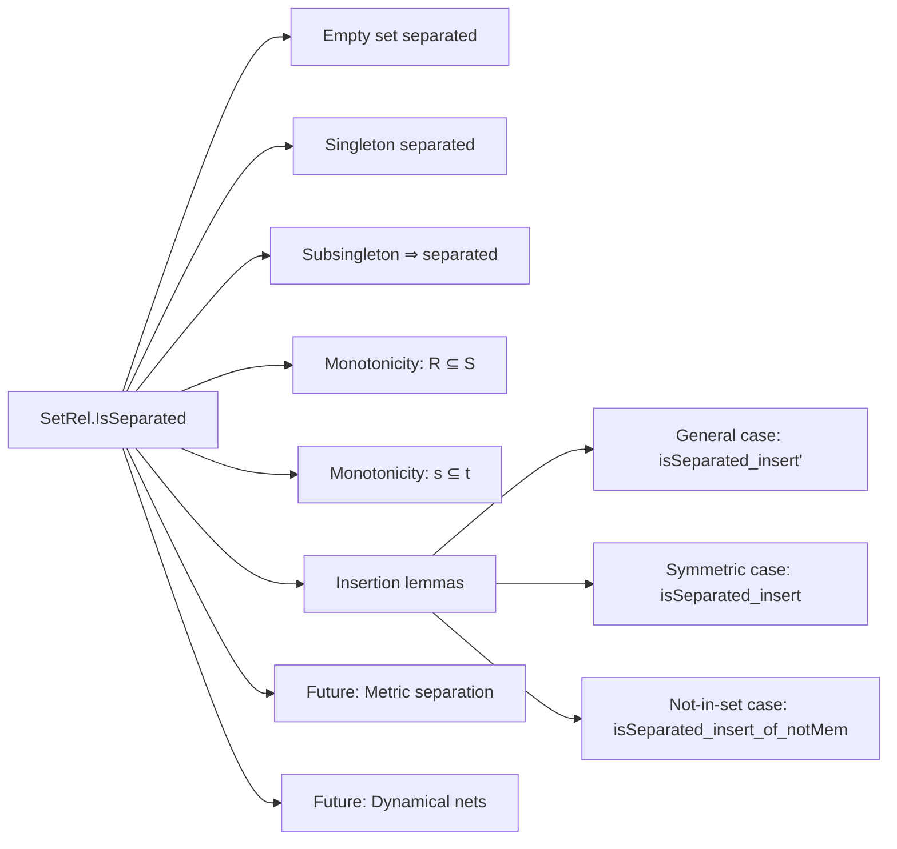
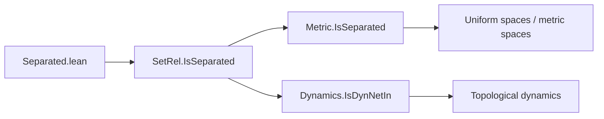

**Technical Brief: `Separated.lean` — Uniform Separation via Relations**

---

### 1. **Key Definitions & Theorems**

| Name | Type | Purpose |
|------|------|---------|
| `IsSeparated` | `def IsSeparated (R : SetRel X X) (s : Set X) : Prop` | Defines that a set `s` is *R-separated*: all distinct elements of `s` are *R*-unrelated. Formally: `s.Pairwise fun x y ↦ ¬ x ~[R] y`. |
| `IsSeparated.empty` | `IsSeparated R ∅` | The empty set is trivially separated. |
| `IsSeparated.singleton` | `IsSeparated R {x}` | Any singleton set is separated. |
| `IsSeparated.of_subsingleton` | `s.Subsingleton → IsSeparated R s` | Any subsingleton (at most one element) is separated. |
| `IsSeparated.mono_left` | `R ⊆ S → IsSeparated S s → IsSeparated R s` | If `s` is separated w.r.t. a *larger* relation `S`, it is separated w.r.t. any subrelation `R ⊆ S`. |
| `IsSeparated.mono_right` | `s ⊆ t → IsSeparated R t → IsSeparated R s` | Subsets of separated sets are separated. |
| `isSeparated_insert'` | `↔` characterisation of `insert` separation | Gives necessary and sufficient conditions for `insert x s` to be `R`-separated: `s` must be `R`-separated, and `x` must not be `R`-related to any element of `s` *unless equal*. |
| `isSeparated_insert` | Same as above, under symmetry of `R` | Simplifies `isSeparated_insert'` using symmetry: only one direction of `R`-relatedness needs checking. |
| `isSeparated_insert_of_notMem` | Under `x ∉ s` and `R` symmetric | Further simplifies: `x` must be *unrelated* to all elements of `s`. |
| `IsSeparated.insert'` | Constructive insertion lemma | If `s` is `R`-separated and `x` satisfies the “no nontrivial `R`-relations” condition, then `insert x s` is `R`-separated. |
| `IsSeparated.insert` | Same, under symmetry of `R` | Uses symmetry to reduce the hypothesis to one direction. |

---

### 2. **Naming Conventions**

- **Prefixes**:
  - `isSeparated_`: for lemmas about `IsSeparated` involving `insert`, `singleton`, etc.
  - `IsSeparated.`: for properties of the predicate itself (e.g., `IsSeparated.empty`, `IsSeparated.insert`).
- **Suffixes**:
  - `'` (prime): variant of a lemma, often weaker or more general (e.g., `isSeparated_insert'` vs `isSeparated_insert`).
  - `of_` / `mono_`: indicate assumptions (e.g., `of_subsingleton`, `mono_left`, `mono_right`).
- **Notation**:
  - `x ~[R] y`: notation for `R x y`, i.e., `x` and `y` are related by `R`.

---

### 3. **Tactic Stack**

- `simp`: heavily used for simplification, especially with `pairwise_insert`, `pairwise_empty`, `pairwise_singleton`.
- `aesop`: not explicitly used here, but `simp` + `intro` + `exact` patterns suggest a similar automation style.
- `rw`, `apply`, `exact`: used in lemma proofs (e.g., `hs.mono'`, `hs.mono`).
- `symmetry` / `mt R.symm`: used to exploit symmetry of `R` (e.g., in `isSeparated_insert`).
- `nonrec lemma`: indicates a definitional unfolding is needed (e.g., to avoid unfolding `IsSeparated` recursively).

---

### 4. **Proof Logic**

- **Structure**:
  - Most proofs are *equational reasoning* or *logical equivalence* (`↔`) proofs.
  - `insert` lemmas use `pairwise_insert` and its variants, often with symmetry or non-membership to simplify.
  - Monotonicity lemmas (`mono_left`, `mono_right`) use `pairwise.mono` / `pairwise.mono'`.
  - Subsingleton case reduces to `pairwise_of_subsingleton`.
- **Typical flow**:
  1. Unfold `IsSeparated` → `s.Pairwise ...`.
  2. Apply `pairwise_insert` or `pairwise_singleton`.
  3. Simplify using `not_imp_comm`, `not_and`, `forall_and`.
  4. Use symmetry or non-membership to eliminate redundant cases.

---

### 5. **Imports**

- `Mathlib.Data.Set.Pairwise.Basic`: provides `Pairwise`, `pairwise_empty`, `pairwise_singleton`, `pairwise_insert`, etc.
- `Mathlib.Data.Rel`: provides `SetRel`, relation notation (`~[R]`), and properties like `IsSymm`.

---

### 6. **Mermaid Diagrams**

#### **Dependency Graph (File-Level)**

#### **Conceptual Overview (Theory Module)**

#### **Relationship to Broader Theory**

> **Note**: As per the `TODO`, the next step is to *define* `Metric.IsSeparated` and `Dynamics.IsDynNetIn` *via* `SetRel.IsSeparated`, using the small-distance relation and dynamical relation respectively.

--- 

Let me know if you'd like the next module (`Metric/Separated.lean`) similarly formalized.
