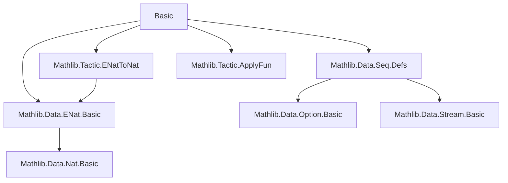
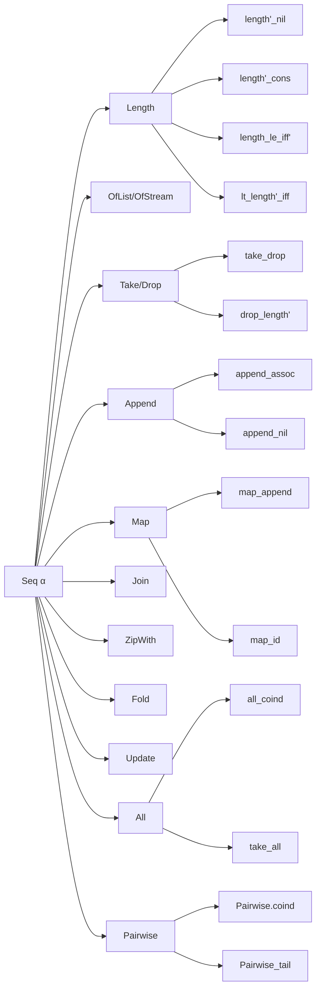

Here's a structured technical brief based on the provided `Basic.lean` file:

---

### **1. Key Definitions & Theorems**

| Name | Type / Signature | Purpose |
|------|------------------|---------|
| `Seq α` | Type `u` | Type of possibly infinite lists (streams with optional finite termination) |
| `Terminates` | `Seq α → Prop` | Predicate indicating that a sequence has finite length (i.e., ends in `nil`) |
| `TerminatedAt n` | `Seq α → Prop` | Predicate indicating that the sequence terminates at or before position `n` |
| `length' : Seq α → ENat` | Function | Returns the length of a sequence as an extended natural number (`ℕ ∪ {∞}`) |
| `length : s.Terminates → ℕ` | Function | Returns the finite length of a terminating sequence |
| `nil : Seq α` | Value | Empty sequence |
| `cons : α → Seq α → Seq α` | Function | Prepend element to sequence |
| `tail : Seq α → Seq α` | Function | Drop first element |
| `drop n : Seq α → Seq α` | Function | Drop first `n` elements |
| `take n : Seq α → List α` | Function | Take first `n` elements as a finite list |
| `append : Seq α → Seq α → Seq α` | Function | Concatenate two sequences |
| `map : (α → β) → Seq α → Seq β` | Function | Apply function pointwise |
| `zipWith : (α → β → γ) → Seq α → Seq β → Seq γ` | Function | Zip two sequences with a binary function |
| `join : Seq (Seq1 α) → Seq α` | Function | Flatten a sequence of nonempty sequences |
| `fold : β → (β → α → β) → Seq α → Seq1 β` | Function | Left fold over a sequence |
| `update n f`, `set n x` | Functions | Update or replace element at index `n` |
| `All p s` | Prop | All elements of `s` satisfy predicate `p` |
| `Pairwise R s` | Prop | All adjacent pairs in `s` satisfy binary relation `R` |
| `ofList : List α → Seq α` | Function | Embed finite list as infinite sequence |
| `ofStream : Stream' α → Seq α` | Function | Embed stream as infinite sequence |
| `toList : s.Terminates → List α` | Function | Convert terminating sequence to finite list |
| `enum : Seq α → Seq (ℕ × α)` | Function | Annotate sequence with indices |
| `nats : Seq ℕ` | Value | Infinite sequence of natural numbers |

#### Key Theorems (selected):
- `length'_nil`, `length'_cons`: `length'` behaves like expected on `nil` and `cons`
- `length_le_iff'`, `lt_length_iff'`: Characterize length comparisons without assuming termination
- `length_take_of_le_length`, `length_toList`: `take` and `toList` preserve length
- `append_assoc`, `map_append`, `join_append`: Algebraic laws for `append`, `map`, `join`
- `mem_append_left`, `of_mem_append`: Membership in `append`
- `Pairwise.coind`, `Pairwise.coind_trans`: Coinductive principles for `Pairwise`
- `at_least_as_long_as_coind`: Coinductive proof principle for comparing lengths

---

### **2. Naming Conventions**

- **Predicates**: `Terminates`, `TerminatedAt`, `All`, `Pairwise`
- **Length-related**:
  - `length'` (ENat-valued, total)
  - `length h` (ℕ-valued, requires proof `h : s.Terminates`)
- **List/Stream conversions**:
  - `ofList`, `toList`, `ofStream`
- **Structural operations**:
  - `cons`, `tail`, `drop`, `take`, `append`, `map`, `zipWith`, `join`, `fold`, `update`, `set`
- **Element access**:
  - `get? : ℕ → Option α`, `getElem? : ℕ → Option α`
- **Membership & properties**:
  - `mem_cons`, `mem_append`, `All`, `Pairwise`
- **Coinductive principles**:
  - `coind`, `coind_trans`, `at_least_as_long_as_coind`

Prefixes/suffixes:
- `length'` vs `length h`: `'` suffix for total version, no `'` for partial (requires termination proof)
- `_iff`, `_iff'`: Biconditional characterizations; `'` variants often relax assumptions (e.g., no termination)
- `_cons`, `_nil`: Behavior on constructors
- `_map`, `_append`, `_drop`, `_take`: Interaction with core operations

---

### **3. Tactic Stack**

Frequently used tactics:
- `simp` (often with `at *`, `only`, `[-implicitDefEqProofs]`, `grind`)
- `induction` (with `generalizing`, `using 1`, `with`)
- `rw`, `convert`, `congr`
- `cases` (on `s`, `n`, `h : s.Terminates`, `Option`, `List`)
- `apply`, `exact`, `intro`, `refine`, `exists`
- `by_cases`, `by_contra`, `contradiction`
- `enat_to_nat`, `lia`, `ring`, `aesop` (via `grind`)
- `ext`, `apply Subtype.ext`, `apply eq_of_bisim` (for coinductive equality)
- `grind =` attribute for `simp`-friendly lemmas

Pattern:  
`simp` + `induction` + `cases` + `congr`/`rw` + `enat_to_nat` (for ENat arithmetic) + `lia` (for arithmetic goals)

---

### **4. Proof Logic**

- **Inductive/Coinductive Reasoning**:
  - Prove equalities via `eq_of_bisim` (coinductive bisimulation) for `Seq`.
  - Prove properties via `all_coind`, `Pairwise.coind`, `at_least_as_long_as_coind`.
- **Length reasoning**:
  - Distinguish terminating vs non-terminating cases (`by_cases h : s.Terminates`).
  - Use `length'_of_terminates`, `length'_of_not_terminates` to reduce to finite or `⊤`.
- **Membership & element access**:
  - Use `mem_iff_exists_get?`, `get?_mem`, `get?_tail`, `get?_drop`.
- **Arithmetic on ENat**:
  - `enat_to_nat` converts `s.length' = ⊤` to contradiction when finite bound exists.
  - `tsub` (truncated subtraction) used in `drop_length'`.
- **Case analysis**:
  - On `s.destruct`, `s`, `n`, `Option.get?`, `h : s.TerminatedAt n`, etc.

---

### **5. Imports & Dependencies**

**Primary imports**:
- `Mathlib.Data.Seq.Defs` — core definition of `Seq`, `Terminates`, `TerminatedAt`, `length'`, etc.
- `Mathlib.Data.ENat.Basic` — extended naturals (`ℕ∞`)
- `Mathlib.Tactic.ENatToNat` — tactic for reasoning about `ENat` subtraction and inequalities
- `Mathlib.Tactic.ApplyFun` — for applying functions to equalities/inequalities

**Key dependencies**:
- `Option`, `List`, `Stream'`, `Nat`, `ENat`, `Function`, `Prop`, `Type`

---

### **6. Mermaid Diagrams**

#### **Dependency Graph (Module-Level)**

#### **Overview of File Structure**

---

Let me know if you'd like a formal dependency graph (e.g., for `leanpkg`), or a summary of the `Seq1` section (currently cut off in the source).
