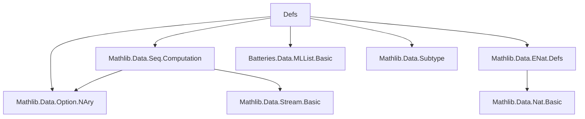

### Technical Brief: `Defs.lean` — Possibly Infinite Lists (`Seq α`)

---

#### **1. Key Definitions & Theorems**

| Name | Type / Signature | Purpose |
|------|------------------|---------|
| `IsSeq` | `Stream' (Option α) → Prop` | Predicate ensuring that once a `none` appears, all subsequent values are `none`. |
| `Seq α` | `Type u` | Type of possibly infinite lists (sequences), encoded as `Stream' (Option α)` satisfying `IsSeq`. |
| `Seq1 α` | `Type u` | Nonempty sequences: `α × Seq α`. |
| `get?` | `Seq α → ℕ → Option α` | Extracts the *n*-th element (if it exists). |
| `nil` | `Seq α` | Empty sequence. |
| `cons` | `α → Seq α → Seq α` | Prepend an element to a sequence. |
| `head` | `Seq α → Option α` | First element of a sequence. |
| `tail` | `Seq α → Seq α` | Tail of a sequence (or `nil` if empty). |
| `destruct` | `Seq α → Option (Seq1 α)` | Destructor: returns `none` for `nil`, `some (a, s)` for `cons a s`. |
| `recOn` | `Seq α → motive nil → (∀ x s, motive (cons x s)) → motive s` | Inductive elimination principle (case analysis on `nil`/`cons`). |
| `corec` | `(β → Option (α × β)) → β → Seq α` | Coinductive constructor: builds sequences via a coalgebra. |
| `eq_of_bisim` | `IsBisimulation R → s₁ ~ s₂ → s₁ = s₂` | Bisimulation principle: proves equality of sequences via structural similarity. |
| `eq_of_bisim'` / `eq_of_bisim_strong` | Coinductive equality principles (more user-friendly variants of `eq_of_bisim`). |
| `Terminates` | `Seq α → Prop` | Predicate for finiteness: ∃ *n*, `s.get? n = none`. |
| `length'` | `Seq α → ℕ∞` | Total length function: finite length if terminates, `⊤` otherwise. |
| `ofList` | `List α → Seq α` | Embed finite lists into sequences. |
| `ofStream` | `Stream' α → Seq α` | Embed infinite streams into sequences. |
| `ofMLList` | `MLList Id α → Seq α` | Embed `MLList` (possibly cyclic) into sequences. |
| `append` | `Seq α → Seq α → Seq α` | Concatenation: if first is infinite, second is ignored. |
| `map`, `zip`, `zipWith`, `unzip`, `join`, `drop`, `splitAt`, `enum`, `fold`, `update`, `set`, `Pairwise` | Standard list-like operations lifted to sequences. |

---

#### **2. Naming Conventions**

- **Predicates**: `is_`, `Terminates`, `TerminatedAt`, `Mem`, `Pairwise`
- **Constructors**: `nil`, `cons`
- **Destructors**: `head`, `tail`, `destruct`
- **Corecursive definitions**: `corec`, `corecOn` (not present, but `corec` is used)
- **Conversion functions**: `ofList`, `ofStream`, `ofMLList`, `forceToList`, `toList`, `toStream`, `toListOrStream`, `toMLList`, `toList'`
- **Operations**: `map`, `zip`, `zipWith`, `append`, `drop`, `splitAt`, `enum`, `fold`, `update`, `set`, `join`, `Pairwise`
- **Properties**: `get?_nil`, `get?_cons_zero`, `get?_tail`, `cons_injective2`, `destruct_eq_cons`, `eq_of_bisim`, `terminated_stable`, `mem_cons_iff`

Prefixes/suffixes:
- `get?_`: element access
- `_nil`, `_cons`: behavior at constructors
- `_stable`: monotonicity of termination
- `_iff`: equivalence lemmas
- `of_`, `to_`: conversion functions
- `mem_`, `TerminatedAt`, `Terminates`: membership/termination predicates

---

#### **3. Tactic Stack**

Frequently used tactics:
- `rfl`, `congr`, `ext`, `funext`, `simp`, `rw`
- `induction`, `cases`, `rcases`, `obtain`, `injections`
- `intro`, `apply`, `exact`, `assumption`
- `dsimp`, `unfold`, `change`, `generalize`
- `grind` (custom tactic, likely from `Batteries`)
- `by_cases`, `contradiction`, `exact False.elim`
- `simp_rw`, `simp only`

Tactic patterns:
- **Equality proofs**: `ext`, `Subtype.ext`, `Stream'.ext`, `Seq.ext`
- **Corecursive definitions**: `corec`, `Stream'.corec'`, `Stream'.eta`
- **Bisimulation**: `eq_of_bisim`, `eq_of_bisim'`, `eq_of_bisim_strong`
- **Termination reasoning**: `le_stable`, `terminated_stable`, `not_terminates_iff`
- **Membership**: `mem_cons`, `mem_cons_of_mem`, `mem_cons_iff`, `mem_rec_on`

---

#### **4. Proof Logic**

- **Inductive reasoning**: `recOn` (case analysis on `nil`/`cons` via `destruct`)
- **Coinductive reasoning**: `corec` + `eq_of_bisim` family (bisimulation-based equality proofs)
- **Termination reasoning**: monotonicity of `get?` (`le_stable`, `terminated_stable`), decidability of `TerminatedAt`
- **Conversion proofs**: often use `ext` + `funext` + `simp` to show equality of streams
- **Corecursion correctness**: `corec_eq`, `corec_nil`, `corec_cons` — relate `corec` to `destruct`
- **Bisimulation proofs**: reduce to `destruct` comparison, then use `destruct_eq_cons` / `destruct_eq_none`

Typical proof flow:
1. Unfold definitions (`destruct`, `get?`, `tail`, etc.)
2. Use `ext` / `funext` to reduce to pointwise equality
3. Apply `simp` or `rw` with lemmas like `get?_cons_zero`, `get?_tail`
4. For coinductive equality: define bisimulation `R`, prove `IsBisimulation R`, apply `eq_of_bisim`

---

#### **5. Imports**

| Module | Purpose |
|--------|---------|
| `Mathlib.Data.Option.NAry` | General option operations |
| `Mathlib.Data.Seq.Computation` | `Computation` monad for partial/total functions |
| `Mathlib.Data.ENat.Defs` | Extended naturals `ℕ∞` for infinite lengths |
| `Batteries.Data.MLList.Basic` | `MLList` (meta list) for cyclic structures |
| `Mathlib.Data.Subtype` | Subtype reasoning (used in `Seq` encoding) |

---

#### **6. Mermaid Diagrams**

##### **Dependency Graph (Module-Level)**



##### **Overview of `Seq α` Theory**

```mermaid
graph TD
  Seq["Seq α"] --> IsSeq["IsSeq predicate"]
  Seq --> nil["nil : Seq α"]
  Seq --> cons["cons : α → Seq α → Seq α"]
  Seq --> destruct["destruct : Seq α → Option (Seq1 α)"]
  Seq --> get?["get? : Seq α → ℕ → Option α"]
  Seq --> head["head : Seq α → Option α"]
  Seq --> tail["tail : Seq α → Seq α"]

  Seq --> corec["corec : (β → Option (α × β)) → β → Seq α"]
  Seq --> recOn["recOn : elimination principle"]

  Seq --> eq_of_bisim["eq_of_bisim : bisimulation → equality"]
  Seq --> Terminates["Terminates : Prop"]
  Seq --> length'["length' : Seq α → ℕ∞"]

  Seq --> ofList["ofList : List α → Seq α"]
  Seq --> ofStream["ofStream : Stream' α → Seq α"]
  Seq --> ofMLList["ofMLList : MLList Id α → Seq α"]

  Seq --> append["append"]
  Seq --> map["map"]
  Seq --> zip["zip"]
  Seq --> drop["drop"]
  Seq --> join["join"]

  eq_of_bisim --> BisimO["BisimO : Option (Seq1 α) → Option (Seq1 α) → Prop"]
  eq_of_bisim --> IsBisimulation["IsBisimulation : Prop"]

  Terminates --> TerminatedAt["TerminatedAt : ℕ → Prop"]
  Terminates --> length["length : Terminates → ℕ"]
```



##### **Coinductive Structure**

```mermaid
graph LR
  A["β --f--> Option (α × β)"] -->|corec f b| S["Seq α"]
  S -->|destruct| O["Option (Seq1 α)"]
  O -->|some (a, s')| S'
  S' -->|destruct| O'
  O' --> ... --> "eventually none or infinite"
```

---

This file defines a foundational coinductive type for possibly infinite lists, with rich operations, conversion paths, and coinductive reasoning principles. It serves as a bridge between finite (`List`), infinite (`Stream'`), and potentially cyclic (`MLList`) data structures, formalized in Lean 4’s dependent type theory.
