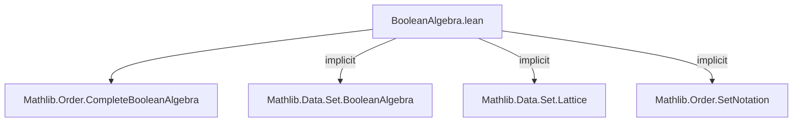
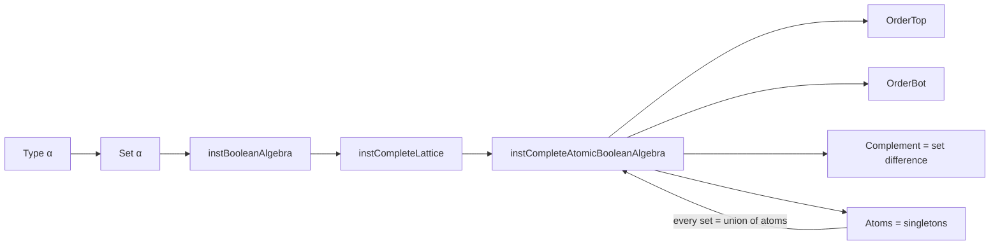

**Technical Brief: `BooleanAlgebra.lean` (Mathlib)**  
*Domain: Formalized Order Theory & Boolean Algebra*

---

### 1. **Key Definitions & Theorems**

| Name | Type / Signature | Purpose |
|------|------------------|---------|
| `Set.completeAtomicBooleanAlgebra` | `CompleteAtomicBooleanAlgebra (Set α)` | Equips the type `Set α` with the structure of a **complete atomic Boolean algebra**, where order, meets, joins, complements, and infinitary operations correspond to subset inclusion, intersection, union, set difference, and indexed union/intersection. |
| `Set.instCompleteAtomicBooleanAlgebra` | `CompleteAtomicBooleanAlgebra (Set α)` | Instance declaration (proof-carrying definition) establishing the above structure. |
| `Set.instOrderTop` | `OrderTop (Set α)` | Provides top element `⊤ = univ` and proof that all sets are below it. |

**Notes**:  
- The `le_sSup`, `sSup_le`, `le_sInf`, `sInf_le`, and `iInf_iSup_eq` fields in the instance definition encode the lattice-theoretic completeness and atomicity conditions.  
- Atomicity is encoded via the `iInf_iSup_eq` axiom (the *interchange law*), which in the case of sets reduces to a classical logic principle (via `Classical.skolem`), ensuring every element is the join of atoms below it.

---

### 2. **Naming Conventions**

- **Prefixes**:  
  - `inst*`: Instance declarations (e.g., `instCompleteAtomicBooleanAlgebra`, `instOrderTop`).  
  - `le_*`, `*_le`: Order-theoretic implications (e.g., `le_sSup`, `sSup_le`).  
- **Suffixes**:  
  - `Sup` / `Inf`: Supremum / infimum (union / intersection).  
  - `iInf` / `iSup`: Indexed infimum / supremum (i.e., `⋂ i, s i`, `⋃ i, s i`).  
- **General pattern**: `action_target` (e.g., `le_sSup` = “≤ sup of a set of sets”).

---

### 3. **Tactic Stack**

- `simp [Classical.skolem]`: Used to simplify using classical choice (essential for proving atomicity in `iInf_iSup_eq`).  
- `ext`: Extensionality for sets (proving equality by extensional membership).  
- `simp`: General simplification (e.g., in `le_top`).  
- `by intros; ext; simp`: Standard pattern for proving set equalities in this context.

No heavy automation (e.g., `aesop`, `ring`, `linarith`) is used—proofs are mostly structural and rely on set-theoretic reasoning.

---

### 4. **Proof Logic**

- **Structure**:  
  - Define the Boolean algebra structure by extending `instBooleanAlgebra` (assumed already defined elsewhere, likely in `Mathlib.Data.Set.BooleanAlgebra`).  
  - Prove completeness and atomicity by verifying the five axioms of a *complete atomic Boolean algebra* (CABA):  
    1. `le_sSup`: $S \subseteq \bigcup T$ if $s \in S \implies s \in t$ for some $t \in T$.  
    2. `sSup_le`: $\bigcup T \subseteq U$ iff all $t \in T$ satisfy $t \subseteq U$.  
    3. `le_sInf`: $S \subseteq \bigcap T$ iff for all $t \in T$, $S \subseteq t$.  
    4. `sInf_le`: $\bigcap T \subseteq t$ for all $t \in T$.  
    5. `iInf_iSup_eq`: The CABA interchange law: $\bigcap_i \bigcup_j s_{i,j} = \bigcup_f \bigcap_i s_{i,f(i)}$, where $f$ ranges over choice functions.  
- **Atomicity**: In `Set`, atoms are singleton sets $\{x\}$. The interchange law ensures every set is the union of its singleton subsets.

---

### 5. **Imports**

- `Mathlib.Order.CompleteBooleanAlgebra`: Core theory of complete Boolean algebras and CABA axioms.  
- Implicitly: `Mathlib.Data.Set.Basic`, `Mathlib.Data.Set.BooleanAlgebra` (for `instBooleanAlgebra`), and `Mathlib.Order.SetNotation` (for indexed unions/intersections, though not directly imported here).

---

### 6. **Mermaid Diagrams**

#### **Dependency Graph (Module-Level)**



#### **Overview of `Set.completeAtomicBooleanAlgebra` Construction**



#### **CABA Axioms Verification Flow**

```mermaid
flowchart LR
  A[Given S, T : Set (Set α)] --> B[le_sSup]
  A --> C[sSup_le]
  A --> D[le_sInf]
  A --> E[sInf_le]
  A --> F[iInf_iSup_eq]
  B --> G[Membership reasoning]
  C --> G
  D --> G
  E --> G
  F --> H[Classical.choice + ext + simp]
```

---

### 7. **Summary**

This file establishes that the powerset of any type $\alpha$, i.e., `Set α`, carries a canonical **complete atomic Boolean algebra** structure. This is foundational for formalizing measure theory, topology, and logic in Lean, where sets serve as propositions (via characteristic functions) and measurable/opens sets. The proof is minimal and leverages classical logic (via `Classical.skolem`) to witness the atomic decomposition.
