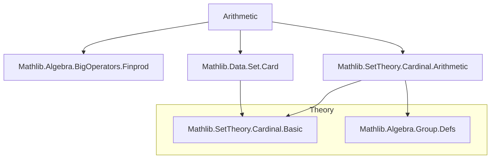
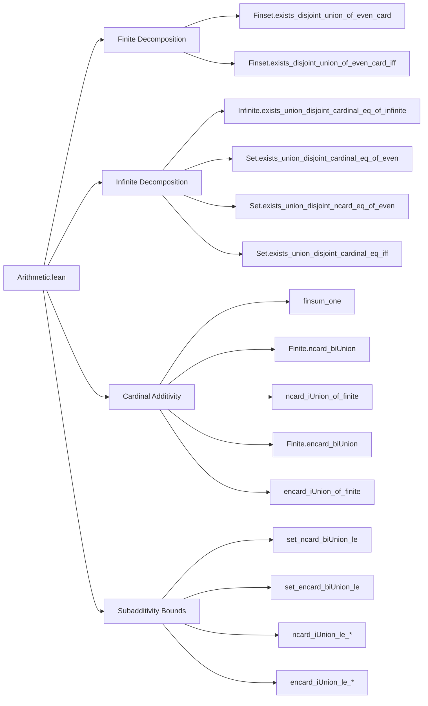

**Technical Brief: `Arithmetic.lean` (Cardinal Arithmetic Results)**  
*Source: `Arithmetic.lean`, Copyright 2025 Pim Otte, Apache 2.0*

---

### 1. **Key Definitions & Theorems**

| Name | Type / Signature | Purpose |
|------|------------------|---------|
| `Finset.exists_disjoint_union_of_even_card` | `{s : Finset α} → Even #s → ∃ t u, t ∪ u = s ∧ Disjoint t u ∧ #t = #u` | Decomposes a finite set of even size into two disjoint subsets of equal size. |
| `Finset.exists_disjoint_union_of_even_card_iff` | `{s : Finset α} → Even #s ↔ ∃ t u, t ∪ u = s ∧ Disjoint t u ∧ #t = #u` | Biconditional version of the above for finite sets. |
| `Set.exists_union_disjoint_cardinal_eq_of_even` | `{s : Set α} → Even s.ncard → ∃ t u, t ∪ u = s ∧ Disjoint t u ∧ #t = #u` | Cardinal-based decomposition for arbitrary sets (finite or infinite) with even cardinality. |
| `Set.exists_union_disjoint_ncard_eq_of_even` | `{s : Set α} → Even s.ncard → ∃ t u, t ∪ u = s ∧ Disjoint t u ∧ t.ncard = u.ncard` | Same as above, but uses `ncard` (natural-number cardinality) instead of `#` (cardinal type). |
| `Set.exists_union_disjoint_cardinal_eq_iff` | `{s : Set α} → Even s.ncard ↔ ∃ t u, t ∪ u = s ∧ Disjoint t u ∧ #t = #u` | Full biconditional characterization of sets with even cardinality. |
| `Infinite.exists_union_disjoint_cardinal_eq_of_infinite` | `{s : Set α} → s.Infinite → ∃ t u, t ∪ u = s ∧ Disjoint t u ∧ #t = #u` | Decomposes an infinite set into two disjoint subsets of equal cardinality (uses `κ + κ = κ` for infinite κ). |
| `finsum_one` | `∑ᶠ i ∈ s, 1 = s.ncard` | Connects finsum of constant 1 with natural cardinality (`ncard`). |
| `Finite.ncard_biUnion` | `{t : Set ι} → t.Finite → (∀ i ∈ t, (s i).Finite) → t.PairwiseDisjoint s → (⋃ i ∈ t, s i).ncard = ∑ᶠ i ∈ t, (s i).ncard` | Exact additivity of `ncard` over finite disjoint unions. |
| `ncard_iUnion_of_finite` | `[Finite ι] → (∀ i, (s i).Finite) → Pairwise (Disjoint on s) → (⋃ i, s i).ncard = ∑ᶠ i, (s i).ncard` | Special case of above for countable index types. |
| `Finite.encard_biUnion`, `encard_iUnion_of_finite` | Analogous lemmas for `encard` (extended cardinal, allowing ∞). | Extend additivity to extended cardinals. |
| `set_ncard_biUnion_le`, `set_encard_biUnion_le`, `ncard_iUnion_le_*` | Various subadditivity lemmas for unions (with or without finiteness assumptions). | Provide upper bounds for cardinality of unions. |

---

### 2. **Naming Conventions**

- **Prefixes**:
  - `Finset.` / `Set.`: Module-scoped namespace.
  - `exists_...`: Existential decomposition results.
  - `biUnion_...`: Lemmas about unions over indexed families.
  - `iUnion_...`: Special case for `ι → Set α` (i.e., indexed by type).
- **Suffixes**:
  - `_le`: Inequality (subadditivity).
  - `_eq`: Equality (additivity under disjointness/finite assumptions).
  - `_iff`: Biconditional (↔) version.
  - `_of_even`, `_of_infinite`: Hypothesis-driven naming.
- **Cardinal Notation**:
  - `#s`: Cardinal lift of `ncard` (type `Cardinal α`).
  - `s.ncard`: Natural-number cardinality (`ℕ`), finite case.
  - `s.encard`: Extended cardinal (` Cardinal`), includes ∞.

---

### 3. **Tactic Stack**

- `simp` / `simp_all`: Dominant simplifier usage (especially for `disjoint`, `union`, `ncard`, `finsum`).
- `rw`: Rewriting using lemmas like `card_sdiff_of_subset`, `ncard_union_eq`, `mk_image_eq`.
- `obtain` / `refine`: Constructive proofs via existential witnesses.
- `by_cases`: Splitting on `finite/infinite`, `mem/diff`, `h : 1 = 0`.
- `congrArg`: Propagating equalities through `Cardinal.toNat`.
- `aesop` / `lia`: Not explicitly used here, but `lia` appears in `Finset.exists_disjoint_union_of_even_card`.
- `exact`, `assumption`, `intro`: Standard proof scripting.
- `classical`: Used to enable classical reasoning (e.g., for `encard_biUnion`).

---

### 4. **Proof Logic**

- **Structure**:
  1. **Case split** on `finite/infinite` (via `infinite_or_finite`).
  2. For **finite** sets: Reduce to `Finset` version using `ncard_eq_toFinset_card`.
  3. For **infinite** sets: Use `κ + κ = κ` (via `add_mk_eq_self` and `Nonempty (s ≃ s ⊕ s)`), then construct subsets via image of injections.
  4. **Disjointness** and **union = s** verified via `preimage`, `image`, `disjoint_image_of_injective`, `← image_union`.
  5. **Equality of cardinalities** via `mk_image_eq` or `congrArg Cardinal.toNat`.
- **Induction**: Not used; relies on algebraic properties of cardinals (e.g., `κ + κ = κ` for infinite κ).
- **Key logical flow**:
  ```
  Even s.ncard
    ⇒ (finite case) ⇒ Finset lemma ⇒ lift to Set
    ⇒ (infinite case) ⇒ κ + κ = κ ⇒ construct via bijection s ≃ s ⊕ s
  ```

---

### 5. **Imports**

| Import | Purpose |
|--------|---------|
| `Mathlib.Algebra.BigOperators.Finprod` | `finsum`, `finsum_mem_*`, `finsum_one` |
| `Mathlib.Data.Set.Card` | `ncard`, `encard`, `Set` cardinal arithmetic basics |
| `Mathlib.SetTheory.Cardinal.Arithmetic` | `add_mk_eq_self`, `mk_image_eq`, infinite cardinal arithmetic |

---

### 6. **Mermaid Diagrams**

#### **Dependency Graph (Module-Level)**



#### **Overview of File Structure**



---

### 7. **Domain-Specific AI Agent Guidance**

- **Focus Areas**:
  - Cardinal arithmetic over sets (especially infinite case).
  - Decomposition lemmas for even cardinality.
  - Translation between `ncard`, `#`, and `encard`.
- **Common Patterns**:
  - Use `infinite_or_finite` to split cases.
  - Use `add_mk_eq_self` for infinite cardinal equalities.
  - Use `finsum_one` to bridge `finsum` and `ncard`.
- **Proof Strategy Templates**:
  - For `Even s.ncard ⇒ ∃ disjoint decomposition`:  
    `obtain ⟨t, u, rfl, hdtu, hctu⟩ := exists_union_disjoint_cardinal_eq_of_even he`
  - For `∑ᶠ i ∈ t, (s i).ncard = (⋃ i ∈ t, s i).ncard`:  
    `apply Finite.ncard_biUnion ht hs h`
- **Key Idioms**:
  - `congrArg Cardinal.toNat` to convert `#t = #u` to `t.ncard = u.ncard`.
  - `← finsum_mem_eq_finite_toFinset_sum` to lift `Finset` lemmas to `Set`.

--- 

*End of Technical Brief.*
