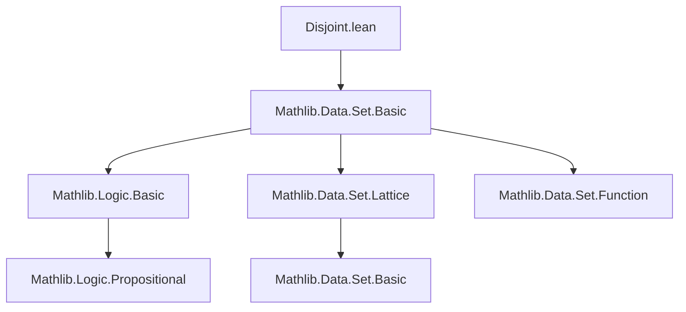

**Technical Brief: `Disjoint.lean` Module**

---

### 1. **Key Definitions & Theorems**

| Name | Type / Signature | Purpose |
|------|------------------|---------|
| `Disjoint s t` | `Prop` (defined elsewhere, e.g., in `Mathlib.Data.Set.Basic`) | Binary relation indicating sets `s` and `t` are disjoint (i.e., their intersection is empty). |
| `disjoint_iff` | `Disjoint s t ↔ s ∩ t ⊆ ∅` | Equivalence between disjointness and empty intersection (as subset). |
| `disjoint_iff_inter_eq_empty` | `Disjoint s t ↔ s ∩ t = ∅` | Stronger equivalence: disjointness iff intersection is *exactly* empty. |
| `disjoint_left` | `Disjoint s t ↔ ∀ a, a ∈ s → a ∉ t` | Characterization via element membership: no element of `s` lies in `t`. |
| `disjoint_right` | `Disjoint s t ↔ ∀ a, a ∈ t → a ∉ s` | Symmetric version of `disjoint_left`. |
| `not_disjoint_iff` | `¬Disjoint s t ↔ ∃ x, x ∈ s ∧ x ∈ t` | Negation of disjointness: existence of a common element. |
| `disjoint_iff_forall_ne` | `Disjoint s t ↔ ∀ a ∈ s, ∀ b ∈ t, a ≠ b` | Disjointness iff all elements from `s` differ from all elements in `t`. |
| `disjoint_union_left` | `Disjoint (s ∪ t) u ↔ Disjoint s u ∧ Disjoint t u` | Union on left distributes over disjointness. |
| `disjoint_union_right` | `Disjoint s (t ∪ u) ↔ Disjoint s t ∧ Disjoint s u` | Union on right distributes over disjointness. |
| `disjoint_empty`, `empty_disjoint` | `Disjoint s ∅`, `Disjoint ∅ s` | Any set is disjoint from the empty set. |
| `univ_disjoint`, `disjoint_univ` | `Disjoint univ s ↔ s = ∅`, `Disjoint s univ ↔ s = ∅` | Only the empty set is disjoint from the universal set. |
| `disjoint_range_iff` | `Disjoint (range x) (range y) ↔ ∀ i j, x i ≠ y j` | Disjointness of ranges of two functions ↔ no overlap in their values. |
| `mem_union_of_disjoint` | `x ∈ s ∪ t ↔ Xor' (x ∈ s) (x ∈ t)` (under `Disjoint s t`) | Under disjointness, membership in union is exclusive (XOR). |
| `Disjoint.union_left`, `union_right`, `inter_left`, etc. | Various lemmas in `Disjoint` namespace | Closure properties: unions/intersections preserve/disjointness under conditions. |
| `subset_left_of_subset_union`, `subset_right_of_subset_union` | `s ⊆ t ∪ u` + disjointness ⇒ `s ⊆ t` or `s ⊆ u` | If a set is contained in a union and disjoint from one part, it lies entirely in the other. |

---

### 2. **Naming Conventions**

- **Prefixes**:
  - `disjoint_`: core properties of the `Disjoint` relation.
  - `not_disjoint_`: negations / contrapositive characterizations.
  - `mem_union_of_disjoint`: specialized result under disjointness.
- **Suffixes**:
  - `_left`, `_right`: indicate which argument (left/right set) is being manipulated.
  - `_iff`: equivalence statements.
  - `_sup_left`, `_sup_right`, `_inf_left`, `_inf_right`: lattice-theoretic operations (union = sup, intersection = inf).
- **Aliases**:
  - `⟨_root_.Disjoint.notMem_of_mem_left, _⟩`, `⟨_, Nonempty.not_disjoint⟩`, etc.: provide named projections from equivalences/implications.

---

### 3. **Tactic Stack**

- `grind`: heavily used (e.g., `@[grind =]`, `by grind`) — likely a custom or extended simplifier tactic for propositional reasoning.
- `simp`: implicit via `simp [...]` in `disjoint_range_iff`, `mem_union_of_disjoint`.
- `rw`: used in `disjoint_right`.
- `exact`, `intro`, `cases`, `apply`: standard for manual proof steps (not shown inline but implied by `grind` usage).
- `em`: classical logic (used in `disjoint_or_nonempty_inter` via `em _`).
- `forall_congr'`, `forall_congr`: for quantifier rewriting.

---

### 4. **Proof Logic**

- **Structure**: Most proofs are *equational reasoning* or *logical equivalence chaining*.
- **Common pattern**:
  1. Reduce to known definitions (`disjoint_iff`, `subset_def`, `mem_def`).
  2. Apply propositional logic (e.g., `not_and`, `forall_congr`).
  3. Use lattice properties (`sup`, `inf`, `bot`, `top`) via `disjoint_sup_left`, `disjoint_bot_right`, etc.
  4. For existential/universal characterizations, use `forall_congr'`/`exists_congr`.
- **Induction**: Not used here — this is purely set-theoretic reasoning.
- **Classical reasoning**: Used in `disjoint_or_nonempty_inter` via `em` (law of excluded middle).

---

### 5. **Imports**

- `Mathlib.Data.Set.Basic`: foundational set theory (defines `Disjoint`, `Set`, `∩`, `∪`, `∅`, `univ`, `range`, etc.).
- `Function`: for `Function`-level utilities (e.g., `range`, `forall_congr`).
- Implicit: Lean’s logic (Prop, type universe polymorphism), lattice theory (via `HeytingAlgebra`, `RelIso` — *asserted not to exist* here).

---

### 6. **Mermaid Diagrams**

#### **Dependency Graph (Module-Level)**



#### **Overview of Theoretical Scope**

```mermaid
flowchart LR
  subgraph Core Concepts
    A[Set Theory] --> B[Disjointness Relation]
    A --> C[Set Operations: ∩, ∪, ∅, univ]
    A --> D[Membership & Subsetting]
  end

  subgraph Logical Tools
    B --> E[Equivalences ↔]
    B --> F[Negations ¬]
    B --> G[Classical Logic (EM)]
  end

  subgraph Lattice Theory
    C --> H[Sup (union) & Inf (intersection)]
    H --> I[Disjointness as orthogonality]
  end

  B --> J[Applications: disjoint unions, XOR membership]
```

---

### 7. **Summary**

This module formalizes foundational properties of the `Disjoint` binary relation on sets in Lean 4, leveraging lattice-theoretic structure of `Set α`. It emphasizes *equational reasoning* and *element-wise characterizations*, with heavy use of `grind` for automated propositional simplification. The theory supports reasoning about exclusivity in unions, closure under set operations, and connections to function ranges — all critical for measure theory, probability, and combinatorics in Mathlib.

--- 

Let me know if you'd like a formalized dependency graph (e.g., `.dot` format) or a proof sketch for a specific theorem.
