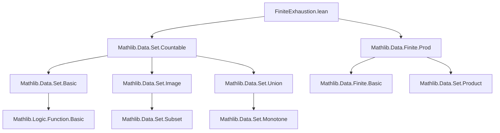

### Technical Brief: `FiniteExhaustion.lean`

---

#### **1. Key Definitions & Theorems**

| Name | Type / Signature | Purpose |
|------|------------------|---------|
| `Set.FiniteExhaustion s` | `Structure` | Represents an increasing sequence of finite sets whose union is `s`. Fields: `toFun : ℕ → Set α`, `finite'`, `subset_succ'`, `iUnion_eq'`. |
| `Set.Countable.finiteExhaustion` | `def {s : Set α} → s.Countable → FiniteExhaustion s` | Noncomputable choice of a finite exhaustion for any countable set `s`. Constructed via surjection from `ℕ` (if `s` nonempty) or empty exhaustion (if `s` empty). |
| `Set.FiniteExhaustion.prod` | `def K : FiniteExhaustion s → K' : FiniteExhaustion t → FiniteExhaustion (s ×ˢ t)` | Constructs a finite exhaustion of the product set `s × t` from exhaustions of `s` and `t`, using pointwise product at each index `n`. |
| `Set.nonempty_finiteExhaustion_iff` | `theorem s : Set α → Nonempty (s.FiniteExhaustion) ↔ s.Countable` | Characterizes exactly when a set admits a finite exhaustion: iff it is countable. |
| `Set.FiniteExhaustion.finite` | `theorem (n : ℕ) → (K n).Finite` | Every stage of a finite exhaustion is finite. |
| `Set.FiniteExhaustion.mono` | `theorem (h : m ≤ n) → K m ⊆ K n` | Monotonicity of the exhaustion: earlier sets are contained in later ones. |
| `Set.FiniteExhaustion.prod_apply` | `theorem (n : ℕ) → (K.prod K') n = K n ×ˢ K' n` | Explicit description of the product exhaustion at index `n`. |

---

#### **2. Naming Conventions**

- **Prefixes**:
  - `finite'`, `subset_succ'`, `iUnion_eq'`: primed variants of core properties (used in structure fields).
  - `finite`, `subset_succ`, `iUnion_eq`: unprimed lemmas derived from structure fields.
- **Suffixes**:
  - `'` (prime): internal field name vs. lemma name distinction.
  - `prod`: for product-related constructions (`prod`, `prod_apply`).
- **Class/Instance naming**:
  - `FunLike`, `RelHomClass`: standard typeclass interfaces for coercion and monotonicity.
- **Top-level definitions**:
  - `_root_.Set.Countable.finiteExhaustion`: explicitly names the definition in the root namespace under `Set.Countable`.

---

#### **3. Tactic Stack**

Frequently used tactics in proofs:
- `grind`: used in `finiteExhaustion` to discharge simple goals (likely a custom or `aesop`-based tactic).
- `simp`: heavily used for simplifying set expressions (`image`, `iUnion`, `prod`, `empty`, `subset`).
- `rw`: rewriting using lemmas like `iUnion_eq`, `prod_apply`, `iUnion_prod_of_monotone`.
- `exact`, `refine`: for constructing proofs and definitions.
- `by_cases`: case analysis on `Nonempty s`.
- `obtain`: destructuring existential witnesses (e.g., surjection `f`).
- `OrderHomClass.mono`: used to lift monotonicity from successor-step to full monotonicity.

---

#### **4. Proof Logic**

- **Existence of finite exhaustion** (`finiteExhaustion`):
  - *Case split* on `Nonempty s`.
    - If `s` nonempty: use countability to get surjection `f : ℕ ↠ s`, define exhaustion as images of initial segments `{i | i ≤ n}` under `f`.
    - If `s` empty: use constant empty sequence.
  - Verify all four structure properties using `simp`, `finite_le_nat`, `image_iUnion`, etc.

- **Product exhaustion** (`prod`):
  - Define stage-`n` set as product of stages.
  - Use `Finite.prod` for finiteness.
  - Use `Set.prod_mono` for monotonicity.
  - Use `Set.iUnion_prod_of_monotone` + `iUnion_eq` to show union equals `s × t`.

- **Characterization** (`nonempty_finiteExhaustion_iff`):
  - `→`: union of countably many finite sets is countable.
  - `←`: apply `finiteExhaustion`.

---

#### **5. Imports & Dependencies**

- **Core imports**:
  ```lean
  Mathlib.Data.Set.Countable
  Mathlib.Data.Finite.Prod
  ```
- **Implicit dependencies** (via `Mathlib`):
  - `Mathlib.Data.Set.Image`
  - `Mathlib.Data.Set.Union`
  - `Mathlib.Data.Set.Product`
  - `Mathlib.Logic.Relation`
  - `Mathlib.Tactic.Grind` (for `grind`)
  - `Mathlib.Order.Monotone.Basic` (for `mono`, `monotone_nat_of_le_succ`)
  - `Mathlib.Data.Set.Countable.Basic` (for `countable_iUnion`, `Finite.to_subtype.countable`)

---

#### **6. Mermaid Diagrams**

##### **Dependency Graph (Module-Level)**



##### **Theoretical Overview (Conceptual Flow)**

```mermaid
flowchart LR
  CountableSet[s : Set α, s.Countable] -->|finiteExhaustion| Exhaustion[K : FiniteExhaustion s]
  Exhaustion -->|finite' n| FiniteSet[K n]
  Exhaustion -->|subset_succ' n| Monotonicity[K n ⊆ K (n+1)]
  Exhaustion -->|iUnion_eq| UnionEqualsS[⋃ K n = s]

  Exhaustion1[K : FiniteExhaustion s] -->|prod| ProdExhaustion[K.prod K' : FiniteExhaustion (s × t)]
  Exhaustion2[K' : FiniteExhaustion t] -->|prod| ProdExhaustion

  ProdExhaustion -->|prod_apply n| ProductStage[(K.prod K') n = K n ×ˢ K' n]
  ProdExhaustion -->|iUnion_eq'| ProductUnion[⋃ n, (K n ×ˢ K' n) = s × t]
```

---

#### **7. Theory Context**

- **Purpose**: Provides a constructive (classically) way to approximate countable sets by finite ones, useful in measure theory, topology, or computability where finite approximations are needed.
- **Role in larger library**: Likely foundational for:
  - Constructing measures on countable sets (e.g., counting measure).
  - Proving properties by finite approximation (e.g., continuity, measurability).
  - Formalizing diagonalization or exhaustion arguments.

- **Design principles**:
  - Leverages `FunLike` and `RelHomClass` for ergonomic notation (`K n`, `K m ⊆ K n`).
  - Uses classical choice for existence (`Classical.choice`).
  - Separates structure (`FiniteExhaustion`) from its properties (`finite`, `mono`, etc.).

--- 

Let me know if you'd like a formalization roadmap for extending this (e.g., with filtrations, sigma-finiteness, or Borel-Cantelli lemmas).
