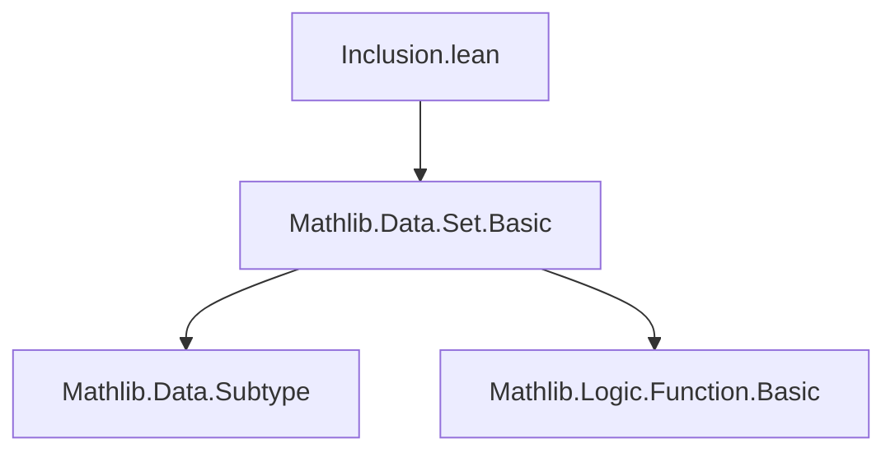
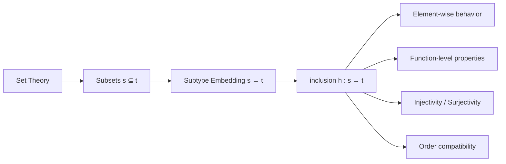

**Technical Brief: `Inclusion.lean` Module**

---

### 1. **Key Definitions & Theorems**

| Name | Type / Signature | Purpose |
|------|------------------|---------|
| `inclusion` | `inclusion (h : s ⊆ t) : s → t` | Constructs the canonical injection from subtype `s` to `t` when `s ⊆ t`. |
| `inclusion_self` | `inclusion Subset.rfl x = x` | Shows `inclusion` along the identity inclusion is the identity map on elements. |
| `inclusion_eq_id` | `inclusion h = id` (when `h : s ⊆ s`) | Extends `inclusion_self` to function extensionality: identity inclusion is the identity function. |
| `inclusion_mk` | `inclusion h ⟨a, ha⟩ = ⟨a, h ha⟩` | Describes how `inclusion` acts on a constructed element of `s`. |
| `inclusion_right` | `inclusion h ⟨x, m⟩ = x` (when `x ∈ t` and `m : x ∈ s`) | Simplifies `inclusion` when the target element is already in `t`. |
| `inclusion_inclusion` | `inclusion htu (inclusion hst x) = inclusion (hst.trans htu) x` | Compatibility of `inclusion` with composition of inclusions (associativity). |
| `inclusion_comp_inclusion` | `inclusion htu ∘ inclusion hst = inclusion (hst.trans htu)` | Function-level version of `inclusion_inclusion`. |
| `coe_inclusion` | `(inclusion h x : α) = (x : α)` | The coercion of `inclusion h x` to `α` equals the coercion of `x`. |
| `val_comp_inclusion` | `Subtype.val ∘ inclusion h = Subtype.val` | The underlying value map commutes with `inclusion`. |
| `inclusion_injective` | `Injective (inclusion h)` | `inclusion` is injective (as expected for a subtype embedding). |
| `inclusion_inj` | `inclusion h x = inclusion h y ↔ x = y` | Equational characterization of injectivity. |
| `eq_of_inclusion_surjective` | `Surjective (inclusion h) → s = t` | If the inclusion is surjective, then the subsets are equal. |
| `inclusion_le_inclusion`, `inclusion_lt_inclusion` | Order-preserving properties under `[LE α]`, `[LT α]` | `inclusion` reflects and preserves order relations. |

---

### 2. **Naming Conventions**

- **Prefixes**:
  - `inclusion_`: all lemmas about the `inclusion` function.
  - `coe_`, `val_`: for coercion and value-related properties.
- **Suffixes**:
  - `_self`: identity case (`h = rfl`).
  - `_eq_id`: when the function itself equals `id`.
  - `_mk`: behavior on `mk`-constructed elements.
  - `_inclusion`: composition of two inclusions.
  - `_inj`, `_injective`: injectivity-related.
  - `_le`, `_lt`: order-theoretic behavior.

---

### 3. **Tactic Stack**

- `cases x`: destructures subtype elements.
- `rfl`: for definitional equalities (core of most proofs).
- `funext`: to prove function extensionality (e.g., `inclusion_eq_id`, `inclusion_comp_inclusion`).
- `grind`: used in `eq_of_inclusion_surjective` to discharge simple goals (likely a custom or `simp`-based tactic).
- `Subtype.ext_iff.1` / `.2`: for reasoning about equality in subtypes.

No heavy automation (e.g., `aesop`, `linarith`, `ring`) is used — proofs are mostly definitional.

---

### 4. **Proof Logic**

- **Structure**: All proofs are *elementary* and *definitional*.
- **Pattern**:
  1. `cases x` to unpack subtype elements.
  2. `rfl` to conclude definitional equality.
  3. For function-level equalities: apply `funext`, then reduce to element-level (`rfl`).
  4. For injectivity/surjectivity: use subtype equality criteria (`Subtype.ext_iff`).
- **Induction**: Not used — no recursive structures or natural numbers.

---

### 5. **Imports**

- `Mathlib.Data.Set.Basic`: foundational set theory (subsets, subtype definitions, `Subset`, `Set` type, etc.).

No other imports are used — this is a minimal, self-contained module.

---

### 6. **Mermaid Diagrams**

#### **Dependency Graph**

#### **Overview of Module Scope**

#### **Theoretical Context**
- Part of the *subtype embedding* infrastructure in Mathlib.
- Serves as a bridge between subset inclusion (`⊆`) and categorical monomorphisms in the category of types.
- Used implicitly in many places where subset inclusions are coerced or manipulated.

--- 

Let me know if you'd like a formalized dependency graph or a comparison with similar constructions (e.g., `subtype.val`, `subtype.restrict`).
