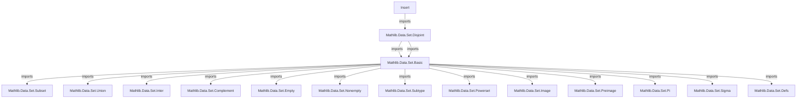
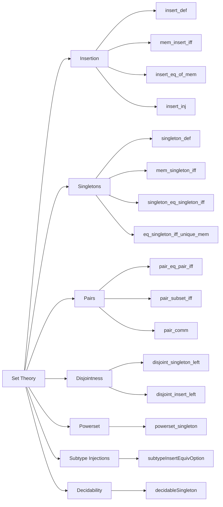

### Technical Brief: `Insert.lean` — Set Insertion, Singletons, Pairs, and Disjointness

---

#### **1. Key Definitions & Theorems**

| Name | Type / Signature | Purpose |
|------|------------------|---------|
| `insert_def` | `insert x s = { y | y = x ∨ y ∈ s }` | Defines `insert` extensionally. |
| `mem_insert_iff` | `x ∈ insert a s ↔ x = a ∨ x ∈ s` | Membership characterization of `insert`. |
| `insert_eq_of_mem` | `a ∈ s → insert a s = s` | Idempotency when element already in set. |
| `singleton_def` | `{a} = insert a ∅` | Singleton as insert into empty set. |
| `mem_singleton_iff` | `a ∈ ({b}) ↔ a = b` | Membership in singleton. |
| `singleton_eq_singleton_iff` | `{x} = {y} ↔ x = y` | Extensionality for singletons. |
| `pair_eq_pair_iff` | `{x, y} = {z, w} ↔ (x = z ∧ y = w) ∨ (x = w ∧ y = z)` | Equality of unordered pairs. |
| `disjoint_singleton_left` | `Disjoint {a} s ↔ a ∉ s` | Disjointness with singleton. |
| `disjoint_insert_left` | `Disjoint (insert a s) t ↔ a ∉ t ∧ Disjoint s t` | Disjointness with inserted set. |
| `powerset_singleton` | `𝒫 {x} = {∅, {x}}` | Powerset of a singleton. |
| `subtypeInsertEquivOption` | `[DecidableEq α] → { i // i ∈ insert x t } ≃ Option { i // i ∈ t }` | Bijection between elements of `insert x t` and `Option (t)`. |
| `eq_singleton_iff_unique_mem` | `s = {a} ↔ a ∈ s ∧ ∀ x ∈ s, x = a` | Characterization of singleton sets. |
| `insert_inj` | `a ∉ s → insert a s = insert b s ↔ a = b` | Injectivity of `insert` when element not already present. |

---

#### **2. Naming Conventions**

- **Prefixes**:
  - `mem_`: membership lemmas (`mem_insert`, `mem_singleton`, `mem_singleton_iff`)
  - `insert_`: insertion-related (`insert_def`, `insert_eq`, `insert_subset`, `insert_comm`)
  - `singleton_`: singleton-related (`singleton_def`, `singleton_nonempty`, `singleton_eq_singleton_iff`)
  - `pair_`: pair-related (`pair_eq_pair_iff`, `pair_subset`, `pair_comm`)
  - `disjoint_`: disjointness (`disjoint_singleton_left`, `disjoint_insert_right`)
  - `subset_`, `ssubset_`: inclusion relations
  - `forall_`, `exists_`: quantifier manipulation (`forall_mem_insert`, `exists_mem_insert`)

- **Suffixes**:
  - `_iff`: equivalence with membership or equality (`mem_insert_iff`, `singleton_subset_iff`)
  - `_left`, `_right`: asymmetry in binary operations (`disjoint_singleton_left`, `disjoint_insert_right`)
  - `_of_mem`, `_of_notMem`: conditional versions based on membership (`eq_of_mem_singleton`, `singleton_inter_of_notMem`)
  - `_iff_eq`: characterizations of equality via subset (`subset_singleton_iff_eq`, `subset_pair_iff_eq`)

- **Pattern**: `X_of_Y` where `Y` is a condition (e.g., `of_mem`, `of_notMem`, `of_subsingleton`).

---

#### **3. Tactic Stack**

- **Core tactics**:
  - `grind`: heavily used for automated simplification and rewriting (custom tactic in Mathlib).
  - `simp`: for simplification using `@[simp]` lemmas.
  - `rfl`, `congr_arg`, `ext`, `funext`: basic equality reasoning.
  - `aesop`: used in `pair_eq_pair_iff`, `subset_pair_iff_eq`, etc., for automated first-order reasoning.
  - `cases`, `intro`, `exact`, `apply`, `rw`, `convert`, `swap`, `left`, `right`, `split`, `intro h, ...`
  - `simpa`: for simplifying and discharging goals using assumptions.

- **Pattern**: `by grind` dominates proofs; `simp only [...]` used for fine-grained control.

---

#### **4. Proof Logic**

- **Induction / Case Analysis**:
  - Membership in `insert` is handled via `Or.elim` (i.e., `Or.inl`, `Or.inr`, `Or.resolve_left/right`).
  - Subtype reasoning (e.g., `subtypeInsertEquivOption`) uses `if ... then ... else` and `elim` on `Option`.

- **Equational Reasoning**:
  - Many proofs are *extensional*: prove equality of sets via `Set.ext`, i.e., `∀ x, x ∈ lhs ↔ x ∈ rhs`.
  - Use `Set.ext_iff` and `iff_iff_implies_and_implies` to reduce to implications.

- **Logical Flow**:
  - **Membership → Equality**: e.g., `mem_insert_iff` → `insert_eq_of_mem`.
  - **Subset → Equality**: e.g., `subset_antisymm_iff` in `pair_eq_pair_iff`.
  - **Disjointness ↔ Non-membership**: via `disjoint_iff` and `mem_insert_iff`.

- **Subtype Reasoning**:
  - `Unique` and `Nonempty` instances for singletons (`uniqueSingleton`, `Nonempty.subset_singleton_iff`).
  - `subtypeInsertEquivOption` constructs a bijection using decidability of equality.

---

#### **5. Imports**

- **Primary dependency**:
  ```lean
  Mathlib.Data.Set.Disjoint
  ```
- **Implicit dependencies** (via `Set` namespace and `@[simp]` usage):
  - `Mathlib.Data.Set.Basic` (e.g., `subset`, `union`, `inter`, `compl`, `empty`, `nonempty`)
  - `Mathlib.Data.Set.Subset` (e.g., `ssubset`, `subset_antisymm`)
  - `Mathlib.Data.Option.Basic` (for `subtypeInsertEquivOption`)
  - `Mathlib.Data.List.Basic` (for `List.replicate`, `List.nodup`, `List.length_pos_iff_exists_mem`)
  - `Mathlib.Data.Product.Basic` (for `Prod.fst`, `Prod.snd`, `range`)
  - `Mathlib.Logic.Function.Basic` (`Function.Injective`, `Function.Surjective`)
  - `Mathlib.Logic.Equiv.Basic` (for `Equiv`, `subtypeEquivOption`)
  - `Mathlib.Logic.Subsingleton` (for `Subsingleton`, `eq_of_nonempty_of_subsingleton`)
  - `Mathlib.Logic.Decidable` (for `DecidableEq`, `DecidablePred`, `DecidableProp`)
  - `Mathlib.Tactic.Grind` (custom `grind` tactic)

---

#### **6. Mermaid Diagrams**

##### **Dependency Graph (Module-Level)**



##### **Overview of Theories in `Insert.lean`**



---

#### **7. Summary**

This file formalizes foundational set-theoretic operations—especially `insert`, `singleton`, and `pair`—with a focus on *extensional reasoning*, *membership equivalence*, and *disjointness*. It leverages Lean’s typeclass system (`DecidableEq`, `Subsingleton`, `Nonempty`, `Unique`) and heavily uses the `grind` tactic for automation. The lemmas are designed to support *inductive proofs* (e.g., `forall_of_forall_insert`, `exists_mem_insert`) and *subtype constructions* (e.g., `subtypeInsertEquivOption`). It serves as a low-level building block for higher-level set theory in Mathlib.

--- 

Let me know if you'd like a dependency graph for specific lemmas (e.g., `subtypeInsertEquivOption`), or a proof tree for a key theorem.
