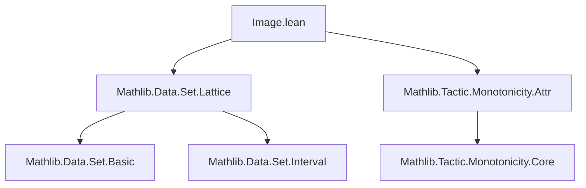
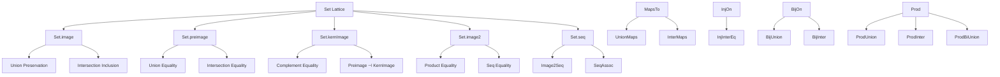

### Technical Brief: `Image.lean` — Set Lattice and (Pre)images of Functions

---

#### **1. Key Definitions & Theorems**

| Name | Type / Signature | Purpose |
|------|------------------|---------|
| `image` | `f '' s` | Direct image of set `s` under function `f` |
| `preimage` | `f ⁻¹' t` | Preimage (inverse image) of set `t` under `f` |
| `kernImage` | `kernImage f s` | Kernel image: `f '' (s ∩ f ⁻¹' univ)` ≡ `(f '' sᶜ)ᶜ` (complement of image of complement) |
| `image2` | `image2 f s t` | Binary image: `{ f a b | a ∈ s, b ∈ t }` |
| `MapsTo` | `MapsTo f s t` | `f '' s ⊆ t` |
| `InjOn` | `InjOn f s` | `f` is injective on `s` |
| `SurjOn` | `SurjOn f s t` | `f '' s ⊇ t` (i.e., surjective onto `t` from `s`) |
| `BijOn` | `BijOn f s t` | `f` is bijective from `s` to `t` |
| `iUnion`, `iInter`, `iUnion₂`, `iInter₂`, `biUnion`, `biInter`, `sUnion`, `sInter` | Indexed/sup/inf unions/intersections | Standard set-theoretic operations over families of sets |

**Key Theorems:**

| Name | Statement | Significance |
|------|-----------|--------------|
| `image_preimage` | `GaloisConnection (image f) (preimage f)` | `f '' s ⊆ t ↔ s ⊆ f ⁻¹' t` |
| `preimage_kernImage` | `GaloisConnection (preimage f) (kernImage f)` | Dual adjunction for kernel image |
| `kernImage_eq_compl` | `kernImage f s = (f '' sᶜ)ᶜ` | Expresses kernel image via complement |
| `image_iUnion` | `f '' ⋃ i, s i = ⋃ i, f '' s i` | Image commutes with arbitrary unions |
| `image_iInter_subset` | `f '' ⋂ i, s i ⊆ ⋂ i, f '' s i` | Image preserves intersections only up to inclusion |
| `InjOn.image_iInter_eq` | If `f` injective on `⋃ i, s i`, then equality holds in `image_iInter_subset` | Injectivity lifts inclusion to equality |
| `image_iInter` | If `f` bijective, `f '' ⋂ i, s i = ⋂ i, f '' s i` | Full preservation of intersections under bijection |
| `preimage_iUnion`, `preimage_iInter` | `f ⁻¹' ⋃ i, s i = ⋃ i, f ⁻¹' s i`, similarly for `iInter` | Preimage preserves both unions and intersections |
| `prod_iUnion`, `prod_iInter` | Product distributes over unions/intersections | E.g., `s ×ˢ ⋃ i, t i = ⋃ i, s ×ˢ t i` |
| `image2_eq_iUnion` | `image2 f s t = ⋃ a ∈ s, ⋃ b ∈ t, {f a b}` | Binary image as iterated union of singletons |
| `bijOn_iUnion`, `bijOn_iInter` | Preservation of bijection under unions/intersections (with directedness/injectivity) | Generalizes `BijOn` behavior over families |

---

#### **2. Naming Conventions**

- **Prefixes:**
  - `image_`, `preimage_`, `kernImage_`: operations on sets via functions.
  - `mapsTo_`, `injOn_`, `surjOn_`, `bijOn_`: properties of functions on sets.
  - `iUnion_`, `iInter_`, `iUnion₂_`, `iInter₂_`, `biUnion_`, `biInter_`, `sUnion_`, `sInter_`: indexed/bounded/sup/inf variants.
  - `prod_`: product set operations.
  - `image2_`, `seq_`: binary image / sequence operations.

- **Suffixes:**
  - `_left`, `_right`: indicate which argument is varied in binary operations (`image2`, `prod`, `seq`).
  - `_mono`: monotonicity lemmas.
  - `_eq`: equality lemmas (as opposed to `_subset`).
  - `_iff`: characterizations via logical equivalence.

- **Notation:**
  - `⋃ i, s i` → `iUnion`
  - `⋂ i, s i` → `iInter`
  - `⋃ i j, s i j` → `iUnion₂`
  - `⋃ i ∈ s, t i` → `biUnion`
  - `⋃₀ S` → `sUnion` (union over a set of sets)

---

#### **3. Tactic Stack**

- **Core automation:**
  - `simp`, `simp_rw`, `ext`, `grind`, `aesop`
- **Set-theoretic reasoning:**
  - `cases`, `rcases`, `obtain`, `choose`, `injection`, `apply Subset.antisymm`
- **Logical manipulation:**
  - `tauto`, `exact`, `refine`, `rw`, `apply`, `convert`
- **Index manipulation:**
  - `nonempty`, `inhabited`, `isEmpty_or_nonempty`, `subtype`, `exists_prop`, `forall_and`
- **Monotonicity & Galois connections:**
  - `.monotone_u`, `.u_unique`, `.monotone`, `mono`

---

#### **4. Proof Logic**

- **Inductive structure:** Most proofs follow standard set-theoretic reasoning:
  - **Equality proofs**: `ext` + `simp` or `Subset.antisymm` + two `intro` + `simp` steps.
  - **Inclusion proofs**: `intro x hx`, unfold definitions, apply hypotheses.
  - **Indexed unions/intersections**: Use `mem_iUnion`, `mem_iInter`, `iUnion_subset_iff`, `subset_iUnion`, `iInter_subset`, etc.
  - **Injectivity/surjectivity**: Use `InjOn`, `SurjOn`, `BijOn` lemmas; often require `cases` on membership in unions/intersections.
  - **Directed families**: Use `Directed` hypothesis to find common upper bound for two indices.

- **Common patterns:**
  - *Image of union*: `simp only [mem_image, mem_iUnion, exists_and]`
  - *Image of intersection*: Use `mapsTo_iInter_iInter` + `image_subset`, or injectivity to upgrade inclusion.
  - *Preimage*: Always distributes over unions/intersections → `simp` suffices.
  - *Product sets*: Use `ext`, `mem_prod`, `mem_iUnion`, `exists_imp`, `and_imp`.

---

#### **5. Imports & Dependencies**

- **Core imports:**
  ```lean
  Mathlib.Data.Set.Lattice
  Mathlib.Tactic.Monotonicity.Attr
  ```
- **Implicit dependencies:**
  - `Function`, `Set`, `Prod`, `Subtype`, `Pi`, `Type*`, `Sort*`, `Nonempty`, `Directed`, `GaloisConnection`, `Monotone`, `mapsTo`, `InjOn`, `SurjOn`, `BijOn`, `image2`, `seq`, `kernImage`, `biUnion`, `biInter`, `iUnion`, `iInter`, `sUnion`, `sInter`, `univ`, `empty`, `compl`, `union`, `inter`, `subset`, `eq`, `iff`, `exists`, `forall`, `and`, `or`, `not`, `eq_comm`, `compl_compl`, `empty_subset`, `subset.refl`, `subset.trans`, `subset.antisymm`, `exists_swap`, `forall₂_swap`, `iSup_range`, `iInf_range`, `iSup_image`, `iInf_image`, `iSup_image2`, `iInf_image2`, `iSup_prod`, `biSup_inter_of_pairwise_disjoint`, `biSup_iInter_of_pairwise_disjoint`, `Function.update`, `forall_update_iff`, `update_self`, `mem_image`, `mem_preimage`, `mem_sUnion`, `mem_sInter`, `mem_iUnion`, `mem_iInter`, `mem_iUnion₂`, `mem_iInter₂`, `mem_biUnion`, `mem_biInter`, `mem_prod`, `mem_singleton`, `range`, `univ`, `empty`, `compl`, `union`, `inter`, `subset`, `eq`, `iff`, `exists`, `forall`, `and`, `or`, `not`, `eq_comm`, `compl_compl`, `empty_subset`, `subset.refl`, `subset.trans`, `subset.antisymm`, `exists_swap`, `forall₂_swap`, `iSup_range`, `iInf_range`, `iSup_image`, `iInf_image`, `iSup_image2`, `iInf_image2`, `iSup_prod`, `biSup_inter_of_pairwise_disjoint`, `biSup_iInter_of_pairwise_disjoint`, `Function.update`, `forall_update_iff`, `update_self`, `mem_image`, `mem_preimage`, `mem_sUnion`, `mem_sInter`, `mem_iUnion`, `mem_iInter`, `mem_iUnion₂`, `mem_iInter₂`, `mem_biUnion`, `mem_biInter`, `mem_prod`, `mem_singleton`, `range`, `univ`, `empty`, `compl`, `union`, `inter`, `subset`, `eq`, `iff`, `exists`, `forall`, `and`, `or`, `not`, `eq_comm`, `compl_compl`, `empty_subset`, `subset.refl`, `subset.trans`, `subset.antisymm`, `exists_swap`, `forall₂_swap`, `iSup_range`, `iInf_range`, `iSup_image`, `iInf_image`, `iSup_image2`, `iInf_image2`, `iSup_prod`, `biSup_inter_of_pairwise_disjoint`, `biSup_iInter_of_pairwise_disjoint`, `Function.update`, `forall_update_iff`, `update_self`.

---

#### **6. Mermaid Diagrams**

##### **Dependency Graph (Module-Level)**



##### **Conceptual Overview of Theory**



---

#### **7. Summary**

This file formalizes the algebra of sets under image, preimage, and kernel image operations, especially their interaction with indexed unions and intersections. It includes:

- **Galois connections** (`image ⊣ preimage`, `preimage ⊣ kernImage`)
- **Distributivity laws** for unions (always preserved), intersections (preserved under injectivity)
- **Binary image (`image2`)** and **sequence (`seq`)** operations, with full algebraic structure
- **Product set behavior** over unions/intersections
- **Preservation of function properties** (`MapsTo`, `InjOn`, `SurjOn`, `BijOn`) under unions/intersections, especially under directed families

The file is a cornerstone for reasoning about set-theoretic constructions in analysis, measure theory, and topology, where image/preimage behavior under limits, unions, and intersections is essential.

--- 

Let me know if you'd like a **dependency graph of definitions**, **proof automation summary**, or **formalization patterns** extracted.
