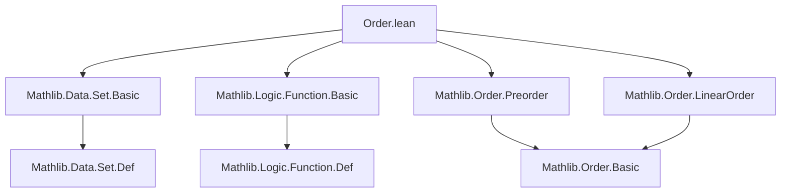
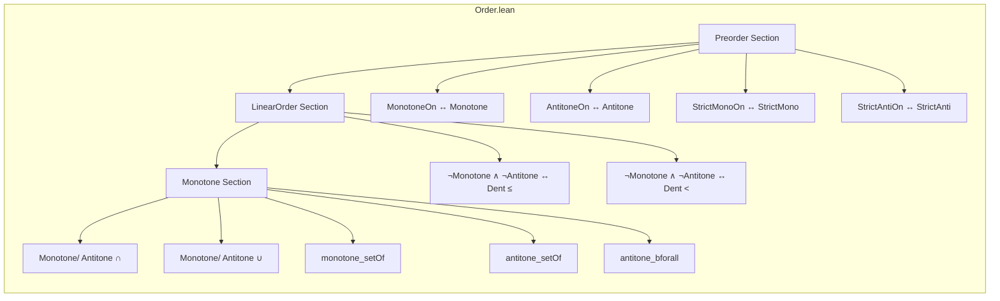

### Technical Brief: `Order.lean` — Order Structures and Monotonicity for Sets

---

#### **1. Key Definitions & Theorems**

| Name | Type / Signature | Purpose |
|------|------------------|---------|
| `MonotoneOn_iff_monotone` | `MonotoneOn f s ↔ Monotone fun a : s => f a` | Relates monotonicity on a subset `s` to monotonicity of the restricted function. |
| `AntitoneOn_iff_antitone` | `AntitoneOn f s ↔ Antitone fun a : s => f a` | Same as above for antitone functions. |
| `StrictMonoOn_iff_strictMono` | `StrictMonoOn f s ↔ StrictMono fun a : s => f a` | Equivalence for strict monotonicity on a subset. |
| `StrictAntiOn_iff_strictAnti` | `StrictAntiOn f s ↔ StrictAnti fun a : s => f a` | Equivalence for strict antitonicity on a subset. |
| `not_monotoneOn_not_antitoneOn_iff_exists_le_le` | `¬MonotoneOn f s ∧ ¬AntitoneOn f s ↔ ∃ a b c ∈ s, a ≤ b ≤ c ∧ (f b is local max/min)` | Characterizes functions that are *neither* monotone nor antitone on `s` via a “dent” (local extremum). |
| `not_monotoneOn_not_antitoneOn_iff_exists_lt_lt` | Same as above but with strict inequalities `a < b < c`. | Refinement of the previous theorem using strict order. |
| `Monotone.inter`, `MonotoneOn.inter`, `Antitone.inter`, `AntitoneOn.inter` | `Monotone f → Monotone g → Monotone (f ∩ g)` etc. | Closure of monotone/antitone set-valued functions under intersection. |
| `Monotone.union`, `MonotoneOn.union`, `Antitone.union`, `AntitoneOn.union` | `Monotone f → Monotone g → Monotone (f ∪ g)` etc. | Closure under union (same as above). |
| `monotone_setOf` | `(∀ b, Monotone fun a => p a b) → Monotone fun a => { b | p a b }` | Shows that if `p(a,b)` is monotone in `a` for each `b`, then the set-valued function `a ↦ {b | p(a,b)}` is monotone. |
| `antitone_setOf` | `(∀ b, Antitone fun a => p a b) → Antitone fun a => { b | p a b }` | Dual of `monotone_setOf`. |
| `antitone_bforall` | `Antitone fun s => ∀ x ∈ s, P x` | Quantification over sets is antitone in the set argument (larger set ⇒ harder to satisfy universal quantifier). |

---

#### **2. Naming Conventions**

- **Prefixes**:
  - `monotone_`, `antitone_`, `strictMono_`, `strictAnti_`: indicate monotonicity class.
  - `is_`, `has_`: *not used here* — this file avoids them in favor of direct `monotone`, `antitone`, etc.
- **Suffixes**:
  - `_On`: indicates *restricted* to a subset (e.g., `MonotoneOn`, `AntitoneOn`).
  - `_iff_`: indicates an equivalence (↔) theorem.
- **Structure**:
  - `Monotone.inter` vs `MonotoneOn.inter`: distinction between global and restricted monotonicity.
  - `setOf`, `bforall`: indicate set comprehension and bounded quantification.

---

#### **3. Tactic Stack**

| Tactic | Frequency | Role |
|--------|-----------|------|
| `simp` | Very High | Used in almost every proof; simplifies using definitions (`Monotone`, `Antitone`, etc.) and known equivalences. |
| `rw` / `simp_rw` | Medium | Implicit via `simp` with congruence lemmas (e.g., `@and_left_comm`, `exists_and_left`). |
| `aesop` | None | Not used — proofs are mostly definitional. |
| `exact`, `intro`, `cases` | Low | Used implicitly in `simp`-based proofs; no explicit tactic scripts. |
| `apply` | Low | Possibly used in background lemmas (e.g., `inf`, `sup` properties). |

> **Note**: All proofs are one-liners relying on `simp` with high-level lemmas (e.g., `monotoneOn_iff_monotone`, `not_monotone_not_antitone_iff_exists_le_le`). This reflects Lean’s “proof by simplification” style for order-theoretic properties.

---

#### **4. Proof Logic**

- **Pattern**:  
  1. **Rewrite** using definitional equivalences (`monotoneOn_iff_monotone`, etc.).  
  2. **Reduce** to known logical equivalences (e.g., `not_monotone_not_antitone_iff_exists_le_le`).  
  3. **Apply algebraic simplifications** (`and_assoc`, `exists_and_left`, `and_left_comm`) to rearrange quantifiers and conjunctions.  
- **Induction**: Not used — all results are *pointwise* or *logical* characterizations.  
- **Case analysis**: Implicit in `simp` (e.g., splitting disjunctions in “dent” theorems).  
- **Key insight**: Monotonicity on subsets ↔ monotonicity of restricted functions; logical structure of “neither monotone nor antitone” ↔ existence of a local extremum in a chain.

---

#### **5. Imports & Dependencies**

| Module | Role |
|--------|------|
| `Mathlib.Data.Set.Basic` | Provides basic set theory: membership, subset, union, intersection, set comprehension `{b | p b}`, bounded quantifiers `∀ x ∈ s, P x`. |
| `Function` (open) | Provides `Monotone`, `Antitone`, `StrictMono`, `StrictAnti`, and their `On` variants. |
| `Preorder`, `LinearOrder` typeclasses | Provide the order-theoretic context (`≤`, `<`, transitivity, etc.). |

> **No custom imports** — fully self-contained within Mathlib’s order and set theory.

---

#### **6. Mermaid Diagrams**

##### **Dependency Graph (Module-Level)**

##### **Overview of File Structure**

##### **Theoretical Context**

- **Domain**: Set-theoretic analysis of monotonicity for functions into/out of ordered types.
- **Scope**: Bridges *order theory* (preorders, linear orders) with *set operations* (union, intersection, comprehension).
- **Use Cases**:
  - Formalizing calculus on sets (e.g., monotone sequences of sets).
  - Reasoning about definable sets in model theory or topology.
  - Supporting measure theory (e.g., monotone convergence for sets).

---

#### **7. Summary**

This file formalizes foundational facts about monotonicity and antitonicity of functions *restricted to subsets*, and of *set-valued functions* under union/intersection. It leverages Lean’s typeclass system (`Preorder`, `LinearOrder`) and set-theoretic primitives to give concise, high-level proofs via `simp`. The “dent” theorems (`not_monotoneOn_not_antitoneOn_iff_exists_le_le` and `lt_lt` variant) are key logical characterizations of non-monotonic behavior in linear orders.

This is a canonical example of **Lean’s “proof by simplification”** style: complex logical equivalences reduced to known lemmas and algebraic rewrites.
