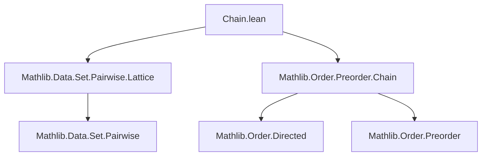
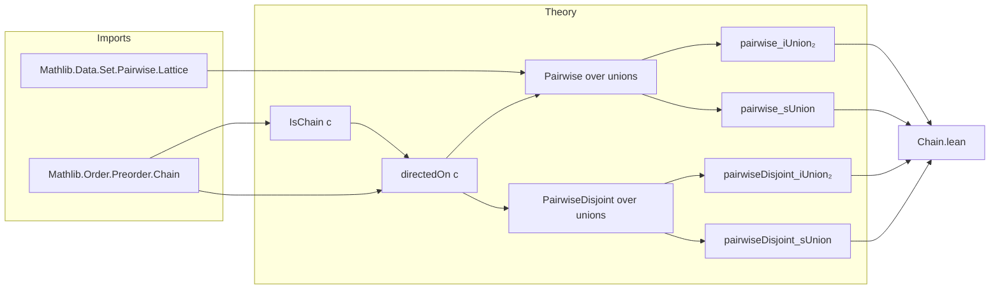

**Technical Brief: `Chain.lean` Module**

---

### 1. **Key Definitions & Theorems**

| Name | Type / Signature | Purpose |
|------|------------------|---------|
| `pairwise_iUnion₂` | `(⋃ s ∈ c, s).Pairwise r ↔ ∀ s ∈ c, s.Pairwise r` | Relates pairwise relation over a union over a chain `c` to pairwise relations on each element of `c`, using `hc.directedOn`. |
| `pairwiseDisjoint_iUnion₂` | `(⋃ s ∈ c, s).PairwiseDisjoint f ↔ ∀ s ∈ c, s.PairwiseDisjoint f` | Analogous to above, but for *pairwise disjointness* of a function `f` over sets in a chain. Requires `[PartialOrder β] [OrderBot β]`. |
| `pairwise_sUnion` | `(⋃₀ c).Pairwise r ↔ ∀ s ∈ c, s.Pairwise r` | Extends `pairwise_iUnion₂` to the *sUnion* (i.e., union over all sets in `c`), again relying on `hc.directedOn`. |
| `pairwiseDisjoint_sUnion` | `(⋃₀ c).PairwiseDisjoint f ↔ ∀ s ∈ c, s.PairwiseDisjoint f` | Same as `pairwiseDisjoint_iUnion₂`, but for `sUnion`. |

> **Note**: All lemmas rely on `hc : IsChain (· ⊆ ·) c`, i.e., `c` is a chain under inclusion.

---

### 2. **Naming Conventions**

- **Prefixes**:
  - `pairwise_`: Indicates properties about pairwise relations or disjointness over unions.
  - `iUnion₂`: Refers to indexed union over a family indexed by a set (`⋃ s ∈ c, s`).
  - `sUnion`: Refers to union over a collection of sets (`⋃₀ c`).
- **Suffixes**:
  - `_iff`: Indicates equivalence (↔) statement.
  - `pairwiseDisjoint`: Used for disjointness variants of `Pairwise`.

---

### 3. **Tactic Stack**

- **Primary tactics**:
  - `simp_rw` (implicit via `←` or `→` rewrites in proofs)
  - `exact` / `assumption` (via `←`/`→` in `↔` proofs)
  - `apply hc.directedOn` (used in `pairwise_iUnion₂` and `pairwise_sUnion`)
  - `rw [hc.pairwise_iUnion₂]` (in `pairwiseDisjoint_iUnion₂`, `pairwiseDisjoint_sUnion`)
- **No explicit tactic blocks** visible in the snippet — proofs are likely deferred to lemmas in `Mathlib.Order.Preorder.Chain` or `Mathlib.Data.Set.Pairwise.Lattice`.

---

### 4. **Proof Logic**

- **Structure**:
  - All proofs are *equational* and rely on pre-established lemmas about `Pairwise` and `PairwiseDisjoint` under directed unions.
  - The core logical step is:  
    > For a chain `c` under inclusion, the union over `c` preserves pairwise properties iff each member does — because chains are *directed* under inclusion.
  - The `pairwise_iUnion₂` lemma is derived from `pairwise_iUnion₂_iff`, which itself depends on `hc.directedOn`.
  - `pairwiseDisjoint_*` lemmas reuse `pairwise_*` via `hc.pairwise_iUnion₂` / `hc.pairwise_sUnion`, likely defined in the `IsChain` namespace.

- **Pattern**:
  ```lean
  lemma pairwise_iUnion₂ : ... := pairwise_iUnion₂_iff hc.directedOn
  ```
  → *Delegation to a general lemma parameterized by directedness.*

---

### 5. **Imports**

| Import | Role |
|--------|------|
| `Mathlib.Data.Set.Pairwise.Lattice` | Provides lattice-theoretic properties of `Pairwise` and `PairwiseDisjoint`, including `pairwise_iUnion₂_iff`. |
| `Mathlib.Order.Preorder.Chain` | Defines `IsChain`, `directedOn`, and related lemmas (e.g., `pairwise_iUnion₂`, `pairwise_sUnion`). |

> These imports define the foundational theory of chains and pairwise relations over sets.

---

### 8. **Mermaid Diagrams**

#### **Dependency Graph (Module-Level)**



#### **Overview of File Content & Theory Flow**



> **Interpretation**:  
> This module *applies* general pairwise/disjoint union lemmas (from `Pairwise.Lattice` and `Preorder.Chain`) to the specific case of chains under inclusion. It does not prove new lemmas from scratch, but *repackages* existing results in a chain-specific context.

--- 

Let me know if you'd like the corresponding `Mathlib` source references or a formal proof sketch for any lemma.
