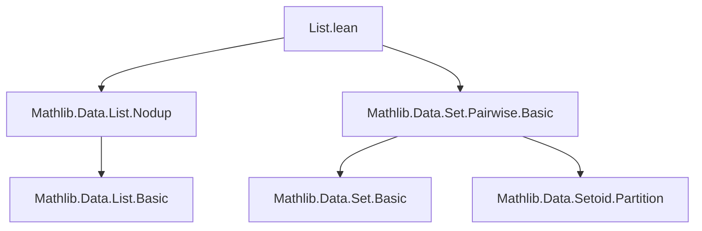

**Technical Brief: `List.lean` — Translating Pairwise Relations Between Sets and Lists**

---

### 1. KEY DEFINITIONS & THEOREMS

| Name | Type / Signature | Purpose |
|------|------------------|---------|
| `Nodup.pairwise_of_set_pairwise` | `∀ {l : List α} {r : α → α → Prop}, l.Nodup → ({x | x ∈ l}.Pairwise r) → l.Pairwise r` | Shows that if a list has no duplicates and its underlying set is pairwise `r`, then the list itself is pairwise `r`. |
| `Nodup.pairwise_coe` | `∀ {l : List α} {r : α → α → Prop}, [Std.Symm r] → l.Nodup → ({a | a ∈ l}.Pairwise r ↔ l.Pairwise r)` | Equivalence between set-wise and list-wise pairwise relations under symmetry and no-duplicates assumption. |

> Note: `Pairwise r` on a list means `∀ x ∈ l, ∀ y ∈ l, x ≠ y → r x y`.  
> `Set.Pairwise s r` means `∀ x ∈ s, ∀ y ∈ s, x ≠ y → r x y`.

---

### 2. NAMING CONVENTIONS

- **Prefixes**:
  - `pairwise_`: Relates to `Pairwise` properties.
  - `coe` (as in `pairwise_coe`): Short for *coercion*, indicating equivalence between list and set coercion (`↑l` or `{a | a ∈ l}`).
- **Suffixes**:
  - `_of_`: Indicates derivation from a hypothesis (e.g., `pairwise_of_set_pairwise`).
  - `_of_symmetric`: Used in internal lemmas (e.g., `Set.pairwise_insert_of_symmetric`).
- **Module/namespace usage**:
  - `List.` prefix for list-specific lemmas.
  - `Nodup.` used as a namespace for lemmas about lists with no duplicates.

---

### 3. TACTIC STACK

| Tactic | Usage Frequency | Role |
|--------|-----------------|------|
| `induction` | High | Structural induction on lists (`l`). |
| `simp` | Very High | Simplification using `simp` lemmas (e.g., `List.nodup_cons`, `Set.pairwise_insert_of_symmetric`, `and_comm`, `forall₂_congr`). |
| `rw` | Medium | Rewriting using hypotheses or equivalences. |
| `have` | Medium | Introducing intermediate facts (e.g., `have : ∀ b ∈ l, …`). |
| `apply` / `exact` | Low | Not explicitly visible here, but implied in `hl.pairwise_of_forall_ne h`. |
| `aesop` | Not used | Not present in this snippet. |

---

### 4. PROOF LOGIC

- **Main proof strategy**:
  - **Forward direction** (`pairwise_of_set_pairwise`): Uses `hl.pairwise_of_forall_ne h`, which is a standard lemma converting set-wise pairwise to list-wise under `Nodup`.
  - **Equivalence** (`pairwise_coe`):
    1. Induct on `l`.
    2. Base case `nil`: trivial by `simp`.
    3. Inductive step `a :: l`:
       - Decompose `l.nodup_cons` into `a ∉ l` and `l.nodup`.
       - Use symmetry of `r` to rewrite `r a b ↔ r a b` (trivial but needed for `simp`).
       - Apply `simp` with:
         - `Set.setOf_or`: to expand `{a | a ∈ a :: l}` as `{a} ∪ {a | a ∈ l}`.
         - `Set.pairwise_insert_of_symmetric`: to reduce pairwise on union to pairwise on parts and cross-pairwise.
         - `ih hl.2`: induction hypothesis.
         - `and_comm`, `forall₂_congr`: to rearrange quantifiers and conjunctions.

- **Key logical insight**: Under `Nodup`, membership in list ↔ membership in set, and symmetry ensures cross-pairwise conditions are symmetric.

---

### 5. IMPORTS & DEPENDENCIES

| Import | Purpose |
|--------|---------|
| `Mathlib.Data.List.Nodup` | Provides `Nodup` typeclass/property and lemmas like `pairwise_of_forall_ne`. |
| `Mathlib.Data.Set.Pairwise.Basic` | Provides `Set.Pairwise`, `pairwise_insert_of_symmetric`, and set-theoretic reasoning tools. |

> Also implicitly uses:
> - `Std.Symm` (symmetry of relation `r`)
> - Standard `List`, `Set`, and `Prop` infrastructure.

---

### 6. MERMAID DIAGRAMS

#### Dependency Graph (Module-Level)



#### Overview of Theoretical Flow

```mermaid
graph LR
  subgraph Definitions
    A[l : List α]
    B[r : α → α → Prop]
    C[l.Nodup]
    D[Set.Pairwise ↑l r]
    E[List.Pairwise l r]
  end

  subgraph Theorems
    F[pairwise_of_set_pairwise]
    G[pairwise_coe]
  end

  A --> C
  A --> D
  C --> F
  D --> F
  F --> E

  C --> G
  D ↔ G --> E
  G --> D
```

> **Interpretation**:  
> - `pairwise_of_set_pairwise` gives one direction: set-pairwise + `Nodup` ⇒ list-pairwise.  
> - `pairwise_coe` gives equivalence under symmetry + `Nodup`.  
> - Both rely on `Nodup` to identify list and set semantics.

---

### 7. SUMMARY

This file bridges the gap between set-theoretic and list-theoretic pairwise relations. It shows that for *duplicate-free* lists, checking pairwise properties on the underlying set is equivalent to checking them on the list itself — provided the relation is symmetric. The proofs are mostly `simp`-driven, leveraging structural induction and standard set/list lemmas.

This is foundational for reasoning about finite sets encoded as lists (e.g., in combinatorics or finite model theory), where lists serve as canonical representatives of sets.
