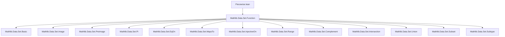
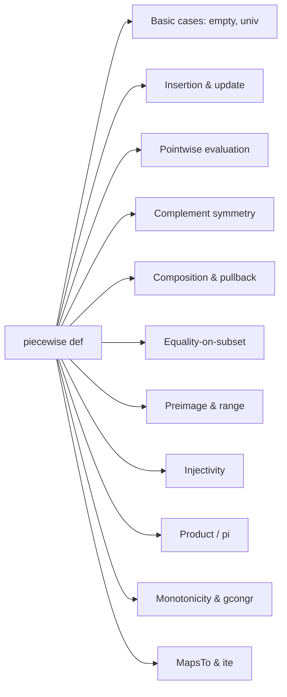

**Technical Brief: `Piecewise.lean` (Lean 4)**  
*Domain: Set-theoretic piecewise function construction in Mathlib*

---

### 1. KEY DEFINITIONS & THEOREMS

| Name | Type / Signature | Purpose |
|------|------------------|---------|
| `piecewise` | `Set α → (∀ i, δ i) → (∀ i, δ i) → ∀ i, δ i` | Constructs a function that behaves like `f` on set `s` and like `g` elsewhere. |
| `piecewise_empty` | `piecewise ∅ f g = g` | Base case: empty domain → always use `g`. |
| `piecewise_univ` | `piecewise univ f g = f` | Base case: full domain → always use `f`. |
| `piecewise_insert` | `(insert j s).piecewise f g = Function.update (s.piecewise f g) j (f j)` | Extends piecewise definition by updating at a new point. |
| `piecewise_eq_of_mem` | `i ∈ s → s.piecewise f g i = f i` | Evaluation on the set. |
| `piecewise_eq_of_notMem` | `i ∉ s → s.piecewise f g i = g i` | Evaluation outside the set. |
| `piecewise_compl` | `sᶜ.piecewise f g = s.piecewise g f` | Swapping `f`/`g` corresponds to complementing `s`. |
| `piecewise_range_comp` | `(range f).piecewise g₁ g₂ ∘ f = g₁ ∘ f` | Restriction to range simplifies composition. |
| `piecewise_comp` | `(s.piecewise f g) ∘ h = (h ⁻¹' s).piecewise (f ∘ h) (g ∘ h)` | Pullback of piecewise along a function. |
| `eqOn_piecewise` | `EqOn (s.piecewise f f') g t ↔ EqOn f g (t ∩ s) ∧ EqOn f' g (t ∩ sᶜ)` | Characterizes equality-on-subset for piecewise. |
| `piecewise_preimage` | `s.piecewise f g ⁻¹' t = s.ite (f ⁻¹' t) (g ⁻¹' t)` | Preimage distributes over `ite` (if-then-else). |
| `range_piecewise` | `range (s.piecewise f g) = f '' s ∪ g '' sᶜ` | Image of piecewise is union of images on parts. |
| `injective_piecewise_iff` | Characterization of injectivity of piecewise functions. | Ensures no collisions across the boundary. |
| `pi_piecewise`, `univ_pi_piecewise` | Product over piecewise families. | Enables reasoning about dependent products of piecewise-defined families. |

---

### 2. NAMING CONVENTIONS

- **Prefixes**:
  - `piecewise_`: core operations on `piecewise`.
  - `eqOn_`, `MapsTo_`, `injective_`, `range_`, `pi_`: relational properties.
- **Suffixes**:
  - `_iff`: equivalence characterizations.
  - `_compl`: behavior under complement.
  - `_insert`, `_singleton`, `_empty`, `_univ`: special cases.
  - `_ite`: interaction with `Set.ite` (if-then-else on sets).
- **`[∀ i, Decidable (i ∈ s)]`**: recurring hypothesis for decidability of membership.

---

### 3. TACTIC STACK

- `simp` (dominant): used extensively with `*`, `if_pos`, `if_neg`, `mem_insert_iff`, `Set.ite`.
- `ext`: extensionality for functions/sets.
- `by_cases`: to split on membership (`i ∈ s`) or equality (`i = j`).
- `rw`, `subst`, `apply`, `refine`: for rewriting and constructing proofs.
- `simp +unfoldPartialApp`: for partial application handling.
- `exact`, `intro`, `use`, `constructor`, `left`, `right`: basic proof structure.
- `aesop` not used — proofs are mostly `simp`-driven case splits.

---

### 4. PROOF LOGIC

- **Standard pattern**:
  1. **Extensionality** (`ext`) for functions or sets.
  2. **Case split** on `i ∈ s` (or `x ∈ s`) using `by_cases`.
  3. Apply `if_pos` / `if_neg` or `piecewise_eq_of_mem` / `piecewise_eq_of_notMem`.
  4. Simplify using `simp [*]` or `simp_all`.
- **Induction** is *not* used — proofs are pointwise and rely on decidability.
- **Logical flow**:
  - For equivalences (`↔`): prove both directions separately.
  - For inclusions (`⊆`): use `intro`, `use`, `simp`.
  - For injectivity/range: decompose domain into `s` and `sᶜ`, then apply known lemmas.

---

### 5. IMPORTS & DEPENDENCIES

- **Core imports**:
  ```lean
  Mathlib.Data.Set.Function
  ```
- **Key dependencies**:
  - `Equivalence`, `Function`, `Set` (basic set theory).
  - `DecidableEq`, `DecidablePred`, `DecidableRel`: for case splits.
  - `Preorder`, `Injective`, `EqOn`, `MapsTo`, `ite`, `pi`, `range`, `univ`, `compl`, `inter`, `diff`.
  - `Function.update`: for `piecewise_insert`.

---

### 6. MERMAID DIAGRAMS

#### Dependency Graph (Module-Level)



#### Overview of `piecewise` Theory Flow



---

### 7. DOMAIN-SPECIFIC INSIGHTS

- **Decidability is essential**: All key lemmas require `Decidable (i ∈ s)` — this is nontrivial in constructive settings.
- **`piecewise` is a generalization of `if-then-else`**: Encodes conditional logic at the function level.
- **Bridge between set theory and function theory**: Enables reasoning about functions defined piecewise over arbitrary sets.
- **Useful for piecewise-defined analysis objects**: e.g., piecewise-constant, piecewise-linear functions.

--- 

Let me know if you'd like a formalization roadmap for extending this theory (e.g., to measurable/piecewise-continuous functions).
