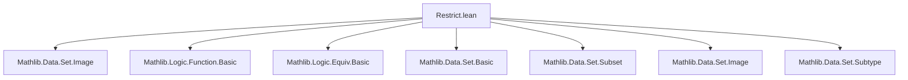

**Technical Brief: `Restrict.lean` — Domain/Codomain Restriction of Functions in Lean 4**

---

### 1. KEY DEFINITIONS & THEOREMS

| Name | Type / Signature | Purpose |
|------|------------------|---------|
| `restrict` | `Set.restrict (s : Set α) (f : ∀ a, π a) : ∀ a : s, π a` | Restricts the *domain* of `f` to subset `s`. |
| `restrict_def` | `s.restrict = fun f x ↦ f x` | Definitional equality of `restrict`. |
| `restrict_eq` | `s.restrict f = f ∘ Subtype.val` | Relates `restrict` to precomposition with coercion. |
| `restrict_apply` | `s.restrict f x = f x` | Evaluation of restricted function. |
| `restrict_eq_iff` | `restrict s f = g ↔ ∀ a ∈ s, f a = g ⟨a, ha⟩` | Characterizes equality of restricted functions. |
| `range_restrict` | `range (s.restrict f) = f '' s` | Range of restricted function equals image of `s`. |
| `image_restrict` | `s.restrict f '' (Subtype.val ⁻¹' t) = f '' (t ∩ s)` | Image under restriction interacts with preimage. |
| `restrict₂` | `s ⊆ t → (∀ a : t, π a) → ∀ a : s, π a` | Restriction along inclusion `s ⊆ t`. |
| `codRestrict` | `∀ x, f x ∈ s → ι → s` | Restricts the *codomain* of `f` to `s`, using witness `h`. |
| `val_codRestrict_apply` | `(codRestrict f s h x : α) = f x` | Coercion of codomain-restricted function recovers original. |
| `restrict_comp_codRestrict` | `s.restrict g ∘ s.codRestrict f h = g ∘ f` | Interaction between domain/codomain restriction. |
| `injOn_iff_injective` | `InjOn f s ↔ Injective (s.restrict f)` | Connects injectivity on a set to injectivity of restriction. |
| `surjOn_iff_surjective` | `SurjOn f s univ ↔ Surjective (s.restrict f)` | Connects surjectivity on a set to surjectivity of restriction. |
| `restrictPreimage` (implicit def via `restrictPreimage`) | `t.restrictPreimage f : f ⁻¹' t → t` | Universal property: restriction of `f` to its preimage over `t`. |
| `restrictPreimage_injective/surjective/bijective` | Under assumptions on `f`, `restrictPreimage f` inherits properties. | |

---

### 2. NAMING CONVENTIONS

- **Prefixes**:
  - `restrict_`: domain restriction.
  - `codRestrict_`: codomain restriction.
  - `restrict₂_`: restriction along inclusion.
  - `restrictPreimage_`: preimage-based restriction.
- **Suffixes**:
  - `_apply`: evaluation lemma.
  - `_def`: definition expansion.
  - `_iff`: equivalence characterizations.
  - `_inj`, `_surj`, `_bij`: injectivity/surjectivity/bijectivity lemmas.
- **Pattern**:
  - `restrict_*` for domain-restricted variants.
  - `codRestrict_*` for codomain-restricted variants.
  - `MapsTo.restrict_*` for restriction in the context of `MapsTo`.

---

### 3. TACTIC STACK

Frequently used tactics in proofs:

| Tactic | Usage |
|--------|-------|
| `rfl` | Definitional equalities (e.g., `restrict_apply`, `restrict_def`). |
| `simp` / `simp only` | Simplification using `@[simp]` lemmas (e.g., `restrict_id`, `range_restrict`). |
| `rw` | Rewriting using lemmas like `restrict_eq`, `range_comp`, etc. |
| `ext` | Extensionality for function equality or set equality. |
| `congr_arg` | Congruence for function/image equality. |
| `split_ifs` / `if_pos` / `if_neg` | Handling `if-then-else` in definitions like `extend`, `piecewise`. |
| `classical` | For classical choice in `extend`-related proofs. |
| `induction` | Inductive arguments (e.g., `coe_iterate_restrict`). |
| `aesop` (implied via `grind =` attribute) | Automated reasoning for simple goals. |

---

### 4. PROOF LOGIC

- **Structure**: Most proofs follow a *definitional + extensionality* pattern:
  1. Expand definitions (`delta`, `rw [restrict_eq]`, etc.).
  2. Apply `funext` / `ext` to reduce to element-wise reasoning.
  3. Use `Subtype.ext_iff` or `Subtype.coe_injective` to reason about subtype equality.
  4. Simplify using `simp` with `@[simp]` lemmas.
- **Common flows**:
  - *Image/range lemmas*: Use `image_comp`, `range_comp`, and `Subtype.range_coe`.
  - *Injectivity/surjectivity*: Translate via `injOn_iff_injective`, `surjOn_iff_surjective`, then apply standard function lemmas.
  - *Preimage restrictions*: Use `preimage_preimage`, `image_preimage_inter`, and `Subtype.image_preimage_coe`.
- **Induction**: Used for iterate lemmas (`coe_iterate_restrict`), often on `ℕ`.

---

### 5. IMPORTS

- `Mathlib.Data.Set.Image`: Provides `image`, `range`, `preimage`, and related lemmas.
- `Equiv`, `Equiv.Perm`, `Function`: For `Injective`, `Surjective`, `Bijective`, `MapsTo`, `EqOn`, `extend`, `piecewise`, etc.

---

### 6. MERMAID DIAGRAMS

#### Dependency Graph (Module-Level)



#### Overview of Theory Flow

```mermaid
flowchart LR
  subgraph Core Concepts
    A[Function f : α → β]
    B[Set s : Set α]
    C[Set t : Set β]
  end

  subgraph Domain Restriction
    D[restrict s f] --> E[range = f '' s]
    D --> F[InjOn f s ↔ Injective (restrict s f)]
  end

  subgraph Codomain Restriction
    G[codRestrict f s h] --> H[range = (↑) ⁻¹' range f]
    G --> I[SurjOn f s t ↔ Surjective (codRestrict f s h)]
  end

  subgraph Preimage Restriction
    J[restrictPreimage f : f⁻¹' t → t] --> K[Injective/Surjective/Bijective iff f is]
  end

  subgraph MapsTo Context
    L[MapsTo f s t] --> M[restrict f s t : s → t]
    M --> N[range = Subtype.val ⁻¹' (f '' s)]
  end

  A --> D
  A --> G
  A --> J
  B --> D
  C --> G
  L --> M
```

---

### 7. THEORY SCOPE

This module formalizes **domain and codomain restrictions** of functions in set-theoretic terms, enabling:
- Reasoning about functions with restricted domains (`restrict`, `restrict₂`).
- Codomain refinement (`codRestrict`).
- Preimage-based universal restrictions (`restrictPreimage`).
- Equivalence between set-theoretic properties (`InjOn`, `SurjOn`) and function-theoretic ones (`Injective`, `Surjective`) via restriction.

It serves as a foundational building block for:
- Subtype calculus (`Subtype.restrict`, `Subtype.coind`).
- Image/preimage interactions.
- MapsTo and restriction in categorical or topological contexts.

---

### 8. NOTES

- The `grind =` attribute on `restrict_apply` suggests integration with the `grind` automation framework (likely for simplification or rewriting).
- The `extend` lemmas (`restrict_extend_range`, `range_extend`) are used to reason about partial functions defined via case analysis on membership in `range f`.
- The `piecewise` lemmas (`restrict_piecewise`, etc.) show how `restrict` interacts with conditional definitions.

--- 

Let me know if you'd like a formalized dependency graph (e.g., `.lean`-level imports), or a summary of how this module integrates with `Mathlib.Data.Set.Subtype`.
