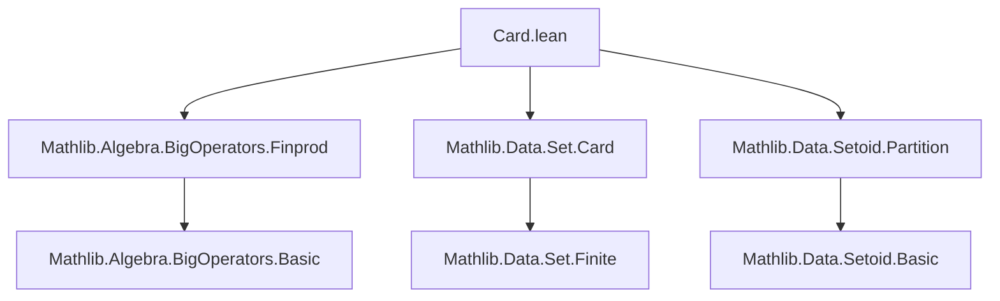

**Technical Brief: `Card.lean` — Cardinality of Parts of Partitions**

---

### 1. **Key Definitions & Theorems**

| Name | Type / Signature | Purpose |
|------|------------------|---------|
| `Setoid.IsPartition` | `P : Set (Set α) → Prop` | Predicate stating that `P` is a partition of the ambient type `α` (i.e., parts are pairwise disjoint and cover `α`). |
| `Setoid.IsPartition.ncard_eq_finsum` | `{α : Type*} → {P : Set (Set α)} → Setoid.IsPartition P → (s : Set α) → s.Finite → s.ncard = finsum fun t : P => (s ∩ t).ncard` | Main theorem: For a finite set `s`, its cardinal is the *finite sum* (`finsum`) of the cardinalities of its intersections with each part of the partition `P`. |

---

### 2. **Naming Conventions**

- **Prefixes**:
  - `ncard_`: for cardinality of sets (`s.ncard` = `Nat.card s` for finite `s`).
  - `finsum_`: for finite sums over index types (e.g., `finsum_def`, `finsum_congr`).
- **Suffixes**:
  - `_eq_finsum`: indicates an equality expressed as a finite sum.
  - `_finite`, `_finite_toFinset`: for conversions between `Nat.card` and `Finset.card`.
- **Other patterns**:
  - `hP`, `hs`, `ht`: standard hypothesis naming (`h` + descriptive name).
  - `hf`, `hst`, `hst'`: intermediate lemmas or derived facts.

---

### 3. **Tactic Stack**

Frequently used tactics in this file:

| Tactic | Role |
|--------|------|
| `classical` | Enables classical reasoning (e.g., choice for `exists.choose`). |
| `rw [finsum_def, dif_pos hs']` | Rewrites using definition of `finsum` and case analysis on finiteness. |
| `simp only [...]` | Simplifies using precise lemmas (e.g., `Nat.card_coe_set_eq`, `Set.mem_inter_iff`). |
| `apply Finset.card_sigma` + `Finset.card_nbij'` | Proves equality of cardinalities via bijection (sigma vs. union). |
| `intro`, `rintro`, `exact`, `use`, `refine` | Standard intro/proof construction. |
| `simp +contextual` | Contextual simplification (e.g., for subtype coercion). |
| `apply Finite.of_injective f` | Shows finiteness/injectivity to conclude cardinal bounds. |

---

### 4. **Proof Logic**

The proof proceeds as follows:

1. **Reduction to finite sets**: Use `toFinite_tac` to ensure `s` is finite.
2. **Rewrite `s.ncard` as `Finset.card`**: Via `Nat.card_eq_card_finite_toFinset`.
3. **Express `finsum` as a sum over support**: Use `finsum_def` and `dif_pos` (since `s` finite ⇒ support finite).
4. **Apply `Finset.card_sigma`**: Interpret the sum as the cardinal of a sigma-type:  
   $$
   \sum_{t \in P} |s \cap t| = \left| \bigsqcup_{t \in P} (s \cap t) \right|
   $$
5. **Construct a bijection**:
   - From `Σ t, s ∩ t` → `s`, via projection `⟨t, x⟩ ↦ x`.
   - Show injectivity using uniqueness of part containing an element (from `Setoid.IsPartition`).
6. **Alternative injective map proof**:
   - Define `f : support (t ↦ |s ∩ t|) → s` by picking an element from each nonempty intersection.
   - Prove `f` injective using partition uniqueness.
7. **Conclude equality** via `Finset.card_nbij'` or finite injective map argument.

---

### 5. **Imports & Dependencies**

| Import | Purpose |
|--------|---------|
| `Mathlib.Algebra.BigOperators.Finprod` | Provides `finsum`, `finsum_def`, and finite sum machinery. |
| `Mathlib.Data.Set.Card` | Defines `s.ncard`, `Nat.card`, and finite set cardinality lemmas. |
| `Mathlib.Data.Setoid.Partition` | Defines `Setoid.IsPartition`, partition properties (disjointness, coverage, uniqueness). |

---

### 6. **Mermaid Diagrams**

#### **Dependency Graph (Module-Level)**

#### **Theoretical Overview (Proof Structure)**

---

### 7. **Mathematical Summary**

The theorem formalizes the intuitive fact:

> If a finite set $ s \subseteq \alpha $ is intersected with the parts of a partition $ P $ of $ \alpha $, then  
> $$
|s| = \sum_{T \in P} |s \cap T|
$$

This is a discrete analog of the additivity of measure over disjoint sets, specialized to finite cardinality.

The proof leverages:
- Classical choice (to pick representatives from nonempty intersections),
- Bijection-based cardinal arithmetic (`Finset.card_nbij'`),
- Partition properties (disjointness, coverage, uniqueness of part containing a point).

---

Let me know if you'd like a formalized version of the Mermaid diagrams or a tactic-level trace of the proof.
