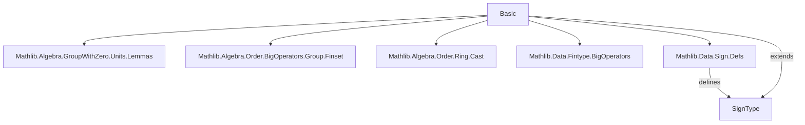
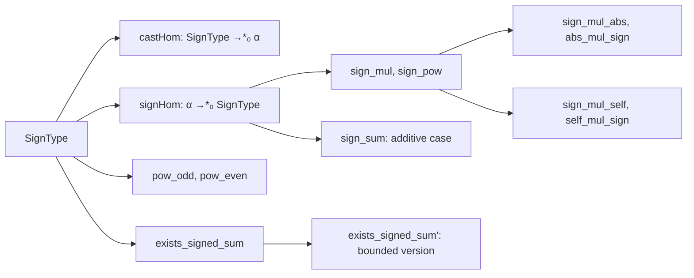

### Technical Brief: `Basic.lean` — Sign Function Formalization in Lean 4

---

#### **1. Key Definitions & Theorems**

| Name | Type / Signature | Purpose |
|------|------------------|---------|
| `SignType` | `Type u` with `Zero`, `One`, `Neg`, `Mul`, `DecidableEq`, `LinearOrder` | A 3-element type `{0, -1, 1}` representing signs; used to model sign of elements in ordered structures. |
| `castHom` | `SignType →*₀ α` (MulWithZeroHom) | Canonical multiplicative zero-homomorphism from `SignType` to any `MulZeroOneClass` with distributive negation. |
| `signHom` | `α →*₀ SignType` (MonoidWithZeroHom) | Sign function as a monoid homomorphism for linearly ordered rings; maps `x ↦ sign x`. |
| `sign_mul` | `sign (x * y) = sign x * sign y` | Multiplicativity of sign in linearly ordered rings. |
| `sign_mul_abs`, `abs_mul_sign` | `sign x * |x| = x`, `|x| * sign x = x` | Decomposition of an element into sign and absolute value. |
| `sign_mul_self`, `self_mul_sign` | `sign x * x = |x|`, `x * sign x = |x|` | Alternative decompositions using sign and absolute value. |
| `sign_pow` | `sign (x ^ n) = sign x ^ n` | Compatibility of sign with natural powers. |
| `sign_sum` | `sign (∑ f i) = t` under uniform sign | Sign of sum of elements with identical sign equals that sign (in linearly ordered additive groups). |
| `exists_signed_sum` | `∃ β, sgn, g, ...` | Decomposition of integer-valued function into signed atoms: sum of signs over a larger index set reproduces original function. |
| `exists_signed_sum'` | Extension of above with cardinality bound | Allows padding with zero-sign elements to reach a prescribed size `n`. |

**Notable Lemmas on `SignType` powers:**
- `pow_odd`, `zpow_odd`: Odd powers of sign elements equal the element itself.
- `pow_even`, `zpow_even`: Even powers (nonzero case) equal `1`.

---

#### **2. Naming Conventions**

- **Prefixes:**
  - `cast_`, `coe_`: Casting / coercion lemmas (`castHom`, `coe_mul`, `coe_pow`, `coe_zpow`).
  - `sign_`: Sign-related functions/lemmas (`sign_mul`, `sign_hom`, `sign_pow`, `sign_sum`).
  - `exists_`: Existence theorems (`exists_signed_sum`, `exists_signed_sum'`).
- **Suffixes:**
  - `_hom`: Homomorphism definitions (`castHom`, `signHom`).
  - `_aux`: Internal auxiliary lemmas (`exists_signed_sum_aux`).
- **Constants:**
  - `pos`, `neg`, `zero`: Canonical elements of `SignType`.
  - `pos_eq_one`, `neg_eq_neg_one`, `zero_eq_zero`: Definitional equalities.

---

#### **3. Tactic Stack**

Frequently used tactics:
- `cases`: Exhaustive case analysis on `SignType` (`0`, `1`, `-1`) or `lt_trichotomy`.
- `simp` / `simp_rw`: Simplification using `@[simp]` lemmas (e.g., `sign_mul_abs`, `pow_odd`).
- `rw`: Rewriting with equalities like `Int.sign_mul_abs`, `mul_comm`.
- `obtain ⟨k, rfl⟩`: Extracting odd/even witnesses.
- `decide`: For decidable propositions (e.g., `univ_eq`).
- `refine`: Constructing existential proofs (e.g., `exists_signed_sum_aux`).
- `sum_attach`, `sum_sigma`: Finset summation utilities for sigma types.

---

#### **4. Proof Logic**

- **Structure:** Modular by sections (`SignType`, `OrderedRing`, `LinearOrderedRing`, `LinearOrderedAddCommGroup`, `exists_signed_sum`).
- **Common pattern:**
  1. **Case analysis** on sign values (`0`, `1`, `-1`) or trichotomy (`x < 0`, `x = 0`, `x > 0`).
  2. **Simplification** using `@[simp]` lemmas (e.g., `abs_of_pos`, `sign_eq_one_iff`).
  3. **Homomorphism properties** (e.g., `map_mul'`, `map_pow`) to lift algebraic structure.
- **Existence proofs** use:
  - Sigma types to encode signed atoms.
  - `Finset.univ.sigma`, `range`, and `attach` to construct finite index sets.
  - `Int.sign_mul_abs` to relate signs and absolute values.

---

#### **5. Imports & Dependencies**

**Core Imports:**
```lean
Mathlib.Algebra.GroupWithZero.Units.Lemmas  
Mathlib.Algebra.Order.BigOperators.Group.Finset  
Mathlib.Algebra.Order.Ring.Cast  
Mathlib.Data.Fintype.BigOperators  
Mathlib.Data.Sign.Defs
```

**Key Dependencies:**
- `GroupWithZero`, `OrderedRing`, `LinearOrderedRing`, `OrderedAddCommGroup`: Algebraic structures.
- `Fintype`, `Finset`: Finite set theory and big operators.
- `SignType` itself is defined in `Mathlib.Data.Sign.Defs`, but this file extends it.

---

#### **6. Mermaid Diagrams**

##### **Dependency Graph (Module-Level)**



##### **Theoretical Overview (File Scope)**



##### **Proof Strategy Flow (e.g., `sign_mul`)**

```mermaid
flowchart TD
  A[Goal: sign(x*y) = sign(x)*sign(y)] --> B[Trichotomy on x]
  B --> C[Case x < 0]
  B --> D[Case x = 0]
  B --> E[Case x > 0]
  C --> F[Trichotomy on y]
  D --> F
  E --> F
  F --> G[Apply mul_pos/neg lemmas]
  G --> H[Simplify with sign_def]
```

---

#### **7. Summary**

This file formalizes the **sign function** in the context of ordered algebraic structures, emphasizing:
- Structural properties (homomorphism, powers, absolute value decomposition).
- Constructive decomposition of integer sums into signed atoms (`exists_signed_sum`), useful in combinatorics or measure theory.
- Heavy reliance on `LinearOrder` and `DecidableLT` for case analysis.
- Clean separation between abstract `SignType` algebra and concrete `sign : α → SignType` for ordered rings/groups.

The formalization is **modular**, **highly automated** (via `simp`/`cases`), and **universe-polymorphic**, with careful attention to zero-divisor handling and nontriviality assumptions.
