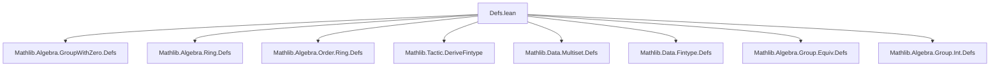
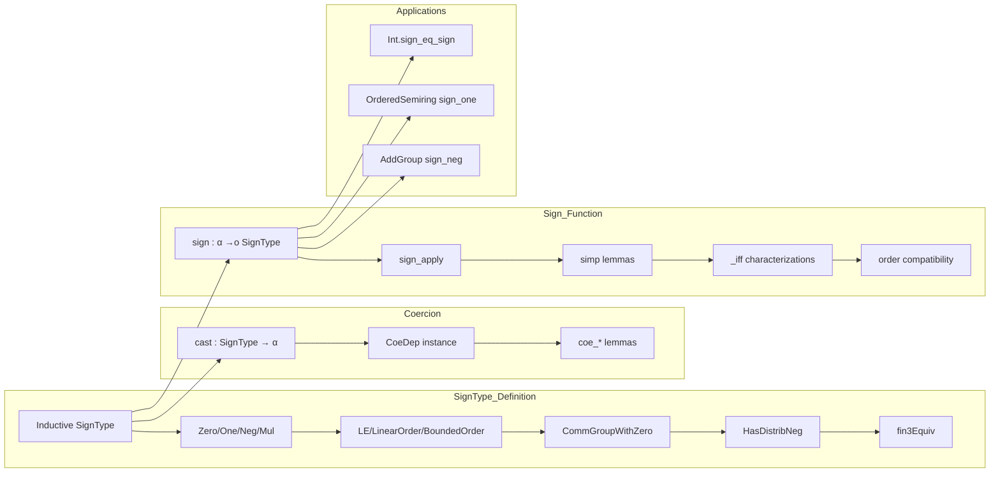

### Technical Brief: `SignType` in Lean 4 (from `Defs.lean`)

---

#### **1. Key Definitions & Theorems**

| Name | Type / Purpose |
|------|----------------|
| `SignType` | Inductive type with constructors `zero`, `neg`, `pos`; models $\{-1, 0, 1\}$. |
| `instance Zero SignType` | `0 := zero` |
| `instance One SignType` | `1 := pos` |
| `instance Neg SignType` | Unary negation: `neg neg = pos`, `neg zero = zero`, `neg pos = neg`. |
| `instance Mul SignType` | Multiplication: `neg * y = -y`, `zero * y = zero`, `pos * y = y`. |
| `instance LE SignType` | Partial order defined inductively: `-1 ≤ *`, `0 ≤ 0`, `* ≤ 1`. |
| `instance LinearOrder SignType` | Total, antisymmetric, transitive order; decidable. |
| `instance BoundedOrder SignType` | Top = `1`, bottom = `-1`. |
| `instance CommGroupWithZero SignType` | Multiplicative structure: invertible except `0`; `inv = id`. |
| `instance HasDistribNeg SignType` | Distributivity of negation over multiplication. |
| `fin3Equiv : SignType ≃* Fin 3` | Multiplicative equivalence to `Fin 3` with multiplication mod 3 (nonstandard). |
| `cast : SignType → α` | Coercion to any type with `0`, `1`, `-1`. |
| `sign : α →o SignType` | Order-preserving function mapping elements to their sign: `1` if $>0$, `-1$ if $<0$, `0` otherwise. |
| `sign_zero`, `sign_pos`, `sign_neg` | Simplification lemmas for `sign`. |
| `sign_eq_one_iff`, `sign_eq_neg_one_iff`, `sign_eq_zero_iff` | Characterizations of when `sign a` equals each value. |
| `sign_nonneg_iff`, `sign_nonpos_iff` | Relates order of `a` to order of `sign a`. |
| `sign_one` | `sign (1 : α) = 1` in ordered semirings. |
| `sign_neg` (Left/Right) | `sign (-a) = -sign a` under additive left/right strict monotonicity. |
| `Int.sign_eq_sign` | Agreement of `Int.sign` and `SignType.sign` on integers. |

---

#### **2. Naming Conventions**

- **Prefixes**:
  - `sign_`: for properties of the `sign` function.
  - `coe_`: for coercion lemmas (`coe_zero`, `coe_neg`, etc.).
  - `nonneg`, `nonpos`, `lt_`, `le_`: for order-theoretic characterizations.
  - `neg_`, `pos_`, `zero_`: for basic element properties.

- **Suffixes**:
  - `_iff`: biconditional characterizations (e.g., `sign_eq_zero_iff`).
  - `_le_`, `_lt_`: for order comparisons.
  - `_neg`, `_pos`, `_zero`: for sign-specific behavior.

- **Pattern**:
  - `theorem [sign_] [property] [iff]`: e.g., `sign_nonneg_iff`.
  - `@[simp]` lemmas often match canonical forms (`pos_eq_one`, `neg_eq_neg_one`, `zero_eq_zero`).

---

#### **3. Tactic Stack**

Frequently used tactics:
- `cases`: structural induction on `SignType` or `a : α`.
- `simp` / `simp only`: simplification using `@[simp]` lemmas.
- `rfl`: reflexivity for definitional equalities.
- `decide`: for decidable propositions (e.g., order relations).
- `intro` / `intro ⟨_⟩`: for destructing conjunctions or equalities.
- `split_ifs`: for case analysis on `if-then-else` expressions.
- `exact`, `assumption`, `trivial`: for simple goals.
- `rw`, `rwa`: rewriting with lemmas and assumptions.
- `rcases`: for case analysis on trichotomies (`lt_trichotomy`).
- `convert`, `congr'`: for congruence reasoning (rare, but used in `map_cast'`).
- `aesop`: not used here — proof automation is mostly manual.

---

#### **4. Proof Logic**

- **Inductive reasoning**: Proofs over `SignType` rely heavily on case analysis on the three constructors (`zero`, `neg`, `pos`).
- **Order reasoning**: Uses `lt_trichotomy`, `le_total`, `le_antisymm`, and decidability of order.
- **Decidability**: Many instances (`DecidableEq`, `DecidableLE`, `DecidableLT`) are derived or proven manually via `decide`.
- **Coercion reasoning**: `cast` and `coe` lemmas use `cases` + `simp`.
- **Sign function reasoning**:
  - Prove `sign a = x` by case analysis on comparisons `0 < a`, `a < 0`.
  - Use `if_pos`, `if_neg`, `if_simp` to simplify `ite` expressions.
  - Prove biconditionals (`_iff`) by splitting into `→` and `←`, often using `rwa` and contradiction (`lt_irrefl`, `lt_asymm`).
- **Monotonicity & homomorphism lemmas**: Use `map_zero`, `StrictMono.sign_comp`, and `sign_apply`.

---

#### **5. Imports**

| Module | Purpose |
|--------|---------|
| `Mathlib.Algebra.GroupWithZero.Defs` | `CommGroupWithZero`, `Zero`, `One`, `Mul`, etc. |
| `Mathlib.Algebra.Ring.Defs` | Ring-like structures, `Neg`, `Mul`, etc. |
| `Mathlib.Algebra.Order.Ring.Defs` | Ordered rings, `Preorder`, `LinearOrder`, `IsOrderedRing`. |
| `Mathlib.Tactic.DeriveFintype` | Deriving `Fintype` instance for `SignType`. |
| `Mathlib.Data.Multiset.Defs`, `Mathlib.Data.Fintype.Defs` | Possibly for future extensions or auxiliary lemmas. |
| `Mathlib.Algebra.Group.Equiv.Defs`, `Mathlib.Algebra.Group.Int.Defs` | For `≃*`, `Int.sign`, etc. |

---

#### **6. Mermaid Diagrams**

##### **Dependency Graph (Top-Level)**

##### **Theory Overview**

---

#### **7. Summary**

`SignType` is a foundational algebraic and order-theoretic structure modeling the three-element sign monoid $\{-1, 0, 1\}$. It supports:
- **Algebraic structure**: `CommGroupWithZero`, multiplication, negation.
- **Order structure**: Linear order, bounded order, decidable comparisons.
- **Coercion**: To any type with `0`, `1`, `-1`.
- **Sign function**: Maps elements of ordered structures to their sign, with rich interaction with monotonicity, homomorphisms, and ring operations.

The file is highly structured, with lemmas grouped by context (`Preorder`, `LinearOrder`, `OrderedSemiring`, `AddGroup`) and heavy use of `@[simp]` for automation-friendly simplification.

--- 

Let me know if you'd like a formalized dependency graph (e.g., for `lean4doc`), or a proof strategy map for `sign` lemmas.
