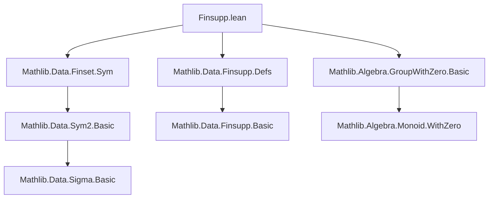
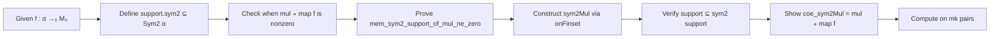

**Technical Brief: `Finsupp.lean` Module**

---

### 1. **Key Definitions & Theorems**

| Name | Type / Signature | Purpose |
|------|------------------|---------|
| `sym2_support_eq_preimage_support_mul` | `f.support.sym2 = map f ⁻¹' mul.support` | Characterizes the symmetric square of the support of `f` as the preimage of the support of multiplication under `map f`. Requires `[NoZeroDivisors M₀]`. |
| `mem_sym2_support_of_mul_ne_zero` | `p ∈ f.support.sym2` (under hypothesis `mul (p.map f) ≠ 0`) | Shows that if the product of `f` over a symmetric pair is nonzero, then the pair lies in the symmetric square of the support. |
| `sym2Mul` | `α →₀ M₀ → Sym2 α →₀ M₀` | Lifts a finitely supported function `f` to a finitely supported function on `Sym2 α` via precomposition with `mul ∘ map f`. Noncomputable. |
| `support_sym2Mul_subset` | `f.sym2Mul.support ⊆ f.support.sym2` | Describes the support of the lifted function as a subset of the symmetric square of the original support. |
| `coe_sym2Mul` | `↑(f.sym2Mul) = mul ∘ map f` | The underlying function of `f.sym2Mul` is exactly `mul ∘ map f`. |
| `sym2Mul_apply_mk` | `f.sym2Mul (.mk (a, b)) = f a * f b` | Evaluates `sym2Mul` on a symmetric pair represented as `mk (a, b)`. |

---

### 2. **Naming Conventions**

- **Prefixes**:
  - `sym2_`: Indicates operations or properties related to `Sym2`.
  - `mul_`: Pertains to multiplication (e.g., `mul.support`, `mul (p.map f)`).
- **Suffixes**:
  - `_eq_preimage_`: Indicates an equality involving a preimage (e.g., `sym2_support_eq_preimage_support_mul`).
  - `_subset`: For subset relations (e.g., `support_sym2Mul_subset`).
  - `_apply_mk`: For evaluation on `mk` constructors (e.g., `sym2Mul_apply_mk`).
- **`noncomputable def`**: Used for definitions not computable in the sense of Lean (here, due to use of classical choice in `onFinset`).

---

### 3. **Tactic Stack**

- `simp` / `simp only [...] at ...`: Dominant tactic for simplification, especially with `map_pair_eq`, `mul_mk`, `ne_eq`.
- `ext`: Used to extend extensionality proofs over pairs (e.g., `ext ⟨a, b⟩`).
- `obtain ⟨a, b⟩ := p`: Pattern matching on `Sym2 α` elements (via `Sym2.exists_mk`).
- `simpa using ...`: To discharge goals by simplifying with a given fact.
- `.intro ...`: Application of `Sym2.mem_support_iff` or similar intro rules (here, likely `Sym2.mem_support_iff` or `Sym2.mem_sym2_support_iff`).

No heavy automation (e.g., `aesop`, `ring`, `linarith`) is used—proofs are mostly direct simplifications.

---

### 4. **Proof Logic**

- **Structure**:  
  Proofs are largely *element-wise* and *extensional*:
  1. Use `ext` to reduce to proving equality on arbitrary elements (pairs).
  2. Simplify using `simp` with lemmas like `map_pair_eq`, `mul_mk`, and definitions of `support`, `sym2`, `map`.
  3. For membership proofs, use `obtain` to unpack symmetric pairs and apply `left_ne_zero_of_mul`, `right_ne_zero_of_mul` (from `NoZeroDivisors`).
  4. Definitions like `sym2Mul` are constructed via `onFinset`, requiring a witness lemma (`mem_sym2_support_of_mul_ne_zero`) to ensure finiteness.

- **Induction**: Not used—proofs are pointwise and rely on extensionality and simplification.

---

### 5. **Imports**

| Import | Role |
|--------|------|
| `Mathlib.Algebra.GroupWithZero.Basic` | Provides `CommMonoidWithZero`, `NoZeroDivisors`, and basic zero-divisor lemmas. |
| `Mathlib.Data.Finset.Sym` | Defines `Sym2`, `sym2`, `mul`, and related operations on symmetric square. |
| `Mathlib.Data.Finsupp.Defs` | Defines `→₀`, `support`, `map`, `onFinset`, and basic `Finsupp` machinery. |

---

### 6. **Mermaid Diagrams**

#### **Dependency Graph (Module-Level)**

#### **Overview of File Logic Flow**

---

### 7. **Domain & Theory Scope**

- **Domain**: Algebraic combinatorics, specifically *finitely supported functions* and *symmetric powers*.
- **Theory**: 
  - Lifts scalar-valued functions to symmetric bilinear-like objects via multiplication.
  - Used in contexts like constructing symmetric tensors, invariant theory, or combinatorial generating functions over symmetric products.
- **Assumptions**: 
  - `M₀` is a `CommMonoidWithZero` (e.g., `ℕ`, `ℤ`, `ℝ≥0`, polynomial rings).
  - `NoZeroDivisors M₀` ensures that `f a * f b ≠ 0` iff both `f a ≠ 0` and `f b ≠ 0`, critical for support characterizations.

--- 

Let me know if you'd like a formalization roadmap for extending this to `Sym n` or `Sym2` tensor products.
