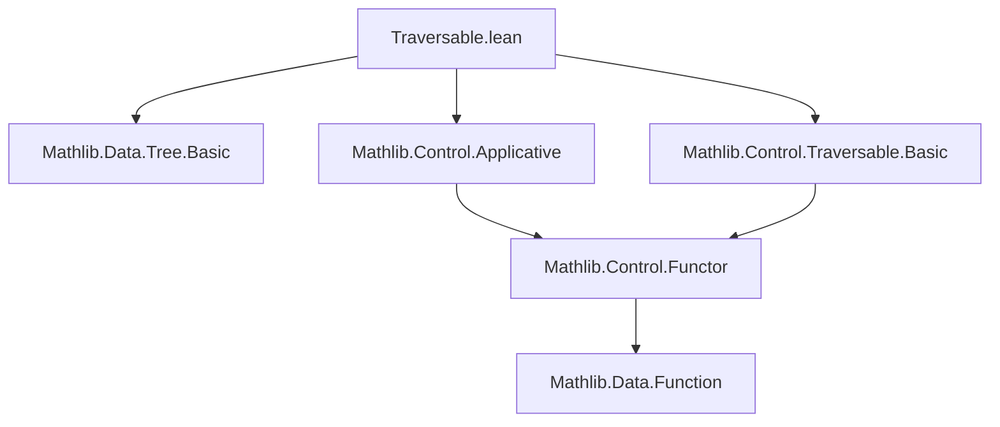
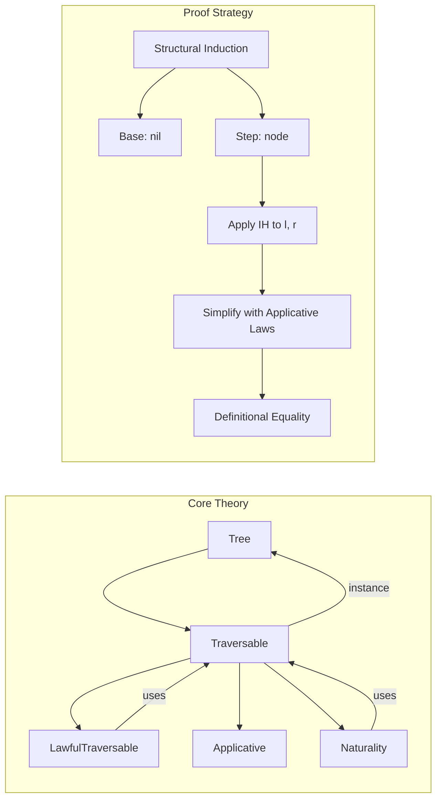
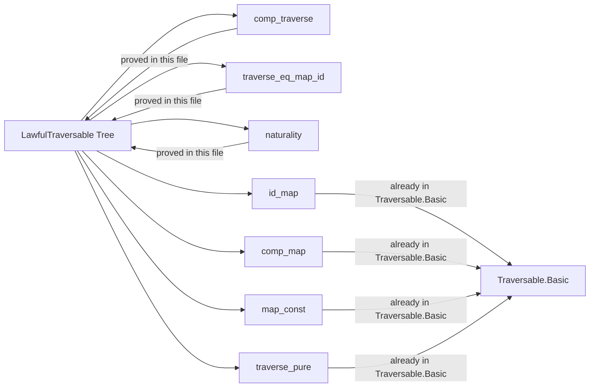

### Technical Brief: `Traversable.lean` — Traversable Instance for `Tree`

---

#### **1. Key Definitions & Theorems**

| Name | Type / Signature | Purpose |
|------|------------------|---------|
| `instance : Traversable Tree` | `Traversable Tree` | Provides a `Traversable` instance for the `Tree` type, using the existing `map` and `traverse` functions defined on trees. |
| `comp_traverse` | `{F G : Type → Type} [Applicative F] [Applicative G] [LawfulApplicative G] → (β → F γ) → (α → G β) → Tree α → ...` | Proves the *composition law* for `traverse`: traversing with a composed effect is equivalent to traversing twice and composing the results. |
| `traverse_eq_map_id` | `(f : α → β) → Tree α → ...` | Shows that traversing with `pure ∘ f` over the identity applicative yields `pure (map f t)`, i.e., `traverse` recovers `map` in the identity case. |
| `naturality` | `{F G : Type → Type} [Applicative F] [Applicative G] [LawfulApplicative F] [LawfulApplicative G] → ApplicativeTransformation F G → (α → F β) → Tree α → ...` | Establishes that natural transformations commute with `traverse`. |
| `instance : LawfulTraversable Tree` | `LawfulTraversable Tree` | Proves that the `Traversable` instance satisfies all required laws (identity, composition, naturality, etc.), using the above lemmas and existing `map_*` lemmas. |

---

#### **2. Naming Conventions**

- **Prefixes**:
  - `traverse_`: for lemmas about `traverse` (e.g., `traverse_eq_map_id`, `comp_traverse`, `naturality`)
  - `is_`, `map_`, `seq_`, `pure_`: standard control/functional programming patterns (e.g., `map_pure`, `pure_seq`)
- **Suffixes**:
  - `_eq_map_id`: indicates equivalence with `map` under identity applicative
  - `_traverse`: indicates a traversal-specific property
- **Function names**:
  - `traverse`, `map`, `seq`, `pure`: standard `Applicative`/`Traversable` operations
  - `Functor.Comp.mk`, `Functor.map_map`, `Comp.seq_mk`, `seq_map_assoc`: internal `Functor`/`Applicative` combinators

---

#### **3. Tactic Stack**

- **Induction**: `induction t with | nil => ... | node v l r hl hr => ...` — structural induction on `Tree`
- **Rewriting**: `rw [...]` — using `traverse`, `map`, `Function.comp_apply`, etc.
- **Simplification**:
  - `simp only [...]` — with a precise set of lemmas for `Functor`, `Applicative`, and `Comp`:
    - `Function.comp_def`, `Function.comp_apply`
    - `Functor.Comp.map_mk`, `Functor.map_map`
    - `Comp.seq_mk`, `seq_map_assoc`, `map_seq`
- **Reflexivity**: `rfl` — for definitional equalities (e.g., base case `nil`, or after simplification)
- **LawfulApplicative assumptions**: used implicitly via `[LawfulApplicative G]` to justify properties like `η.preserves_*`

---

#### **4. Proof Logic**

- **Structure**: Structural induction on `t : Tree α`
  - **Base case (`nil`)**:
    - Reduce `traverse nil ...` using definition (`traverse_nil`)
    - Simplify using `map_pure`, `pure_seq`, etc.
  - **Inductive step (`node v l r`)**:
    - Expand `traverse (node v l r) f` using `traverse_node`
    - Apply IH (`hl`, `hr`) to subtrees `l`, `r`
    - Simplify using `Applicative`/`Functor` laws (e.g., `seq_map_assoc`, `map_map`)
    - Conclude via definitional equality (`rfl`) or `simp only`
- **Key pattern**: 
  - Use `induction` → `rw [traverse]` → apply IH → `simp only [...]` → `rfl`
- **Leverages**: 
  - `LawfulApplicative` assumptions to justify algebraic properties of `pure`, `seq`, `map`
  - `ApplicativeTransformation` properties (`preserves_pure`, `preserves_seq`, `preserves_map`)

---

#### **5. Imports**

| Import | Purpose |
|--------|---------|
| `Mathlib.Data.Tree.Basic` | Defines the `Tree` type and basic operations (`map`, `nil`, `node`) |
| `Mathlib.Control.Applicative` | Provides `Applicative`, `LawfulApplicative`, `ApplicativeTransformation`, and their laws |
| `Mathlib.Control.Traversable.Basic` | Defines `Traversable`, `LawfulTraversable`, and basic lemmas (e.g., `traverse_pure`, `id_map`, `comp_map`) |

> **Scope**: This module extends `Tree` with `Traversable` structure and proves it satisfies all required laws.

---

#### **6. Mermaid Diagrams**

##### **Dependency Graph (Module-Level)**

##### **Theoretical Overview (File-Level)**

##### **Proof Dependency (for `LawfulTraversable` instance)**

---

### Summary

This file formalizes the `Traversable` structure for `Tree`, proving it satisfies all axioms of a `LawfulTraversable`. The proofs rely on structural induction and standard `Applicative`/`Functor` laws, with heavy use of `simp only` for precise rewriting. The naming and tactic stack reflect Lean’s functional programming style and Mathlib’s emphasis on lawfulness and modularity.
